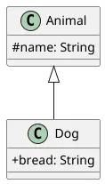

# OOP - Polymorphism
> Polymorphism comes from the greek roots "poly" (*many*) and "morphe" (*form*). The central concept is that an object can take many forms.  
In simple terms, polymorphism enables us to treat different objects as instances of their common superclass or shared interface(s).  
*For example:* `public class Cat extends Animal{}` any object of the Cat class is also an object of the Animal class.

## Why does polymorphism matter?
Like the other central OOP concepts, polymorphism allows for **flexibility** and code **reusability**.

We might have some code that operates on all Animals, and we don't care whether they're a Cat or Dog or Fish or Giraffe. Without polymorphism this would be hard to achieve.  
With polymorphism we can simply instantiate a `List<Animal>` and add all of the relevant objects to it.

## Interfaces
Inheritance is not the only way to define relationships between classes. Instead, we can use `interfaces`. This approach is known as **composition** rather than **inheritance**.

- An interface contains a list of methods that a class must implement.

<details>
	<summary>*example:* interface</summary>

	```java
	public interface Shape {
	    double PI = 3.14159; // interfaces may define **constants** but not variables

	    double area();       // interfaces may also list methods
	    double perimeter(); 
	}

	public class Circle implements Shape {

		/* rest of class omitted */

	    // we must implement the methods of any interfaces
	    public double area(){
	    	return this.PI * this.radius * this.radius;
	    }

	    public double perimeter(){
	    	return 2 * this.PI * this.radius;
	    }
	}
	```
</details>

## Polymorphism via interfaces
Just as we can treat objects as any of their superclasses (*e.g. a `Dog` can be an `Animal` or a `Mammal` when required*),  
we can treat objects as any of their interfaces (*e.g. a `List<Shape>` can contain **any** object that implements the `Shape` interface, whether a `Circle`, `Square`... or even a `Dog` if `Dog` implements `Shape` for some reason!*)  

This allows us to have many different classes which have diverse functionality, but also share functionality when it's helpful.

<details>
	<summary>*example:* polymorphism via interface</summary>

	```java
	public interface EfficiencyCalculable{
	    double calculateEfficiency();
	}
	```
	Many potential classes might implement this interface, from `Car` to `SpaceHeater` to `EBike` to `Battery`. These classes would mostly have wildly different functionality, but it's helpful to put them all together when we need to compare efficiencies.
</details>

## instanceof
Sometimes we need to know if an object is a more specific type. For example, if we have a `List<Animal>` we may need to act differently for some special case.  

The `instanceof` keyword helps with this. It acts upon an object and evaluates to a boolean value, telling us if an object belongs to a certain type.

```java
Animal animal = getAnimal();

if (animal instanceof Dog) {
    // do something dog-specific here
}
```

:::note instanceof
Note that instanceof happens at runtime. When the code is written ("compile-time"), we can't possibly know if the specific data we'll have when the code runs will include dogs or not. instanceof checks the type of an object while the code is running.
:::

<details>
	<summary>*example:* instanceof</summary>


```java
public class Animal {
    protected String name;

    Animal(String name) {
        this.name = name;
    }
}
```

```java
public class Dog extends Animal {
    public String breed;

    public Dog(String name, String breed) {
        super(name);
        this.breed = breed;
    }
}
```

```java showLineNumbers
public class Main {
    public static void main(String[] args) {
        Dog rex = new Dog("Wuffie", "Wuff");

		//highlight-next-line
        if (rex instanceof Animal)
            System.out.printf("%s is of the bread %s.%n", rex.name, rex.breed);
    }
}
```
```bash
Wuffie is of the bread Wuff.
```
- *line 5:*  
	Because `rex` extends the `Animal` class, it is also (*besides `Dog`*) an instance of `Animal` and therefore the condition is `true`.

```java showLineNumbers
public class Main {
    public static void main(String[] args) {
		//highlight-next-line
        Animal rex = new Dog("Wuffie", "Wuff");

		//highlight-next-line
        if (rex instanceof Animal)
            System.out.printf("%s is a Animal.%n", rex.name);
    }
}
```
```bash
Wuffie is a Animal.
```
- *line 3*:  
	Rex is now only of type `Animal` class, even it is instantiated as `Dog` (*the last argument in the constructor is not saved*).
- *line 5*:  
	The condition is still true, but `rex` dose not have the field `bread` because that is part of the subclass `Dog`. 
</details>

## Composition versus inheritance
We'll return to this topic repeatedly, but composition is inherently more flexible than inheritance.

Rather than a rigid inheritance hierarchy, we can compose together whatever combination of interfaces are required in each situation.

Composition provides great flexibility in our class design. Recall the ["platypus" problem](./oop_inheritance.md#considerations-for-inheritance) of a `Mammal` which lays eggs. This is tricky to define using inheritance, as it's such an exception to the usual rules. However, with composition we can simply create two interfaces: `EggLayable` and `MilkProduceable`. Most mammals would implement `MilkProduceable` and most birds would implement `EggLayable`. And a platypus would implement both!

## The default keyword
The `default` keyword is used in interfaces to define a default method implementation. This allows interfaces to provide method implementations without breaking compatibility with existing classes.

<details>
	<summary>*example:* default in interfaces</summary>

```java
public interface Trainable {
    default void train() {
        System.out.println("This " + this.getClass().getSimpleName() + " is attending training.");
    }
}
```
</details>

## Conclusion
**Inheritance** allows us to share code between classes through a hierarchical relationship.

**Composition** allows us to share code between classes through mix-and-match interfaces of methods they implement.

**Polymorphism** refers to the ability of objects to take on multiple forms, allowing different types of objects to be treated as instances of a common class/interface. This is essential in object-oriented programming as it promotes code reusability, flexibility, and scalability.
