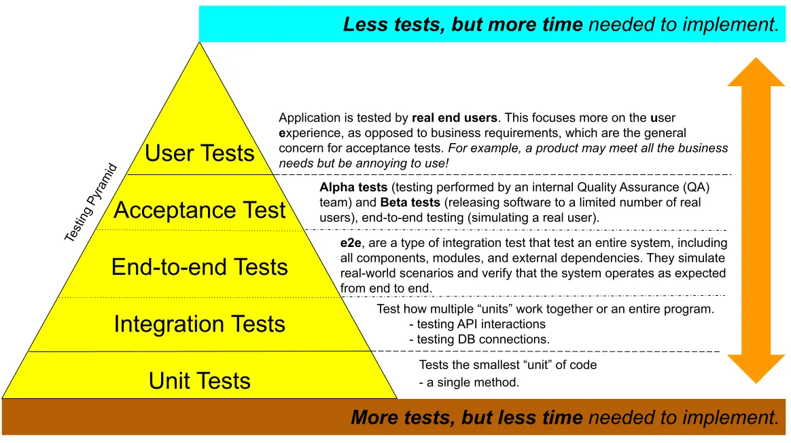
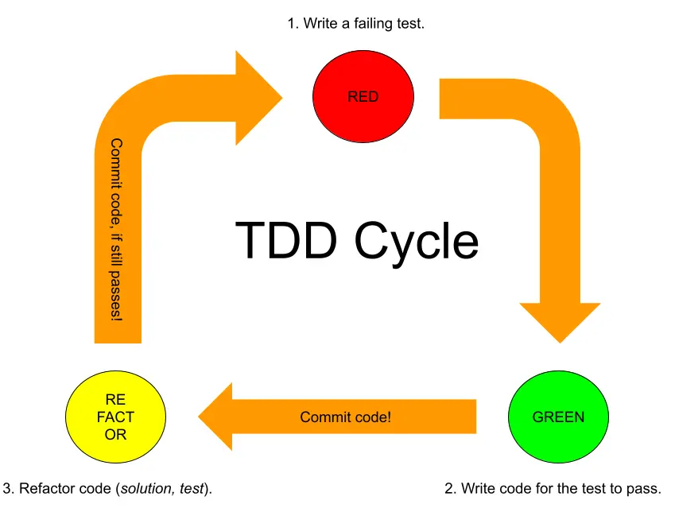

# Test-Driven Development (TDD)
>Is a style of programming which involves writing test code **before** application code.

- The design of your code remains focused on the business requirements/acceptance criteria.
- “Emergent design” where the eventual needs of the software drive the design.
- Helps reduce code bloat by only writing code that you need.
- Ensures robust code as every step of the way is pre-tested.
- Helps to find the origin of bugs.

:::note balance of confidence
**TDD** also enables "confidence" when adding more features to an existing program, because if the code still passes a variety of tests, than it is less likely that the code is broken.
Keep in mind that more test take more time and should be only implemented if they can reasonable increase the confidence in the code.
:::

## The Testing Pyramid



## RED/GREEN/REFACTOR Cycle
  

1. Write a **failing test**:  
	- To be "more sure" that the test is going to target a not jet implemented solution.
2. Write code for the **test to pass**:  
	- Only write enough to satisfy the test without breaking any of the previous tests.
	- Commit code to repository.
3. **Refactor code** (solution/test):  
	- Refactor code if needed, but check if it still passes all test cases.
	- Commit code to repository.

<details>
	<summary>*example:* TDD cycle</summary>

Let's say you want to create a `Calculator` class with a `sum(int a, int b)` method.

### Step 1: Write a Test That Fails (Red)
First, write a JUnit test before implementing the actual method.

```java
import static org.junit.jupiter.api.Assertions.assertEquals;
import org.junit.jupiter.api.Test;

public class CalculatorTest {
    @Test
    @DisplayName("Returns the sum of the two input arguments.")
    public void testSum() {
        Calculator calculator = new Calculator();
        int result = calculator.sum(2, 3);
        assertEquals(5, result); // This test will fail since the method doesn't exist yet.
    }
}
```
- `assertEquals(5, result);` checks if the result of `sum(2, 3)` is `5`.
- Since `sum()` isn’t implemented yet, this test will fail, giving you a "red" result.

### Step 2: Write Code to Pass the Test (Green)
Now, implement the `sum` method in the `Calculator` class to make the test pass.
```java
public class Calculator {
    public int sum(int a, int b) {
        return a + b;
    }
}
```
- Now, if you rerun the test, it should pass and turn green because the method meets the basic requirement of summing two integers.

### Step 3: Refactor
In this example, the `sum` method is simple, so refactoring might not be necessary. However, as code complexity grows, you might refactor to improve readability, optimize performance, or clean up duplication.

- After refactoring, always rerun the test to ensure it still passes.
- If additional requirements or edge cases arise, you can add new tests and repeat the Red-Green-Refactor cycle.
</details>


## Test Coverage
A fully-tested program would have full test coverage, meaning every method on every class is unit tested. Often in practice it may not be necessary to have full test coverage. It can be more cost-effective to test the most important logic.

## Good unit tests
- Use **good code practices**, just like our app code (*i.e. modular, D.R.Y, clean*).
- Are **deterministic** (*i.e. get the same result every time*) especially when handling time or randomness. In other words, tests must not pass or fail randomly or unpredictably.
- Consider **test sampling**. This requires testing both a range of good data and edge cases.

:::note
Ask yourself "what could go wrong?" and write a group of tests which check that each method handles all types of situation.
:::

## How to structure a Unit Test.
To make sure other developers can easily understand and expand the tests.  

1. **Arrange**:  
	- Set up any input data.
2. **Act**:  
	- Call the method we are testing.
3. **Assert**:  
	- Check the result is what we expected for the input.

<details>
	<summary>*example*: Arrange, Act, Assert</summary>

	```java
	// ARRANGE
	SomeInputClass testData = null;

	// ACT
	ResultType result = someClass.someMethodBeingTested(testData);

	// ASSERT
	assertEquals(ResultType.INVALID_INPUT, result);
	```
	```java
	// ARRANGE
	SomeInputClass testData = new SomeInputClass(12, "Pool Noodle", 3.99);

	// ACT
	ResultType result = someClass.someMethodBeingTested(testData);

	// ASSERT
	assertEquals(ResultType.PURCHASE_SUCCESSFUL, result);
	```
</details>

### Test Tenants (*according to Alex*)
1. **"Write tests to verify behavior, not implementation."**
	- Only test the result, not how it is achieved.
2. **"Follow a convention for DisplayNames and test method names"** and stick to it.
	- Example for display name pattern: `return X when passed Y`.
	- Example for method name pattern: `testMethodCondition`.
	- Reduces cognitive load and makes it easier to read.
3. **"Keep a healthy ratio between effort and confidence"**.
	- Only spend time on test which will significant increase realistic test cases.
4. **"Be mindful of brittleness"**.
	- Only test what is really significant, otherwise the test can unnecessarily break when it gets refactored.
5. **"Red-Green-Refactor"** (*don't break the test, break the implementation!*)
	- Do not change the test to fit the solution.

## Test sampling Strategy
>Is the approach used to decide which inputs, scenarios, and cases to include in the tests to ensure the code meets the requirements and behaves as expected. This strategy is crucial to balance thorough testing with efficient resource usage, as testing every possible input is often impractical. The goal of test sampling in TDD is to identify a representative set of tests that covers different aspects of the feature or functionality.

1. **Boundary Testing**
- Boundary testing focuses on values at the edges of input ranges, as these are common points where errors occur.
- For example, if testing a method that accepts an integer between `0` and `100`, boundary testing would cover values like `0`, `1`, `99`, and `100`.  

2. **Equivalence Partitioning**
- Equivalence partitioning divides inputs into classes or partitions where all members of a class should be treated the same by the code.
- For instance, if a function processes positive integers, negative integers, and zero differently, you would only need to test one representative from each category rather than every possible integer.  

3. **Positive and Negative Testing**
- Positive testing confirms that the function behaves as expected for valid inputs. Negative testing, on the other hand, checks how the code handles invalid inputs.
- In a Java `Calculator` class, positive testing for a `sum()` method might test typical cases (like `sum(2, 3)`), while negative testing could pass null inputs, non-integer data, or extremely large numbers to ensure the function handles them gracefully.  

4. **Edge Case and Corner Case Testing**
- Edge cases are inputs that lie at the outer boundaries of valid input domains, while corner cases involve multiple boundaries or unusual situations.
- For example, if testing a sorting method, edge cases could include a single-element list, an empty list, or a list with all identical elements, while a corner case might involve a list with both extreme high and low values.

5. **Error Handling and Exception Testing**
- When designing a test sampling strategy, include cases that should throw exceptions.
- In Java, using JUnit’s `assertThrows` method allows you to check that specific invalid inputs trigger the correct exceptions, such as `IllegalArgumentException` or `NullPointerException`.

<details>
	<summary>*example:* test sampling strategy</summary>

Let’s say you’re developing a `BankAccount` class in Java with a `withdraw` method. A solid test sampling strategy could involve:

1. **Setting up boundary tests** to ensure the method handles the minimum and maximum allowable withdrawal limits.
2. **Partitioning equivalence classes** into cases like:
	- Valid withdrawal amounts (positive and less than balance)
	- Invalid withdrawal amounts (negative, zero, or greater than balance)
3. **Testing edge cases** such as attempting to withdraw exactly the account balance or zero.
4. **Ensuring exception handling** by testing invalid types or overly large withdrawals that should trigger exceptions.

```java
import static org.junit.jupiter.api.Assertions.*;
import org.junit.jupiter.api.Test;

public class BankAccountTest {

    @Test
    public void testWithdraw_validAmount() {
        BankAccount account = new BankAccount(100);
        account.withdraw(50);
        assertEquals(50, account.getBalance()); // Positive test
    }

    @Test
    public void testWithdraw_exactBalance() {
        BankAccount account = new BankAccount(100);
        account.withdraw(100);
        assertEquals(0, account.getBalance()); // Boundary test
    }

    @Test
    public void testWithdraw_exceedingBalance() {
        BankAccount account = new BankAccount(100);
        assertThrows(IllegalArgumentException.class, () -> {
            account.withdraw(150); // Negative test - exceeding balance
        });
    }

    @Test
    public void testWithdraw_negativeAmount() {
        BankAccount account = new BankAccount(100);
        assertThrows(IllegalArgumentException.class, () -> {
            account.withdraw(-10); // Negative test - negative input
        });
    }

    @Test
    public void testWithdraw_zeroAmount() {
        BankAccount account = new BankAccount(100);
        account.withdraw(0);
        assertEquals(100, account.getBalance()); // Edge case - zero withdrawal
    }
}
```

</details>
