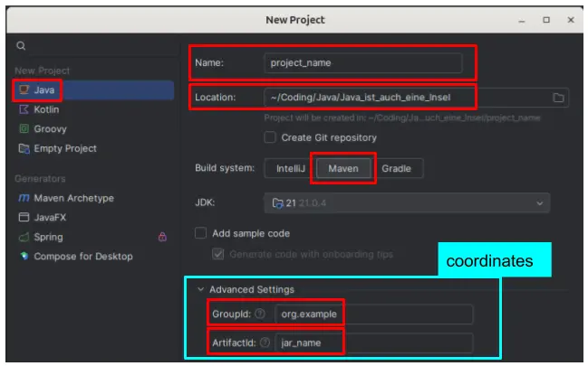

# Project Set Up

## Marven

Maven is an open-source "**build automation**" and "**project management**" tool widely used for Java applications.  
As a build automation tool, it automates the "**source code compilation**" and "**dependency management**", assembles binary codes into packages, and executes test scripts.

### creating a project

  

##### Coordinates
"Coordinates" refer to a set of identifiers that uniquely identify a specific artifact (such as a library or a project module). They are used to locate dependencies in repositories like Maven Central.

- **Groupid**: This identifies the group, organization, or company behind the artifact. It's typically written in reverse domain notation, like com.example.  
- **Artifactid**: This is the name of the project or module, representing the specific artifact within the group. The name should be in lowercase letters and no strange symbols. *For example, my-app.*

##### File Structure
|file|explanation|
|---|---|
|`src/main/java`|contains the "source code" |
|`src/main/resources`|resources for the "source code"|
|`src/test/java`|contains "test cases"|
|`target/classes`|contains the built (*executable*)|
|`pom.xml` (_**P**roject **O**bject **M**odel_)|contains the project configuration (*coordinates and dependencies*) and description|

### adding a class
- in the "**file tree**" on the left side: "right click" on the `src/main/java` folder to open the "**context menu**" to select `New` -> `Java Class`
