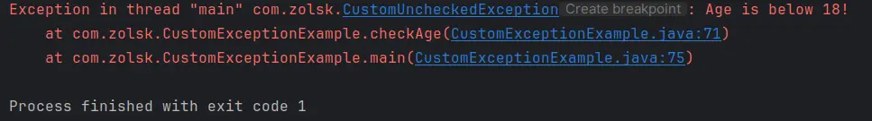
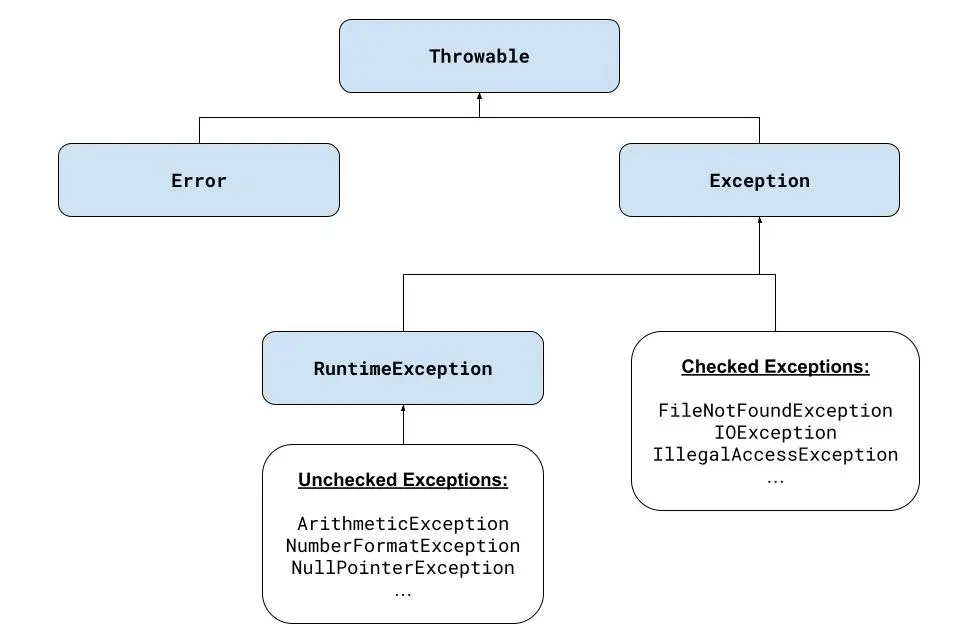

# Exceptions
> In Java, exceptions are a mechanism for handling runtime errors and other exceptional events that can disrupt the normal flow of a program. An exception is an object that represents an error or an unusual condition that occurs during program execution. When an exception is thrown, the normal flow of the program is interrupted, and the control is transferred to an appropriate exception handler.

## Types of Exceptions in Java
Java exceptions can be categorized into three main types:

### 1. Checked Exceptions (Compile Time Exceptions):

- These exceptions are **checked at compile time**. A method which uses the `throws` keyword in it's signature **MUST** be wrapped in an "**try-catch block**" when called otherwise you can not compile.
- They represent scenarios where a recoverable error might occur, such as issues related to file handling, database access, or network connectivity.
- Common checked exceptions include `IOException`, `SQLException`, and `FileNotFoundException`.

	<details>
		<summary>*example*: **checked exception**</summary>

	```Java showLineNumbers
	import java.io.*;

	public class CheckedExceptionExample {
	    public static void main(String[] args) {
	        try {
			//highlight-next-line
	            FileReader file = new FileReader("file.txt");
	        } catch (FileNotFoundException e) {
	            System.out.println("File not found exception occurred!");
	        }
	    }
	}
	```
	- *"line 6"*:  
		Because the `FileReader` class uses `throws` in the constructor's signature, we need to wrap the object instantiation in an "try-catch block" otherwise the compiler let us not compile the code.
	</details>

### 2. Unchecked Exceptions (Runtime Exceptions):

- Unchecked exceptions are not checked at compile time but crush your program at **runtime**. They are usually the result of programming errors, such as logical mistakes or improper use of an API.
- They are subclasses of `RuntimeException` and include exceptions like `NullPointerException`, `ArrayIndexOutOfBoundsException`, and `ArithmeticException`.
- Unchecked exceptions do not need to be declared in the method signature or explicitly caught.

	<details>
		<summary>*example*: **unchecked exception**</summary>

	- "*line 4*:"
		- Will crush the program at runtime.  
	```java showLineNumbers
	public class UncheckedExceptionExample {
	    public static void main(String[] args) {
	        int[] arr = new int[0];
			//highlight-error-next-line
	        System.out.println(arr[-1]);  // This line will cause ArrayIndexOutOfBoundsException
	    }
	}
	```

	- "*line 4-5*": `try {}`  
		The statement which would throw an exception is wrapped in an try block.
	- "*line 6-8*": `catch {}`  
		The `RuntimeException` exception is caught and it's reference saved in the variable `e`.  
		The error message is printed to the terminal and the code can continues without crashing.
	```java showLineNumbers
	public class UncheckedExceptionExample {
	    public static void main(String[] args) {
	        int[] arr = new int[0];
			//highlight-start
            try {
	            System.out.println(arr[-1]);
            } catch (RuntimeException e) {
	            System.out.println(e.getMessage());
            }
			//highlight-end
            System.out.println("The program did not crash!");
	    }
	}
	```
	```bash
	Index -1 out of bounds for length 0
	The program did not crash!

	Process finished with exit code 0
	```
	</details>

### 3. Errors:

- Errors are not exceptions but rather serious problems that indicate a failure in the Java runtime environment (JVM).
- Errors are usually not meant to be caught or handled, as they represent system-level issues like `OutOfMemoryError` or `StackOverflowError`.
- These errors are subclasses of the `Error` class and should not be handled programmatically.

	<details>
		<summary>*example*: **error**</summary>

	```Java
	public class ErrorExample {
	    public static void main(String[] args) {
	        //highlight-error-next-line
	        recursiveMethod();  // This will cause a StackOverflowError due to infinite recursion
	    }

	    public static void recursiveMethod() {
	        recursiveMethod();
	    }
	}
	```
	</details>

## Exception Handling Mechanism
Java uses the following keywords to handle exceptions:

- **`try`**: Used to specify a block of code that may throw an exception.
- **`catch`**: Used to specify a block of code that will execute if a particular exception is thrown in the `try` block.
- **`finally`**: Used to specify a block of code that will always execute, regardless of whether an exception is thrown or not. It is generally used to release resources like closing files or database connections.
- **`throw`**: Used to explicitly throw an exception.
- **`throws`**: Used in the method signature to declare that a method may throw one or more exceptions.

	<details>
		<summary>*example*: **exception handling** </summary>

	```java
	import java.io.*;

	public class ExceptionHandlingExample {
	    public static void main(String[] args) {
	        try {
	            // This might throw a FileNotFoundException
	            FileReader file = new FileReader("nonexistentfile.txt");
	            BufferedReader fileInput = new BufferedReader(file);
	            // Read and print the first line of the file
	            System.out.println(fileInput.readLine());
	        } catch (FileNotFoundException e) {
	            // This block handles FileNotFoundException
	            System.out.println("File not found. Please check the file path.");
	        } catch (IOException e) {
	            // This block handles other IOExceptions
	            System.out.println("An IOException occurred while reading the file.");
	        } finally {
	            // This block always executes, whether an exception occurs or not
	            System.out.println("Executing the finally block.");
	        }
	    }
	}
	```
	</details>

## Creating Custom Exceptions
Java allows developers to define their own custom exceptions by extending the `Exception` class or `RuntimeException` class.

	:::caution Example Only
	**NOTE**: This are only examples to demonstrate the use of "custom exceptions",  
	You should always try to avoid throwing exceptions and rather fix your code in a way that it does not crash!
	:::

	<details>
		<summary>*example*: **custom "checked exception"**</summary>

	```java showLineNumbers
	// Creating a custom checked exception
	//highlight-start
	class CustomCheckedException extends Exception {
	    public CustomCheckedException(String message) {
	        super(message);
	    }
	}
	//highlight-end

	public class CustomExceptionExample {
	    // Method that throws a custom checked exception
		//highlight-next-line
	    public static void checkAge(int age) throws CustomCheckedException {
	        if (age < 18)
			//highlight-next-line
	            throw new CustomCheckedException("Age is below 18!");
	    }

	    public static void main(String[] args) {
	        try {
				//highlight-next-line
	            checkAge(16);  // This will throw the custom checked exception
	        } catch (CustomCheckedException e) {
	            System.out.println(e.getMessage());
	        }
		System.out.println("Program did not crash!");
	    }
	}
	```
	- "**line 2-6**": *defining the "custom exception class"*  
	Defines the `CustomCheckedException` (*the name is arbitrary*) subclass by extending the `Exception` class.
	- "**line 10**":
		- Because the keyword `throws` is used in the method signature, the method needs to be always wrapped in an "try-catch block" when called.
		- Need to have a `throw new` + `CUSTOM_EXCEPTION_CLASS` statement.
	- "**line 12**":
		- Throw (*create an instance of the object*) the `CustomCheckedException` object with message `Age is below 18!`.
	- "**line 17**":  
	Because the `checkAge` method uses throws, it needs to be always wrapped in an try-catch block even if it would not throw an exception (*e.g.:* `age >= 18`).
	- "**line 18**":  
	The `catch` block runs only if there was an exception in the `try` block.

	```bash title="output terminal"
	Age is below 18!
	Program did not crash!

	Process finished with exit code 0
	```
	</details>

	<details>
		<summary>*example*: **custom "unchecked exception"**</summary>

	```java showLineNumbers
	//highlight-next-line
	class CustomUncheckedException extends RuntimeException {
	    public CustomUncheckedException(String message) {
	        super(message);
	    }
	}

	public class CustomExceptionExample {
	    // Method that throws a custom checked exception
	    public static void checkAge(int age) throws CustomUncheckedException {
	        if (age < 18)
	            throw new CustomUncheckedException("Age is below 18!");
	    }

	    public static void main(String[] args) {
			// highlight-next-line
	        checkAge(0);       // Crush program but would pass if 18 or higher
	        try {
	            checkAge(16);  // This will throw the custom checked exception
	        } catch (CustomUncheckedException e) {
	            System.out.println(e.getMessage());
	        }
	        System.out.println("Program did not crash!");
	    }
	}
	```
	This example works in the same way as the other example above "checked exceptions", but with a few differences!

	- "**line 2**":  
	Note: in this example we are extending the `RuntimeException` class.
	- "**line 15**":  
	Note: The method dose not need to be wrapped in an "try-catch block"! The compiler compiles the code but it will crush at runtime because of the uncaught error, none of the code after is executed.
	
	- "**line 17**":  
	Assuming the argument of the `checkAge()` method on "*line 15*" would have been `18` or higher, than the program would not have crushed at runtime.  
	The argument is still to low and an exception is thrown, but because it will be caught on in the next block, the program dose not crash.

	```bash title="output terminal"
	Age is below 18!         #// from 'line 17'
	Program did not crash!   #// from 'line 21'

	Process finished with exit code 0
	```
	</details>

## Exception Hierarchy

All exception classes in Java are part of a hierarchical structure:

1. **`Throwable`**:  
	The root class for all errors and exceptions in Java. It has two main subclasses:
		- **`Exception`**: Represents conditions that a reasonable application might want to catch.
		- **`Error`**: Represents serious issues that a program should not try to catch (e.g., system failures).
2. **`Exception`**:  
	has two main categories:
		- **Checked exceptions**: Direct subclasses of `Exception` (excluding `RuntimeException` and its subclasses).
		- **Unchecked exceptions**: Subclasses of `RuntimeException`.
3. **`RuntimeException`**:  
	Base class for unchecked exceptions, such as `NullPointerException` and `ClassCastException`.

## Catch and the Exception class hierarchy  
Start with the less precise exception object, because only the first true `catch` block is executed. Which can lead to a lose of information (*e.g.* `.getMessage()`).

### multiple exception objects stacked
```java showLineNumbers
try {
    // code that might generate exceptions
//highlight-start
} catch (IOException ioe) {
    System.out.println("Input/output error");
    System.out.println(ioe.getMessage());
//highlight-end
} catch (ClassNotFoundException cnfe) {
    System.out.println("Class not found");
    System.out.println(cnfe.getMessage());
} catch (InterruptedException ie) {
    System.out.println("Program interrupted");
    System.out.println(ie.getMessage());
}
```
- The code will compile but uses the less precise exception object.
- "**line 3-5**":  
	Move this lines to the end to get a more precise error message.

### multiple exception objects in one statement
Multiple exceptions can be combined as `catch` argument when separated by a pipe `|`, the last argument is the variable in which the reference of the true exception is stored.  
The less "specific exception objects" needs to precede the "more precise objects". Or in other words, a "exception subclass" can not precede "an exception superclass".

```java title="Ok, will compile because order is correct."
try {
    // code that reads a file from disk
} catch (EOFException | FileNotFoundException exc) {
    System.out.println("File error: " + exc.getMessage());
} catch (IOException ioe) {
    System.out.println("IO error: " + ioe.getMessage());
}
```

The following code will not compile because `IOException` is a superclass of the following two exceptions.

```java title="Error, not compiling because of incorrect order."
try {
    // code that reads a file from disk
//highlight-error-next-line
} catch (IOException | EOFException | FileNotFoundException exc) {
    System.out.println("File error: " + exc.getMessage());
}
```

## When Not to Use Exceptions
Don’t use them in circumstances you could avoid easily in your code.
- **`ArrayIndexOutofBoundsException`**:  
	Indicate when you’ve gone past the end of an array, it’s simple to use the array’s length variable to keep from going beyond the bounds.
- **` NullPointerException`**:  
	Revise your code to check whether an object equals `null` before attempting to call it.
- Or if your users will enter data that must be an integer, testing to make sure that the data is an integer is a much better idea than throwing an exception and dealing with it somewhere else.

:::note
Exceptions take up a lot of processing time. A simple conditional will run much faster than exception handling and will make your program more efficient. Exceptions should be used  only for truly exceptional cases that are out of your control.  
Declaring a method to throw either few or many exceptions is a trade-off; the more exceptions your method can throw, the more complex that method is to use. Declare only the exceptions that have a reasonably fair chance of happening and that make sense for the overall design of your classes.
:::
