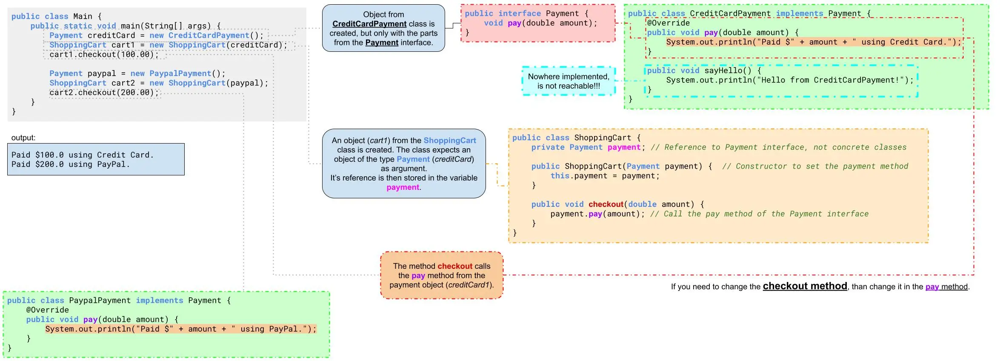

# Interfaces
It allows you to specify a set of methods that a class **MUST** implement, without dictating **how** the methods should be implemented (*if not overwrite `default`*). This provides a way to achieve abstraction, where you can separate what an object does from how it does it. Interfaces enable "multiple inheritance" and define a contract that a class must adhere to.

## 1. Basic Syntax
1. "**Define the Interface**":  
	1. "**HEAD**":
		- **without modifier** then it is only visible within the package (*but the classes which use the interface can be used outside if they are `public`*)  
		```java
		interface NAME { BODY }
		```
		- **`public`** than it can be imported into other packages.
		```java
		public interface NAME { BODY }
		```
	2. "**BODY**":
		- Contains the methods and constants, see below "method definitions".
2. "**Implement the Interface**":
	1. "**in an class**":
		- A class can have multiple interfaces, but it **MUST** implement all the interfaces methods.  
			```java
			class SomeClass implements SomeInterface, AnotherInterface { STATEMENTS;}
			```


## 2. Characteristics of Interfaces
1. **Method Definitions**:  
	- "**public and abstract**":  `interface NAME { R_TYPE M_NAME(PARA);}`  
	Originally (*until Java 8*) an interface contains **only the signature** (*+ return type*) of the method and not it's implementation, All methods in an interface are implicitly `public` and `abstract` (*the keywords are not needed*).  
		<details>
			<summary>*example*: original, **public and abstract** interface method</summary>

			- The Animal interface defines two abstract methods: `eat()` and `sleep()`.  
			```java title="define the interface 'Animal'"
			// Define an interface with abstract methods
			public interface Animal {
			    void eat();  // Abstract method (no body, implementation)
			    void sleep(); 
			}
			```
			- The `Dog` class implements the `Animal` interface and provides concrete implementations for these methods using the `@Override` annotation.
			```java title="the 'dog' class implements the 'Animal' interface"
			public class Dog implements Animal {
			    @Override  // Instructs the compiler that you intend to override a method in the superclass.
			    public void eat() {
			        System.out.println("Dog is eating.");
			    }

			    @Override
			    public void sleep() {
			        System.out.println("Dog is sleeping.");
			    }
			}
			```
		</details>
	- "**default**":  `interface NAME { default R_TYPE M_NAME(PARA){STATEMENT;}}`  
	Since Java 8, there is a `default` interface containing **signature and implementation**, which can be overwritten by the class.  
		<details>
			<summary>*example*: **default** interface method</summary>
			```java title="Animal.java"
			public interface Animal {
			    default void eat() {
					System.out.println("Is eating.");
			    }

			    default void sleep() {
					System.out.println("Is sleeping.");
			    }
			}
			```
			```java title="Dog.java"
			public class Dog implements Animal {
			    @Override  // Instructs the compiler that you intend to override a method in the superclass.
			    public void eat() {
			        System.out.println("Dog is eating.");
			    }

			    // public void sleep(); //'default' interfaces does not need to be implemented again
			}
			```
			```java title="InterfaceTest.java"
			public static void main(String[] args) {
			    Dog dachshund = new Dog();
			    dachshund.eat();   //OUTPUT: 'Dog is eating.'
			    dachshund.sleep(); //OUTPUT: 'Is sleeping.'
			}
			```
		</details>
	- "**static**": `interface NAME { static R_TYPE M_NAME(PARA){STATEMENT;}}`  
	A static method in an interface is associated with the interface itself, rather than any class implementing it. The interface has to be instantiated directly for the static method to be available and is not available with the object.
		<details>
			<summary>*example*: **static** interface method</summary>

			```java title="IFHello.java"
			public interface PrintHello {
			    static void sayHello(String name) {
			        System.out.println("Hello " + name + "!");
			    }
			}
			```
			```java title="InterfaceTest.java"
			public static void main(String[] args) {
			    PrintHello.sayHello("Zolsk");  // Calling the static method from the interface
			}
			```
			- The interface does not need to be instantiated to call the method and is only available in this form. If you would have 'implemented' the interface in an class and instantiated an object from the class, the 'static' method would not be available on the object.
		</details>
	- "**private**":  `interface NAME { private R_TYPE NAME(PARA){STATEMENT;}}`  
	Since Java 9, interfaces can have private methods which are only accessible within the interface to keep the code **dry**.  
		<details>
			<summary>*example*: **private** interface methods</summary>

			```java
			public interface Calculator {
			    default int add(int a, int b) {
					//highlight-next-line
			        log("Adding numbers");
			        return a + b;
			    }

			    default int subtract(int a, int b) {
					//highlight-next-line
			        log("Subtracting numbers");
			        return a - b;
			    }

			    // Private method, only visible and usable in the interface
				//highlight-start
			    private void log(String message) {
			        System.out.println("LOG: " + message);
			    }
				//highlight-end
			}
			```
			- In the above example, the log method is used by both add and subtract methods, but it's not visible to classes implementing the Calculator interface.
		</details>

2. **Constants**:  `interface NAME { D_TYPE NAME = VALUE;}`
	- Fields in an interface are implicitly `public`, `static`, and `final`. This means that they are constants that cannot be changed and belong to the interface itself, not to instances of classes implementing the interface.
		<details>
			<summary>*example*: **constants** interface variable</summary>

		```java
		interface ConVar {
		    public static final int CONST_1 = 1;
		    int CONST_2 = 2;                     // the same as above
		}
		```
		```java
		public class Dog implements ConVar{
		    @Override public void eat() {
		        System.out.println("Dog is eating. " + (CONST_1 + CONST_2));
		    }
		    // Constant values are available in the class in which the interface is implemented
		}
		```
		```java
		public class InterfaceTest {
		    public static void main(String[] args) {
		        Dog dachshund = new Dog();
		        dachshund.eat();                        //Output: 'Dog is eating. 3'
				//highlight-next-line
		        System.out.println(ConVar.CONST_1);     //Output: '1'
				//highlight-error-next-line
		        System.out.println(dachshund.CONST_1);  //CONSTANT is not visible
		    }
		}
		```
		</details>

## 2. Inheritance and Implementation  

### Extending Interfaces
	- An interface can **extend other interfaces** using the `extends` keyword, inheriting their methods and constants.
		<details>
			<summary>*example*: **extending** interfaces</summary>

			```java
			public interface Animal {
			    void eat();
			}

			//highlight-next-line
			public interface Mammal extends Animal {  // 'Mammal' includes 'Animal' interface
			    void run();
			}

			public class Dog implements Mammal {
			    @Override
			    public void eat() {
			        System.out.println("Dog is eating.");
			    }

			    @Override
			    public void run() {
			        System.out.println("Dog is running.");
			    }
			}
			```
		</details>

	### Multiple Interfaces
	- A class can implement **multiple interfaces**, which provides a way to achieve multiple inheritance in Java.
		<details>
			<summary>*example*: **multiple inheritance**</summary>

			```java
			public interface Flyable {
			    void fly();
			}

			public interface Swimmable {
			    void swim();
			}

			// Class implementing multiple interfaces
			public class Duck implements Flyable, Swimmable {
			    @Override
			    public void fly() {
			        System.out.println("Duck is flying.");
			    }

			    @Override
			    public void swim() {
			        System.out.println("Duck is swimming.");
			    }
			}
			```
		</details>

	### Loose Coupling
	Interfaces decouple the code, meaning that classes can interact with each other through interfaces rather than specific implementations. This makes the codebase more flexible and easier to change.  
	For example, if you want to change the implementation of a class that a method depends on, you only need to modify the class itself, not the methods using it.

	<details>
		<summary>*example*: **loose coupling**</summary>

		```java showLineNumbers
		public interface Payment {
		    void pay(double amount);
		}

		public class CreditCardPayment implements Payment {
		    @Override
		    public void pay(double amount) {
		        System.out.println("Paying with credit card: " + amount);
		    }
		}

		public class PaymentProcessor {
		    private Payment payment;

		    public PaymentProcessor(Payment payment) {
		        this.payment = payment;
		    }

		    public void processPayment(double amount) {
		        payment.pay(amount);  // Interacts through interface, not specific implementation.
		    }
		}
		```
		In the above example, the `PaymentProcessor` class does not depend on a specific type of payment method. You can pass any class implementing the Payment interface  
		(e.g., `CreditCardPayment`, `DebitCardPayment`), making it flexible and easily extendable.
	</details>

<details>
	<summary>*example*: *payment* **loose coupling**</summary>

	```java title="Main.java" showLineNumbers
	// Main.java (Testing the ShoppingCart with Different Payment Methods)
	public class Main {
	    public static void main(String[] args) {
	        Payment creditCard = new CreditCardPayment();
			//highlight-error-next-line
	        creditCard.sayHello(); // not exist, because it is not part of the Payment interface
	        ShoppingCart cart1 = new ShoppingCart(creditCard);
			//highlight-next-line
	        cart1.checkout(100.00); // Output: Paid $100.0 using Credit Card.

	        Payment paypal = new PaypalPayment();
	        ShoppingCart cart2 = new ShoppingCart(paypal);
	        cart2.checkout(200.00); // Output: Paid $200.0 using PayPal.
	    }
	}
	```
	- *line 7*:  
		If you want to change how the `checkout` method for `CreditCardPayment` works, than you only need to change "*line 4*" in the `CreditCardPayment` class.
	```java title="interface Payment"
	public interface Payment {
	    void pay(double amount);
	}
	```
	```java title="CreditCardPayment class" showLineNumbers
	public class CreditCardPayment implements Payment {
	    @Override
	    public void pay(double amount) {
			//highlight-next-line
	        System.out.println("Paid $" + amount + " using Credit Card.");
	    }

	    public void sayHello() {
	        System.out.println("Hello from CreditCardPayment!");
	    }
	}
	```
	```java title="PaypalPayment class"
	class PaypalPayment implements Payment {
	    @Override
	    public void pay(double amount) {
	        System.out.println("Paid $" + amount + " using PayPal.");
	    }
	}
	```
	```java title="ShoppingCart class"
	public class ShoppingCart {
	    private Payment payment; // Reference to Payment interface, not concrete classes

	    // Constructor to set the payment method
	    public ShoppingCart(Payment payment) {
	        this.payment = payment;
	    }

	    public void checkout(double amount) {
	        payment.pay(amount); // Call the pay method of the Payment interface
	    }
	}
	```
	
</details>
