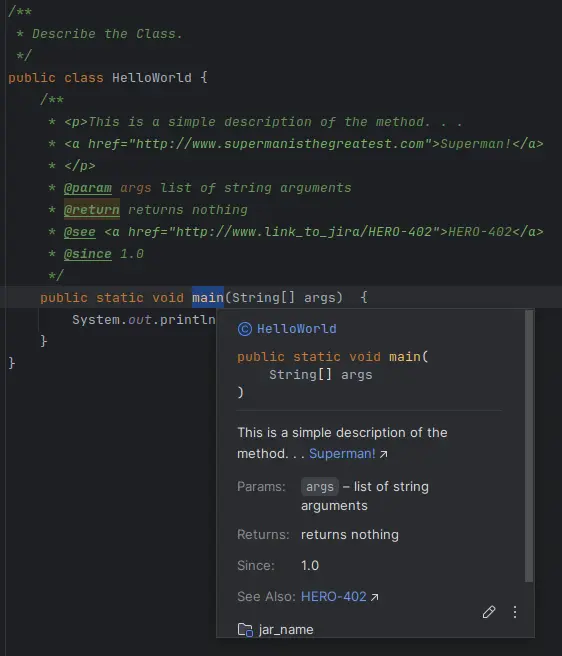

# Basic Elements

The **syntax** of a Java program defines the "**tokens**" and thus forms the vocabulary.  
However, correctly written programs do not have to be correct. We therefore use the term "**semantics**" to summarize the meaning of a "syntactically correct program". "**Semantics**" determine what the program does.  
The order of abstraction is: **lexicals** (*allowed symbols*) **syntax** and **semantics**. The compiler goes through these steps before it can generate the bytecode.

## Token
:::note
A token is a lexical unit that provides the compiler with the building blocks of the program.
:::
The compiler uses the grammar of a language to recognize which sequences of characters form a token.  
For identifiers, for example, this means: "Take the next characters as long as a letter is followed only by letters or numbers."

### Separator
:::note
Are characters or sequences of characters used to separate **tokens**, **code blocks**, or **logical segments**.
:::
Separators are essential in structuring Java code and **defining scope**, **control flow**, and **data structures**. 

|separator|explanation|
|---|---|
|Whitespace|**Spaces**, **tabs**, "**line feeds**" and "**form feeds**". These characters have no meaning except as separators. They can be used in any number and help to make the code more readable to humans.|
|Parentheses `( )`|-> **Method calls**: Enclosing arguments to be passed to methods.  -> **Control structures**: Enclosing conditions in control structures like if, while, for.  -> **Precedence grouping**: In arithmetic expressions to control order of evaluation.|
|Braces `{ }`|Define a block of code or a scope, typically: -> For method bodies, class bodies, or control structure blocks (if, for, while, etc.). -> For defining a static or instance initialization block.|
|Semicolon `;`|Marks the end of a statement. Java requires semicolons at the end of every executable statement except in control structures where blocks are used.|
|Comma `,`|Used to separate multiple items in: -> Variable declarations. -> Method arguments. -> For loop headers. `for (int i = 0, j = 10; i < j; i++, j--) {}`|
|Period (Dot) `.`|-> Accessing class members (fields and methods). -> Separating package names in fully qualified class names. -> Accessing methods of an object. -> Calling methods on object instances or classes.|
|Colon `:`|-> In enhanced for loops (for-each) to separate the variable and the collection being iterated over. -> In ternary operators as part of the conditional statement. `(a > b) ? a : b;` -> In labeled statements (though rarely used).|
|Double Colon `::` (*Method Reference Operator*)|To refer to a method or constructor without invoking it, often in the context of lambda expressions.|
|Ellipsis `...` (*Varargs*)|Used in method parameter declarations to indicate that the method accepts a variable number of arguments.|
|At symbol `@`|Used for annotations in Java. Annotations provide metadata about the code and do not directly affect program logic.|

### Identifier
:::note
Is a name used to identify variables, methods, classes, packages, or any other user-defined item.
:::

#### Rules for a Valid Identifier:
1. Must begin with a **letter** `a-z` or `A-Z`, **underscore** `_`, or **dollar sign** `$`.  
(_**NOTE**: only use letters from the english alphabet, even only the **letters** from [ISO 8859-1 (Latin-1)](https://en.wikipedia.org/wiki/Latin-1_Supplement) would be allowed._)
2. Subsequent characters can also include **digits**.
3. **No spaces** are allowed.
4. Can not be a **reserved keyword** (*like int, class, if, else, while, etc.*). **NOTE**: the single underscore `_` is a reserved keyword.
5. Identifiers are **case-sensitive**.
6. No length limit.

|valid identifier|explanation|
|---|---|
|`Mami`|Contains alphabetic characters.|
|`__RAPHAEL_IS_NICE__`|Underscore is valid.|
|`Bóolêáñ`|Contains letters from ISO 8859-1 (Latin-1).|
|`α`|Contains letters from ISO 8859-1 (Latin-1).|
|`REZE$$SION`|Doller sign is valid.|
|`¥€$`|Contains letters from ISO 8859-1 (Latin-1).|

|invalid identifier|explanation|
|---|---|
|`2plus2is4`|First character must be a letter (a-z) or underscore.|
|`get your shots`|Contains whitespace.|
|`faster!`|Most symbols are not allowed, such as the exclamation mark.|
|`null` `class`|Keywords are not allowed.|
|`_`|A single underscore is a keyword.|

#### Naming Conventions
- For **variables** and **methods**, use **camelCase** (*e.g., `myVariable`, `calculateTotal`*).
- For **class names**, use **PascalCase** (*e.g., `MyClass`, `OrderProcessor`*).
- For **constants**, use **ALL_CAPS** with underscores separating words (*e.g., `MAX_VALUE`, `PI`*).

### Literals
:::note
Are fixed values that are directly written in the code. They represent constant values that the program does not compute but directly uses as-is.
:::
Literals are classified based on the **type of value** they represent:

1. **Integer Literals**  
Represent whole numbers without any decimal points. They can be written in different **bases** ([*base converter*](https://www.rapidtables.com/convert/number/decimal-to-binary.html?x=10)):  

	|base|notation|example|
	|---|---|---|
	|**Decimal** *base 10*|Normal integer numbers|`10` // Decimal 10|
	|**Binary** *base 2*|Prefix with `0b` or `0B`|`0b1010` // Binary for 10|
	|**Octal** *base 8*|Prefix with `0` |`0123` // Octal for 83|
	|**Hexadecimal** *base 16*|Prefix with `0x` or `0X`|`0x1A` // Hexadecimal for 26`|  

	(*NOTE: in all bases the notation refers to `0` as in zero not in the character `O` .*)  
	Adding the suffix `L` or `l` changes the default type from `int` to `long`, *e.g.* `100L`, `0b1010L`.

2. **Floating-Point Literals**  
	Represent numbers with fractional parts (decimals), *e.g.* `12.567`.  
	Adding the suffix `F` or `f` changes the default type from `double` to `float`, *e.g.* `12.567F`.

:::tip exponential notation `e` or `E`
Is used to shorten floating-point literals, `e` or `E` followed by the the number of zero digits to the floating point.  
*e.g.:* `123e2` --> `12300.0` , a minus moves the floating point into the other direction `1E-2` --> `0.01`.
:::

:::tip underscore `_`
Is used to increase readability in large numbers. It can be placed between digits in integer and floating-point literals but not at the beginning, end, or next to a decimal point or suffix, *e.g.* `1234_5678_9012_3456` .
:::

3. **Character Literals**  
	Represent a single character enclosed in single quotes `' '`, *e.g.* `'A'`, `'1'`, `'@'` .  
	Some characters are **escaped** by a prefixed `\` backslash, which changes there meaning:

	|Escape Sequence|Meaning|
	|---|---|
	|`\n`|Newline|
	|`\t`|Tab|
	|`\'`|Single quote|
	|`\"`|Double quote|
	|`\\`|Backslash|

4. **String Literals**
	Represent a sequence of characters enclosed in double quotes `" "`. Strings in Java are instances of the **String class**.
	*e.g.* `"Hello, World!"`, `""` (*empty string*), `"He, \"What is up!\""` (*`"` need to be escaped `\"`*) .

5. **Boolean Literals**  
	Represent one of two values: `true` or `false`.

6. **Null Literal**  
	Represents the "**null reference**", which means a variable does not refer to any object and is used with objects.

### Comments
Are ignored (*removed from byte code*) by the compiler, but also separate the code, *e.g.:* ` 1/*2*/3` is seen by the compiler as `1` and `3` and not `13`.

1. **Single-line Comments**  
	Start with `//` and reach to the end of the line.
	Commonly used to temporary "comment out" code.

2. **Multi-line Comments**  
	Start with `/*` and end with `*/`, could be placed any where in the code, but can not be nested.  

3. **Javadoc Comments**  
	Start with `/**` and end with `*/`, generates an API documentation from the content, which can be viewed in the ide by "mouse over" the identifier of the method or class. Helps to describe what the method is doing, what argument are needed and what it returns.
	

