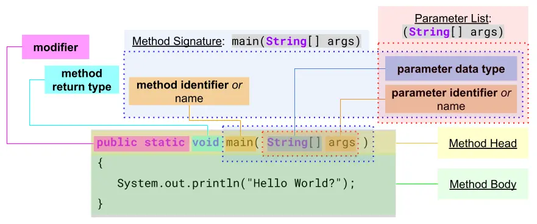
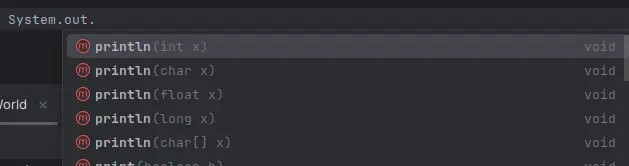
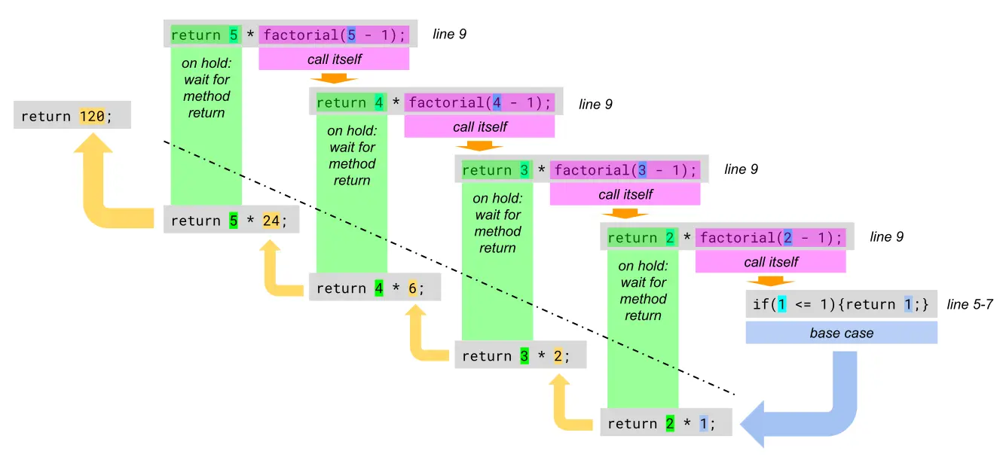

# Methods
>A method is a function that belongs to a class. A function is a reusable portion of a program, sometimes called a procedure or subroutine.

#### advantages:
1. Recurring program parts should not be programmed over and over again, but should be offered in one place. Changes to the functionality can then be made easier.
2. Complex programs are broken down into small subprograms to reduce the complexity of the program. This makes the control flow easier to understand.

## Syntax of an Method
  
1. **Method Head**:
	- "**modifier**": (*optional*)
		- **`public`** methods can be used by **everyone**.
		- **`private`** methods can only be used by the **object** itself (*to reduce complexity*).
		- **`static`** methods can be used over the "class name" without first creating the object of the method.
	- "**return type**": (*mandatory*)
		- Needs to be `void` (*is not really a data type*) if the method is not returning anything. Otherwise use the appropriated "data type" *e.g.:* `int`, `double` , ... .
	- "**Method Signature**":  
		The "method name", the "number of parameters" and the order of the "parameter data types" make up the "method signature". **The signature must be unique within a class!**  
		*e.g.:* `hello(int n, char c)` and `hello(char c, int n)` **is ok**, because the order of the "parameter data types" are different, but ...  
		*e.g.:* `hello(int n, char c)` and `hello(int x, char z)` **is not ok**, because the number and the order of the data type is the same. The "parameter names" are insignificant.
		- "**method identifier / name**": (*mandatory*)
			- Need to be in **c**amel**C**ase notation.
			- Need to start with a "character" or "underscore", but can be followed by "numbers", "no spaces" and "no keywords".
			- Could have the same name as a method from a different class, (*e.g. `println`*) but that would be "bad naming practice".
			- "Good naming practice" is to describe first the verb, "*how it is doing*", followed by the object, "what it is doing", *e.g.:* `copyFile()`.
		- "**parameter list**": (*optional*)
			- Parameter must match in number, order and data type when called.
			- Leave braces `( )` blank when declaring and calling if there are no parameters.
2. **Method Body**:
	- Statements to be executed.
	- Use the `return` keyword to mark the return value or expression if needed.

---
### Calling a "Static Method"
There is no need to create first an instance of the methods objects.

#### calling within the same class
```java title="ProgramStart.class" showLineNumbers
public class ProgramStart {                    //class of the method
    public static void hello() {               //can be declared below 'main()'
        System.out.println("Hello.");
    }
    public static void main(String[] args)  {  //starting point of the program
        hello();
    }
}
```
- *line 6*:  
	The method `hello()` is called without referencing the class, because it is declared in the same class.

#### calling from a different class
```java title="ProgramStart.class" showLineNumbers
class HelloYou {                               //declare 'HelloYou' class
    public static void hello() {               //declare 'hello' method
        System.out.println("Hello.");
    }
}
public class ProgramStart {                    //declare 'ProgramStart' class
    public static void main(String[] args)  {  //starting point of the program
        HelloYou.hello();                      //reference 'HelloYou' class
    }
}
```
- *line 1*:  
	`HelloYou` class is declared with the method `hello`. `HelloYou` could have been declared below the `ProgramStart` class.
- *line 8*:  
	The method `hello` of the class `HelloYou` is called, which needs to be referenced, because the method is from a different class then the one from where it is called.

---
### Parameters, Arguments and Parameter Values
- Parameters are placeholders (*when a method is declared*) for the values (*arguments*) when the method is called.  
- The "data type" must match between declaration and call, but in some cases the compiler may be able to "implicit cast" to the "parameter data type".
- Variables within the method are **local** which are only created when the method is called and are destroyed as soon as the method ends.  
Even if they have the same name as "outside variables", they have nothing to do with them. 
- Expressions in the "parameter list" are first evaluated, from left to right, before they are **copied** to the method, *e.g.:* `System.out.print(2 * 4);` prints `8`.
```java showLineNumbers
public class HelloWorld {
    static void printSum(double num_1, double num_2) {
        num_1 += num_2;
        System.out.println(num_1);
    }
    public static void main(String[] args)  {
        double num_1 = 2.0;
        double mum_2 = 100;                     //cast to 'double', not used
        printSum(num_1, 6);                     //output '8.0'
        System.out.println(num_1);              //output '2.0'
    }
}
```
- *line 2-5*:  
	Declaration of the `printSum()` method.
- *line 8*:  
	The literal value `100` is casted to `100.0` but the variable `num_2` has nothing to do with the parameter `num_2` of the method `printSum()`.
- *line 9*:  
	The 2nd argument, the literal value `6` (*int*) is "implicitly casted" by the compiler to an double `6.0`.
- *line 10*:  
	The "outside variable" `num_1` has not changed after its value has been passed to the method.

---
### Method Overloading
> Is a feature that allows a class to have multiple methods with the same name but different parameters. This enables methods to perform similar, yet slightly varied tasks, based on different inputs. It’s a type of polymorphism, specifically compile-time (or static) polymorphism, since the decision of which method to invoke is made at compile-time.

#### Key Points of Method Overloading
1. **Same Method Name**: All overloaded methods must have the same name.
2. **Different Parameter List**: Overloaded methods must differ in terms of:
	- Number of parameters (e.g., method(int) vs. method(int, int)).
	- Type of parameters (e.g., method(int) vs. method(double)).
	- Order of parameters (e.g., method(int, double) vs. method(double, int)).
3. **Return Type Can Be Different**: Return types can be different, but they don’t differentiate overloaded methods. The method signature (name + parameter list) is what matters for overloading.
4. **Does Not Depend on Access Modifiers**: Access modifiers (e.g., public, private) don’t affect method overloading.
5. **Cannot Overload by Changing Only Return Type**: Changing only the return type or access modifier without changing the parameter list results in a compilation error, since Java cannot distinguish between methods based solely on return type.

#### Example of Method Overloading
```java
public class MethodOverloadingExample {

    // Method 1: Adds two integers
    public int add(int a, int b) {
        return a + b;
    }

    // Method 2: Adds three integers
    public int add(int a, int b, int c) {
        return a + b + c;
    }

    // Method 3: Adds two double values
    public double add(double a, double b) {
        return a + b;
    }

    public static void main(String[] args) {
        MethodOverloadingExample example = new MethodOverloadingExample();

        // Calling different overloaded methods
        System.out.println("Sum of 2 integers: " + example.add(10, 20));           // Calls Method 1
        System.out.println("Sum of 3 integers: " + example.add(10, 20, 30));       // Calls Method 2
        System.out.println("Sum of 2 doubles: " + example.add(10.5, 20.5));        // Calls Method 3
    }
}
```
``` bash title="output"
Sum of 2 integers: 30
Sum of 3 integers: 60
Sum of 2 doubles: 31.0
```
The screen shot below shows that the method `System.out.println()` is also overloaded.


#### Benefits of Method Overloading
1. **Code Readability and Reusability**: Overloading makes it easier to read and maintain code, as you don’t need to use multiple method names for similar actions.
2. **Flexibility**: It provides flexibility by allowing methods to handle different types or numbers of inputs.
3. **Cleaner Code**: Overloading helps avoid unnecessary complexity by not having to invent different method names for similar operations.

#### Overloading with Type Promotion
When method overloading, type promotion can occur where one data type is automatically converted to another.  
*For example*, an `int` can be promoted to a `long`, `float`, or `double`.
```java
public class TypePromotionExample {

    public void show(int a) {
        System.out.println("Method with int: " + a);
    }

    public void show(double a) {
        System.out.println("Method with double: " + a);
    }

    public static void main(String[] args) {
        TypePromotionExample example = new TypePromotionExample();

        example.show(10);    // Calls method with int
        example.show(10.5);  // Calls method with double
        example.show('A');   // Calls method with int (char is promoted to int)
    }
}
```
```bash title="output"
Method with int: 10
Method with double: 10.5
Method with int: 65
```
The last method call `example.show('A')` demonstrates type promotion. The `char 'A'` is promoted to its ASCII value `65`, and the method with the `int` parameter is invoked.

#### Method Overloading vs. Method Overriding
- **Overloading** happens within the same class, while **overriding** is between a parent and child class.
- Overloading is resolved at compile-time, while overriding is resolved at runtime.
- Overloading relies on different parameter lists, while overriding requires the same method signature (name, parameters, and return type).

#### When to Use Method Overloading
Use method overloading when:
- You want a single method name to perform a similar task for different types or numbers of inputs.
- You want to improve code readability by avoiding multiple method names for similar actions.

#### Summary
Method overloading is a way to enhance code readability and organization by allowing methods to share the same name while performing slightly different tasks based on varying inputs.

---
### Scope
>In Java, scope refers to the accessibility and lifetime of variables, methods, and classes within different parts of a program. Understanding scope is crucial as it determines where a particular variable or method can be accessed and modified.

#### Types of Scope in Java
1. **Class Scope** (*Static Variables and Methods*)
2. **Instance Scope** (*Instance Variables and Methods*)
3. **Method Scope** (*Local Variables*)
4. **Block Scope** (*Variables inside loops or conditional statements*)

#### 1. Class Scope
- **Definition**: Variables and methods that are declared as static belong to the class rather than an instance of the class. They have a single copy shared among all instances.
- **Accessibility**: Can be accessed using the class name directly without creating an object.
- **Lifetime**: Exists for the lifetime of the class, as long as it is loaded in memory.
```java
public class ScopeExample {
    // Class scope variable
    public static int classVar = 10;

    public static void main(String[] args) {
        // Accessing class variable
        System.out.println(ScopeExample.classVar);
    }
}
```

#### 2. Instance Scope
- **Definition**: Variables and methods declared without the static keyword are associated with an instance of the class. These are known as instance variables or methods.
- **Accessibility**: Can be accessed only through an object of the class.
- **Lifetime**: Exists as long as the object exists in memory.
```java
public class ScopeExample {
    // Instance scope variable
    private int instanceVar = 20;

    public void display() {
        System.out.println("Instance variable: " + instanceVar);
    }

    public static void main(String[] args) {
        ScopeExample obj = new ScopeExample(); // Create an object
        obj.display(); // Access instance variable through method
    }
}
```

#### 3. Method Scope (Local Variables)
- **Definition**: Variables declared within a method (local variables) have method scope.
- **Accessibility**: Can only be accessed within the method in which they are declared.
- **Lifetime**: Exists only during the execution of the method. Once the method completes, the local variables are destroyed.
```java
public class ScopeExample {
    public void display() {
        // Method scope variable
        int localVar = 30;
        System.out.println("Local variable: " + localVar);
    }

    public static void main(String[] args) {
        ScopeExample obj = new ScopeExample();
        obj.display();
        // System.out.println(localVar); // Error: localVar not accessible here
    }
}
```

#### 4. Block Scope
- **Definition**: Variables declared inside a block of code, such as loops, if statements, or switch blocks, have block scope.
- **Accessibility**: Accessible only within the block of code in which they are declared.
- **Lifetime**: Exists only during the execution of the block.
```java
public class ScopeExample {
    public static void main(String[] args) {
        if (true) {
            // Block scope variable
            int blockVar = 40;
            System.out.println("Block variable: " + blockVar);
        }
        // System.out.println(blockVar); // Error: blockVar not accessible here
    }
}
```

#### Scope Rules in Java
1. **Inner to Outer Scope**: Variables in an inner scope (e.g., local or block) can access variables in an outer scope (e.g., instance or class scope), but not vice versa.
2. **Variable Shadowing**: If a local variable has the same name as an instance or class variable, it "shadows" the outer variable, making it inaccessible within the method or block.
```java
public class ScopeExample {
    private int var = 50; // Instance variable

    public void display() {
        int var = 100; // Local variable shadows instance variable
        System.out.println("Local variable: " + var); // Prints 100
        System.out.println("Instance variable: " + this.var); // Prints 50
    }

    public static void main(String[] args) {
        ScopeExample obj = new ScopeExample();
        obj.display();
    }
}
```
In this example, this.var is used to access the instance variable var that is shadowed by the local variable var in the display method.

#### Summary
- **Class Scope**: Variables and methods accessible through the class itself.
- **Instance Scope**: Variables and methods accessible through an object of the class.
- **Method Scope**: Local variables within a method.
- **Block Scope**: Variables defined within a block of code (loops, if statements).  

Understanding scope helps you manage the accessibility and lifespan of variables and methods, thereby improving code readability, organization, and error prevention.

---
### Recursion
>Recursion is a concept in programming where a method calls itself in order to solve a problem. It's often used when a problem can be divided into smaller, similar sub-problems.  
In Java, a "recursive function" typically has a **base case** to prevent "infinite recursion" and a **recursive case** that reduces the problem step-by-step.

#### Components of Recursion
- "**Base Case**": This is a condition that stops the recursion. Without it, the function would call itself indefinitely, leading to a stack overflow.
- "**Recursive Case**": This is the part where the function calls itself with a modified argument, moving towards the base case.

```java title="Example: Factorial Calculation" showLineNumbers
public class RecursionExample {
    // Recursive method to calculate factorial
    public static int factorial(int n) {
        // Base case: if n is 0 or 1, return 1
        if (n <= 1) {
            return 1;
        }
        // Recursive case: multiply n by factorial of (n-1)
        return n * factorial(n - 1);
    }

    public static void main(String[] args) {
        int number = 5;
        System.out.println("Factorial of " + number + " is: " + factorial(number));
    }
}
```
```bash title="output"
Factorial of 5 is: 120
```



<details>
	<summary>explanation</summary>
1. (*line 14*) The `factorial` method is called with `n = 5`.
2. (*line 5*) Since `n` is not less than or equal to `1`, it proceeds to the **recursive case**:  
	(*line 9*) `return 5 * factorial(4)`.  
3. This pattern continues, breaking the problem into smaller pieces:  
`5 * factorial(4)`  
`5 * (4 * factorial(3))`  
`5 * (4 * (3 * factorial(2)))`  
`5 * (4 * (3 * (2 * factorial(1))))`  
4. (*line 5*) Finally, when `factorial(1)` is called, the **base case** is reached, returning `1`.
5. Now, the recursive calls start returning:  
`factorial(2) = 2 * 1 = 2`  
`factorial(3) = 3 * 2 = 6`  
`factorial(4) = 4 * 6 = 24`  
`factorial(5) = 5 * 24 = 120`  
6. The final result, `120`, is printed.
</details>

#### Use Cases of Recursion
1. **Mathematical calculations** like factorials, Fibonacci series, or power calculations.
2. **Tree traversal** (*e.g.*, binary trees).
3. **Graph algorithms** like depth-first search (DFS).
4. **Divide and conquer algorithms** like merge sort and quicksort.

#### Benefits and Drawbacks
##### Benefits:
Makes code concise and easier to understand for problems that have repetitive substructure.
Avoids the need for complex loops or manual stack management.

###### Drawbacks:
Can lead to a **stack overflow** if the **base case** is not defined correctly or if the recursion is too deep.  
May be less efficient than iterative solutions due to repeated function calls and stack management.

#### Converting Recursion to Iteration
In some cases, recursion can be converted to iteration using data structures like stacks or queues, which might be more efficient for certain problems.

#### Summery
Recursion is a powerful tool in Java for solving problems that can be broken down into smaller, identical sub-problems, but it should be used carefully due to potential performance issues and risks like stack overflow.
