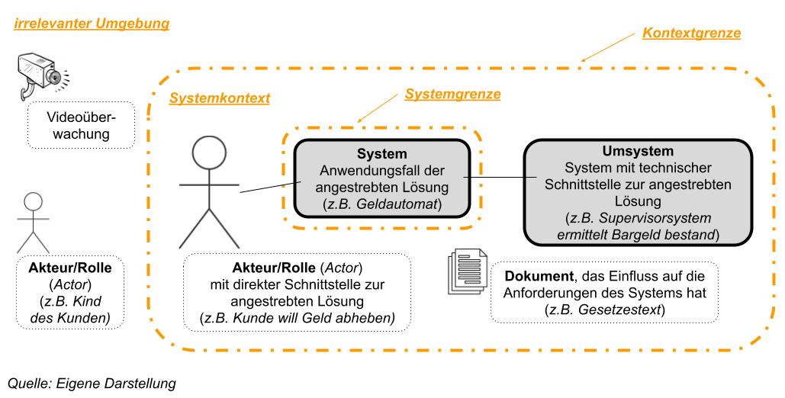
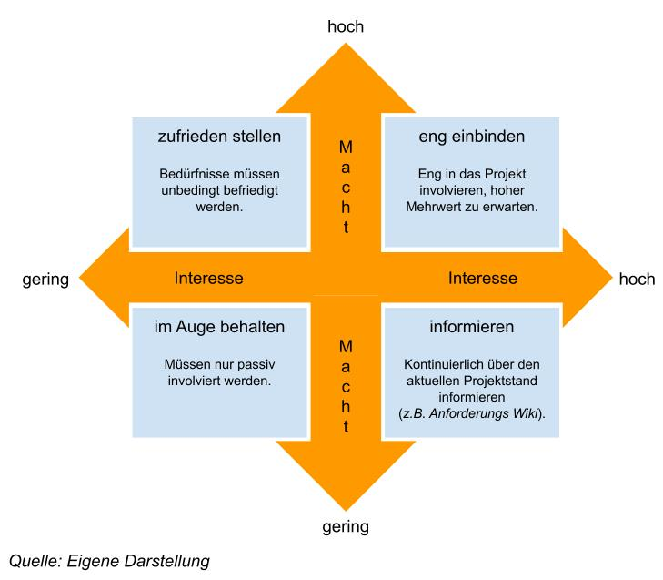

# Requirements Engineering

## L02 ERMITTLUNG VON ANFORDERUNGEN
> Die Ermittlung von Anforderungen ist die Kernaktivität im Requirements Engineering, in der die funktionalen Anforderungen, die Qualitätsanforderungen und die Randbedingungen für ein System identifiziert und bewertet werden. Das System, für das die Anforderungen erhoben werden, muss sich später in ein bestehendes Umfeld eingliedern. 

1. **Systemkontext bestimmen**:  
Es wird analysiert, welche Stakeholder und welche anderen Systeme direkte Abhängigkeiten zu dem erstellenden System haben, um eine Idee über die konkreten Quellen für Anforderungen zu bekommen.
2. **Quellen für Anforderungen ermitteln**:  
 Typische Quellen für Anforderungen sind Stakeholder, Dokumente und andere Systeme.
3. **Geeignete Ermittlungstechniken auswählen**:  
Je nach Anforderungsquelle, Projektsituation und Art der Anforderungen muss eine geeignete Ermittlungstechnik oder eine Kombination aus verschiedenen Ermittlungstechniken ausgewählt werden.
4. **Anforderungen unter Einsatz der Techniken ermitteln**:  
Aus den bestimmten Quellen mit den gewählten Ermittlungstechniken werden Anforderungen in dem für die aktuelle Situation erforderlichen Detailgrad ermittelt.

LERNZIELE

<ul>
<li>Was ein Systemkontext ist, was die Kontextgrenzen sind und wie man dies bestimmt.</li>
<li>Welche Quellen es zur Ermittlung von Anforderungen gibt.</li>
<li>Welche Kategorien es zur Einordnung von Techniken für die Ermittlung von Anforderungen gibt.</li>
<li>Was bei der Wahl geeigneter Techniken zur Anforderungsermittlung zu berücksichtigen ist.</li>
<li>Wie Anforderungen unter Einsatz der Techniken ermittelt werden können.</li>
</ul>

ZUSAMMENFASSUNG

Um Anforderungen systematisch zu ermitteln, muss der Requirements Engineer zunächst die vorläufige Systemgrenze und die Grenze zwischen der relevanten und irrelevanten Umgebung analysieren. Beide Grenzen bewegen sich in einem Korridor. Mit zunehmendem Wissen und
zunehmender Stabilität der Anforderungen wird der Korridor schmaler, bis die Grenzen schließlich fix sind. Relevante Stakeholder, Dokumente und andere Systeme werden mit dem Wissen, was Teil des Systems ist, als Quellen für Anforderungen identifiziert. In der Regel müssen mehrere Quellen untersucht werden, um eine hinreichend vollständige Menge von Anforderungen zu ermitteln.  

Für die Ermittlung der relevanten Anforderungen stehen eine Reihe von Techniken zur Verfügung, die sich in die Kategorien Befragungstechniken, Kreativitätstechniken, dokumentenzentrierte Techniken, Beobachtungstechniken und Prototyping klassifizieren lassen. Die Auswahl einer geeigneten Kombination von Ermittlungstechniken unterliegt dem Einfluss von menschlichen organisatorischen und fachlichen sowie inhaltlichen Randbedingungen. Für die Ermittlung der Anforderungen ist es wichtig, dass alle Quellen identifiziert werden und deren Verfügbarkeit rechtzeitig geplant wird.  

Außerdem ist die menschliche Wahrnehmung zu beachten. Sowohl in der Rolle des Senders als auch in der des Empfängers muss sich der Requirements Engineer darüber bewusst sein, dass das mentale Modell jedes Individuums Einfluss auf die Interpretation des Gesagten, Erlebten
oder Gelesenen hat und durch kontinuierliches Feedback Anforderungen an die Stakeholder zurückspiegelt, mit dem Ziel, zu prüfen, ob das Verstandene das Geäußerte trifft.

---
### 1. Bestimmung des Systemkontextes

#### Systemkontext:  
> Relevanter Teil der Systemumgebung, der zur Definition und zum Verständnis von Anforderungen analysiert werden muss.
- **Stakeholder**:  
	Verfolgen bestimmte Ziele und interagieren direkt mit dem System.
- **Umsysteme**:  
	Über technische Schnittstellen zu Umsystemen können die Funktionen anderer Systeme eingebunden werden (*z. B. das Prüfen von Adressdaten*).
- **Dokumente**:  
	Können Randbedingungen für die Entwicklung des Systems liefern (*z.B. Gesetze, Richtlinien*).  
	Dokumente von bereits existierenden Umsystemen (*z.B. für Schnittstellen*).
- **System- und Kontextgrenzen**:  
Können sich während des Projektverlaufs ändern.  
	- Eine Anforderung kann durch dass System selber gelöst oder durch eine technische Schnittstelle zu einem Umsystem.  
	- Durch die Hinzunahme oder den Ausschluss von Anforderungen verändern sich der funktionale Umfang des Systems und damit auch die Grenzen.
	- Häufig wird erst während des Projektverlaufs klar ob Gesetze relevant sind.
---

### 2. Bestimmung der Quellen von Anforderungen

#### Quellen von Anforderungen
- **Systemkontext**
- **Stakeholder** (*alle*) :  
	(*z.B. Auftraggeber, Benutzer, Mitarbeiter der Rechtsabteilung, Entwickler, ...*)
- **Dokumente**:  
	Unternehmensinterne Dokumente (*z.B. Leitlinien, Unternehmens- oder IT-Strategien, Nachhaltigkeitsberichten und Sicherheitskonzepten*) sowie  
	Öffentliche Dokumente (*z.B. Standards und Best-Practices-Quellen*)
- **Altsysteme**:  
	Dokumente des Altsystems.  
	Was kann verbessert oder gestrichen werden?
- **Konkurrenzsysteme**

#### Stakeholdermanagement
> Jeder Stakeholder hat einen individuellen Hintergrund, Kenntnisstand und ein individuelles Problemverständnis.
Dies führt dazu, dass auch jeder Stakeholder eine eigene Sichtweise und eigene Prioritäten hat.

#### Stakeholder-Priorisierungsmatrix
> Zunächst ist es die Aufgabe des Requirements Engineer, die relevanten Stakeholder zu identifizieren und deren Interessen und Einflüsse auf das Projekt im Detail zu analysieren. Oft geschieht das in Zusammenarbeit mit der Projektleitung. Anhand dieser Erkenntnisse werden die Stakeholder in eine Stakeholder-Priorisierungsmatrix eingetragen

#### Stakeholder Tabelle
> Ausgehend von der Stakeholder-Priorisierungsmatrix wird eine Tabelle mit weiteren Merkmalen erstellt  
(*z.B. Name, Rolle im Unternehmen, zugehörige Aufgaben*).

|Name|Rolle|Macht|Interesse|Unterstützung|Benötigte Info.|
|---|---|---|---|---|---|
|Meier|Sachbearbeiter|gering|hoch|Quelle für GUI-Anforderungen|Verbesserungsvorschläge|
|Müller|Auftraggeber|hoch|hoch|Geld|Freigabe der Anforderungen|

#### Best Practies im Umgang mit Stakeholdern
- Regelmäßige **Statusbesprechungen**:  
Stakeholder müssen über den aktuellen Stand auf dem Laufenden gehalten werden, damit sich diese einbezogen fühlen.
- **Aufmerksamkeit**:  
Anliegen von Stakeholdern müssen stets ernst genommen und durch entsprechende Reaktionen wertgeschätzt werden.
- Festlegen von **Aufgaben**, **Verantwortungsbereichen** und **Weisungsbefugnissen**:  
zur Vermeidung von Missverständnissen, fördern die Wertschätzung und vermeiden Gerangel um Kompetenz.
- **Negative** eingestellte **Stakeholder**:  
das Projekt erläutern, überzeugen und motivieren.
- **Positiv** eingestellte **Stakeholder**:  
durch aktive Einbeziehung und regelmäßige Informationsweitergabe bestärken.
---

### 3. Auswählen der geeigneten Ermittlungstechniken
> Für die Ermittlung von Anforderungen gibt es verschiedene Techniken, welche grundsätzlich immer von der spezifischen Situation und der Art der zu ermittelnden Anforderungen abhängig sind.

#### Befragungstechnik
- **Techniken**:  
Interview, Fragebogen
- **Nachteile**:  
	- Stakeholder müssen fähig und willig sein sowie genug Zeit besitzen um Anforderungen explizit zu äußern.
	- Ungeeignet für als selbstverständlich vorausgesetzte Anforderungen.
- **Vorteile**:  
	- Detailgrad der Anforderungen kann sehr hoch sein.
	- Ermittlung von **innovativen**, **explizit geforderten** und **grundlegenden Anforderungen**.

#### Kreativitätstechniken
- **Techniken**:  
verbales Brainstorming, schriftliches Brainstorming, Brainstorming paradox, Perspektivwechsel, Workshop
- **Nachteile**:  
	- Vergleichsweise hoher Aufwand.
	- Weniger detaillierte Anforderungen.
- **Vorteile**:  
	- Gemeinsame Systemvision durch kreative und kooperative Zusammenarbeit.
	- Ermittlung von **Innovativen Anforderungen**.

#### Dokumentenzentriete Technik
- **Techniken**:  
Systemarchäologie, perspektiven basiertes Lesen, Wiederverwendung
- **Vorteile**:  
	- Ermittlung basiert auf der Nutzung vorhandener Systeme oder Dokumentation.
	- Anforderungen wurden bereits in vorherigen Systemen umgesetzt.
	- Ermittlung von **grundlegenden Anforderungen**.

#### Beobachtungstechnik
- **Techniken**:  
Feldbeobachtung, Apprenticing
- **Vorteile**:
	- Durch Beobachtung von Arbeitsabläufen werden Systemfunktionalitäten abgeleitet.
	- Ermittlung von **grundlegenden Funktionalität** und für von Stakeholdern als **selbstverständlich eingeschätzten Anforderungen**. 

#### Prototyping
- **Techniken**:  
horizontal, vertikal, wegwerf, evolutionär, analog, digital
- **Vorteile**:  
	- Initiale Systemversionen werden erstellt um ein tieferes Problemverständnis und Wissen über potenzielle Lösungen zu erlangt.
	- Beschaffenheit des Prototyps (*z. B. analoge Handskizzen und digitale Prototypen*) hängt von Projektvorschriften ab.
	- Ermittlung von **innovative Anforderungen**

#### Unterstützende Techniken
- **Techniken**:  
Mindmaps, CRC-Karten, Analogietechnik, audiovisuelle Aufzeichnung, UC-Modelle

#### Einflussfaktoren auf die Wahl der Ermittlungstechniken
> Um möglichst vollständige Anforderungen zu erhalten, werden die Techniken in der Praxis häufig kombiniert (*z. B. eine Kreativitätstechnik, um Fragen für ein Interview zu erarbeiten*).  
Es müssen verschiedene Faktoren, die Einfluss auf das Projekt und die Anforderungen haben, untersucht werden, um die geeigneten Techniken auswählen zu können.

- **Menschliche Einflussfaktoren** (*soziale, gruppendynamische und kognitive Fähigkeiten der Stakeholder*):
	- Beachte ob die Anforderungen explizit geäußert oder als selbstverständlich vorausgesetzt werden.
	- Unbewusst vorliegendes Wissen wird beispielsweise besser durch eine Kreativitätstechnik als durch eine dokumentenzentrierte Technik ermittelt.
	- Grundlegende, als selbstverständlich vorausgesetzte Anforderungen lassen sich besser durch Beobachtungstechniken als durch Befragungstechniken erheben.
- **Organisatorische Einflüsse**:
	- Beispiele für organisatorische Einflüsse können die Vertragsart oder die Art des Entwicklungsprojekts sein. In einem knapp budgetierten Festpreisprojekt zur Migration eines Informationssystems werden weniger Kreativitätstechniken notwendig sein als Techniken mit denen Basisfunktionalität und explizit geforderte Anforderungen ermittelt werden können, also beispielsweise Befragungstechniken.
	- Die Räumliche und zeitliche Verfügbarkeit von Stakeholdern hat wesentlichen Einfluss auf die Wahl der Ermittlungstechnik. Sind Stakeholder zeitlich nur begrenzt verfügbar, ist eine ausführliche Befragung weniger geeignet.
- **Fachlich/inhaltliche Einflüsse**:
	- Die Komplexität eines Projekts kann beispielsweise erfordern, dass eine gut strukturierte dokumentenzentrierte Technik zum Einsatz kommt.
---

### 4. Anforderungen unter Einsatz der Techniken ermitteln
> Während der Ermittlung muss je nach Ermittlungstechnik ggf. steuernd eingreifen und durch Moderation sichergestellt werden, dass der Fokus der Anforderungserhebung nicht verloren geht. Gleichzeitig muss die eigene Wahrnehmung und die Aussagen der Stakeholder hinterfragen werden, um zu überprüfen ob die Anforderung richtig verstanden wurden.

#### Menschliche Wahrnehmung
- **Informationsaufnahme**:  
ist von der individuellen Erfahrung und kulturellen Prägung abhängig. Die gleichen Informationen werden von verschiedenen Menschen unterschiedlich wahrgenommen und interpretiert.
- **Informationswiedergabe**:  
jeder Mensch hat ein ganz persönliches inneres Modell von der realen Welt. Dieses Modell ist beeinflusst von Wissen, Erfahrung und kultureller Prägung des Einzelnen. Mentale Bilder werden in der Realität häufig stark vereinfacht vom Sender wiedergegeben und vom Empfänger auf sein individuelles mentales Modell abgebildet.

Der Grund für Missverständnisse liegt in der Interpretation des gesprochenen Wortes auf Basis der Abbildung auf das eigene mentale Modell des Empfängers. Je weniger Informationen der Sender dabei kommuniziert, desto größer ist die Wahrscheinlichkeit von Missverständnissen.  

Oft verwendete Begriffe, die für jeden Beteiligten persönlich völlig klar sind, stellen sich oft erst nach langer Diskussion als unterschiedlich heraus. Eine besonders gründliche Begriffsbildung ist daher erforderlich.
