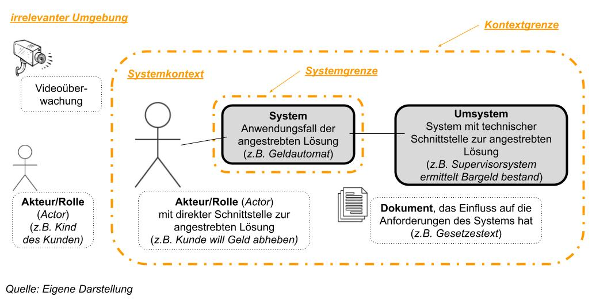
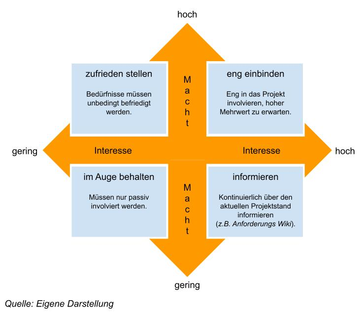

# Requirements Engineering

# L02 ERMITTLUNG VON ANFORDERUNGEN
> Die Ermittlung von Anforderungen ist die Kernaktivität im Requirements Engineering, in der die [funktionalen Anforderungen](./L01_grundlagen_begriffe_re.md#funktionale-anforderungen), die [Qualitätsanforderungen](./L01_grundlagen_begriffe_re.md#qualitätsanforderungen) und die [Randbedingungen](./L01_grundlagen_begriffe_re.md#randbedingungen) für ein System identifiziert und bewertet werden. Das System, für das die Anforderungen erhoben werden, muss sich später in ein bestehendes Umfeld eingliedern. 

##### 4 Schritte zur Ermittlung von Anforderungen
1. [**Systemkontext bestimmen**](#1-bestimmung-des-systemkontextes):  
**Was ist relevant für das System?**  
Grenzt den Bereich ab aus dem die Anforderungen später ermittelt werden.
2. [**Quellen für Anforderungen ermitteln**](#2-bestimmung-der-quellen-von-anforderungen):  
**Woher kommen die Anforderungen konkret?**  
Bestimmung der genauen Quelle für Anforderungen + Stakeholdermanagement.
3. [**Geeignete Ermittlungstechniken auswählen**](#3-auswählen-der-geeigneten-ermittlungstechniken):  
Je nach Anforderungsquelle, Projektsituation und Art der Anforderungen muss eine geeignete Ermittlungstechnik oder eine Kombination aus verschiedenen Ermittlungstechniken ausgewählt werden.
4. [**Anforderungen unter Einsatz der Techniken ermitteln**](#4-anforderungen-unter-einsatz-der-techniken-ermitteln):  
Aus den bestimmten Quellen mit den gewählten Ermittlungstechniken werden Anforderungen in dem für die aktuelle Situation erforderlichen Detailgrad ermittelt.

LERNZIELE

<ul>
<li>Was ein Systemkontext ist, was die Kontextgrenzen sind und wie man dies bestimmt.</li>
<li>Welche Quellen es zur Ermittlung von Anforderungen gibt.</li>
<li>Welche Kategorien es zur Einordnung von Techniken für die Ermittlung von Anforderungen gibt.</li>
<li>Was bei der Wahl geeigneter Techniken zur Anforderungsermittlung zu berücksichtigen ist.</li>
<li>Wie Anforderungen unter Einsatz der Techniken ermittelt werden können.</li>
</ul>

ZUSAMMENFASSUNG

Um Anforderungen systematisch zu ermitteln, muss der Requirements Engineer zunächst die vorläufige Systemgrenze und die Grenze zwischen der relevanten und irrelevanten Umgebung analysieren. Beide Grenzen bewegen sich in einem Korridor. Mit zunehmendem Wissen und
zunehmender Stabilität der Anforderungen wird der Korridor schmaler, bis die Grenzen schließlich fix sind. Relevante Stakeholder, Dokumente und andere Systeme werden mit dem Wissen, was Teil des Systems ist, als Quellen für Anforderungen identifiziert. In der Regel müssen mehrere Quellen untersucht werden, um eine hinreichend vollständige Menge von Anforderungen zu ermitteln.  

Für die Ermittlung der relevanten Anforderungen stehen eine Reihe von Techniken zur Verfügung, die sich in die Kategorien Befragungstechniken, Kreativitätstechniken, dokumentenzentrierte Techniken, Beobachtungstechniken und Prototyping klassifizieren lassen. Die Auswahl einer geeigneten Kombination von Ermittlungstechniken unterliegt dem Einfluss von menschlichen organisatorischen und fachlichen sowie inhaltlichen Randbedingungen. Für die Ermittlung der Anforderungen ist es wichtig, dass alle Quellen identifiziert werden und deren Verfügbarkeit rechtzeitig geplant wird.  

Außerdem ist die menschliche Wahrnehmung zu beachten. Sowohl in der Rolle des Senders als auch in der des Empfängers muss sich der Requirements Engineer darüber bewusst sein, dass das mentale Modell jedes Individuums Einfluss auf die Interpretation des Gesagten, Erlebten
oder Gelesenen hat und durch kontinuierliches Feedback Anforderungen an die Stakeholder zurückspiegelt, mit dem Ziel, zu prüfen, ob das Verstandene das Geäußerte trifft.

---
## 1. Bestimmung des Systemkontextes
> Bestimmung der **relevante Teil der Systemumgebung**, die zur Definition und zum Verständnis der Anforderungen nachher analysiert werden müssen.

*Zusammenhang von System, Systemkontext und irrelevanter Umgebung*

##### Zusammenhang: System - Systemkontext - irrelevanter Umgebung
- **System**: (*das zu entwickelnde oder anzupassende System*)
- **Systemkontext**:  
Alles **was Abhängigkeiten** (*Bezug*) zum entwickelnden System hat.
	- alle **Stakeholder**
	- existierende **Systeme**: (*nicht das zu entwickelnde oder anzupassende System*)  
		- **Umsysteme**:  
			Andere Systeme die durch eine technische Schnittstelle mit dem System verbunden sind (*z. B. prüfen von Adressdaten*).
		- **Altsysteme**:  
			- Analyse von Altsystems (*z.B. Nutzungsprotokolle*). Welche Stärken und Schwächen gab es? Was kann besser gemacht bzw. gestrichen werden?
		- **Konkurrenzsysteme**:  
			- Produktanalyse
	- **Dokumente**:  
		- ... die Randbedingungen liefern (*z.B. Gesetze, Richtlinien*).  
			- Unternehmensinterne Dokumente (*z.B. Leitlinien, Unternehmens- oder IT-Strategien, Nachhaltigkeitsberichten und Sicherheitskonzepten*)  
			- Öffentliche Dokumente (*z.B. Standards und Best-Practices-Quellen*)
		- ... von bereits existierenden Umsystemen (*z.B. Schnittstellen*) oder Altsystemen.
- **irrelevante Umgebung**:  
Alles was **keine Abhängigkeiten** (*Bezug*) zum entwickelnden System hat. 

##### System- und Kontextgrenze
- Können sich während der Entwicklung verschieben.
- Anforderung können entweder direkt vom System oder durch ein Umsystem gelöst werden.   
- Durch die Hinzunahme oder den Ausschluss von Anforderungen verändern sich der funktionale Umfang des Systems und damit auch die Grenzen.
- Häufig wird erst während des Projektverlaufs klar ob Gesetze relevant sind.

---
## 2. Bestimmung der Quellen von Anforderungen

### Quellen von Anforderungen
>**Identifikation der Quellen** aus dem Systemkontext: Stakeholder, Dokumente, existierende Systeme.

### Stakeholdermanagement
>Aktives Stakeholdermanagement ist ein **elementarer** Bestandteil des Requirements Engineerings. 

##### Zentrale Aufgaben:
- Identifizierung aller [**relevanten Stakeholder**](./M03_glossar.md#relevante-stakeholder).
	1. Stakeholder werden nach Interesse und Einfluss (*Macht*) auf das Projekt in die **Stakeholder-Priorisierungsmatrix** eingeordnet (*oft in Zusammenarbeit mit der Projektleitung*).
	2. Ausgehend von der Matrix und weiteren Details  
	(*z.B. benötigte Unterstützung, ggf. Projektrolle mit zugehörigen Aufgaben, vom Stakeholder benötigten Informationen*)  
	wird eine **Stakeholder-Tabelle** erstellt. Diese wird genutzt um die **Stakeholderinvolvierung** im Detail zu planen.
- Die Herstellung und Aufrechterhaltung der **Kooperationsbereitschaft** der Stakeholder.  
Ursachen für unzureichende Kooperationsbereitschaft können *z.B. Motivationsmangel, Unzufriedenheit mit dem Altsystem oder Angst vor Veränderung sein.*

##### Wichtig
- Vergessene oder fehlende Stakeholder können dazu führen, dass Anforderungen spät oder gar nicht erkannt werden.
- Anforderungen, die zu spät im Projekt erkannt werden, verursachen hohe Kosten.

*"Stakeholder-Priorisierungsmatrix"*

*"Stakeholder-Tabelle"*
|Name|Rolle|Macht|Interesse|Unterstützung|Benötigte Info.|
|---|---|---|---|---|---|
|Meier|Sachbearbeiter|gering|hoch|Quelle für GUI-Anforderungen|Verbesserungsvorschläge|
|Müller|Auftraggeber|hoch|hoch|Geld|Freigabe der Anforderungen|

#### Best Practies im Umgang mit Stakeholdern
- Regelmäßige **Statusbesprechungen**:  
Stakeholder müssen über den aktuellen Stand auf dem Laufenden gehalten werden, damit sich diese einbezogen fühlen.
- **Aufmerksamkeit**:  
Anliegen von Stakeholdern müssen stets ernst genommen und durch entsprechende Reaktionen wertgeschätzt werden.
- Festlegen von **Aufgaben**, **Verantwortungsbereichen** und **Weisungsbefugnissen**:  
zur Vermeidung von Missverständnissen, fördern die Wertschätzung und vermeiden Gerangel um Kompetenz.
- **Negative** eingestellte **Stakeholder**:  
das Projekt erläutern, überzeugen und motivieren.
- **Positiv** eingestellte **Stakeholder**:  
durch aktive Einbeziehung und regelmäßige Informationsweitergabe bestärken.
---

## 3. Auswählen der geeigneten Ermittlungstechniken
> Für die Ermittlung von Anforderungen gibt es verschiedene Techniken, welche grundsätzlich immer von der spezifischen Situation und der Art der zu ermittelnden Anforderungen abhängig sind.

|Technik |Beispiele |Vorteile |Nachteile |Geeignet für ...|
|---|---|---|---|---|
|**Befragungs-  techniken**|Interview, Fragebogen|- Sehr detaillierte Anforderungen möglich  - Verschiedene Anforderungstypen ermittelbar (*innovativ, explizit, grundlegend*)|- Stakeholder müssen Anforderungen explizit formulieren können  - Erfordert Zeit und Kooperationsbereitschaft der Stakeholder|Explizit gewünschte & detaillierte Anforderungen|
|**Kreativitäts-  techniken**|Brainstorming, Perspektivwechsel, Workshop|- Viele Ideen in kurzer Zeit  - Fördert innovative & unkonventionelle Anforderungen  - Entwicklung einer gemeinsamen Systemvision|- Weniger detaillierte Anforderungen  - Hoher Aufwand  - Ergebnisse abhängig von Gruppendynamik  - Dominante Stakeholder können Ergebnisse verfälschen|Innovative Anforderungen & erste Systemvision|
|**Beobachtungs-  techniken**|Feldbeobachtung, Apprenticing|- Erfasst implizite/unbewusste Anforderungen  - Unabhängig von der Fähigkeit, Anforderungen zu verbalisieren|- Zeitaufwändig  - Beobachter muss Ist-Zustand kritisch hinterfragen, um Soll-Situationen abzuleiten  - Risiko der subjektiven Interpretation|Grundlegende & als selbstverständlich angesehene Anforderungen|
|**Dokument-  zentrierte Techniken** |Systemarchäologie, Perspektivenbasiertes Lesen |- Wiederverwendung bereits bewährter Anforderungen  - Gut strukturiert & nachvollziehbar |- Erfordert Domänenwissen & Fähigkeit zur Interpretation von Modellen  - Gefahr, veraltete Anforderungen zu übernehmen |Grundlegende Anforderungen aus bestehenden Systemen/Dokumenten |
|**Prototyping** |Handskizzen, digitale Prototypen |- Tiefes Problemverständnis durch frühzeitiges „Anfassen"  - Ermittlung & Prüfung von Anforderungen in einem  - Liefert auch innovative Anforderungen |- Aufwändig in der Erstellung  - Grenze zwischen Ermittlung und Prüfung oft unklar  - Prototypen können falsche Erwartungen wecken |Innovative Anforderungen & Validierung von Anforderungen|

##### Unterstützende Techniken
*Z.B. Mindmaps, CRC-Karten, Analogietechnik, audiovisuelle Aufzeichnung, UC-Modelle.*

##### Wichtig
Die Techniken werden in der Praxis nicht isoliert, sondern in Kombination eingesetzt. Die Wahl der richtigen Technik hängt ab von:
- Art der Anforderungen (innovativ, explizit, grundlegend)
- Verfügbarkeit und Fähigkeiten der Stakeholder
- Organisatorischen Rahmenbedingungen (Budget, Zeit, Vertragsart)
- Komplexität des Projekts

### Einflussfaktoren auf die Wahl der Ermittlungstechniken
> Um möglichst vollständige Anforderungen zu erhalten, werden die Techniken in der Praxis häufig kombiniert (*z. B. eine Kreativitätstechnik, um Fragen für ein Interview zu erarbeiten*).  
Es müssen verschiedene Faktoren, die Einfluss auf das Projekt und die Anforderungen haben, untersucht werden, um die geeigneten Techniken auswählen zu können.

- **Menschliche Einflussfaktoren** (*soziale, gruppendynamische und kognitive Fähigkeiten der Stakeholder*):
	- Beachte ob die Anforderungen explizit geäußert oder als selbstverständlich vorausgesetzt werden.
	- Unbewusst vorliegendes Wissen wird beispielsweise besser durch eine Kreativitätstechnik als durch eine dokumentenzentrierte Technik ermittelt.
	- Grundlegende, als selbstverständlich vorausgesetzte Anforderungen lassen sich besser durch Beobachtungstechniken als durch Befragungstechniken erheben.
- **Organisatorische Einflüsse**:
	- Beispiele für organisatorische Einflüsse können die Vertragsart oder die Art des Entwicklungsprojekts sein. In einem knapp budgetierten Festpreisprojekt zur Migration eines Informationssystems werden weniger Kreativitätstechniken notwendig sein als Techniken mit denen Basisfunktionalität und explizit geforderte Anforderungen ermittelt werden können, also beispielsweise Befragungstechniken.
	- Die Räumliche und zeitliche Verfügbarkeit von Stakeholdern hat wesentlichen Einfluss auf die Wahl der Ermittlungstechnik. Sind Stakeholder zeitlich nur begrenzt verfügbar, ist eine ausführliche Befragung weniger geeignet.
- **Fachlich/inhaltliche Einflüsse**:
	- Die Komplexität eines Projekts kann beispielsweise erfordern, dass eine gut strukturierte dokumentenzentrierte Technik zum Einsatz kommt.
---

## 4. Anforderungen unter Einsatz der Techniken ermitteln
> Während der Ermittlung muss je nach Ermittlungstechnik ggf. steuernd eingreifen und durch Moderation sichergestellt werden, dass der Fokus der Anforderungserhebung nicht verloren geht. Gleichzeitig muss die eigene Wahrnehmung und die Aussagen der Stakeholder hinterfragen werden, um zu überprüfen ob die Anforderung richtig verstanden wurden.

### Menschliche Wahrnehmung
- **Informationsaufnahme**:  
ist von der individuellen Erfahrung und kulturellen Prägung abhängig. Die gleichen Informationen werden von verschiedenen Menschen unterschiedlich wahrgenommen und interpretiert.
- **Informationswiedergabe**:  
jeder Mensch hat ein ganz persönliches inneres Modell von der realen Welt. Dieses Modell ist beeinflusst von Wissen, Erfahrung und kultureller Prägung des Einzelnen. Mentale Bilder werden in der Realität häufig stark vereinfacht vom Sender wiedergegeben und vom Empfänger auf sein individuelles mentales Modell abgebildet.

Der Grund für Missverständnisse liegt in der Interpretation des gesprochenen Wortes auf Basis der Abbildung auf das eigene mentale Modell des Empfängers. Je weniger Informationen der Sender dabei kommuniziert, desto größer ist die Wahrscheinlichkeit von Missverständnissen.  

Oft verwendete Begriffe, die für jeden Beteiligten persönlich völlig klar sind, stellen sich oft erst nach langer Diskussion als unterschiedlich heraus. Eine besonders gründliche Begriffsbildung ist daher erforderlich.
