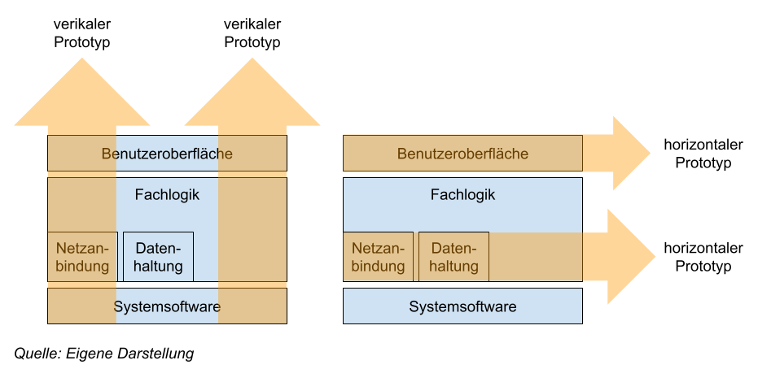

# Requirements Engineering
# L03 Ausgewählte Ermittlungstechniken

LERNZIELE

	<ul>
		<li>Welche konkreten Techniken zu welcher Technikkategorie gehören.</li>
		<li>Wie die vorgestellten Techniken eingesetzt werden.</li>
		<li>Welche Einsatzszenarien sich für welche Technik eignen.</li>
		<li>Welche Stärken und Schwächen die vorgestellten Techniken haben.</li>
		<li>Welcher Aufwand mit dem Einsatz jeder Technik verbunden ist.</li>
	</ul>

ZUSAMMENFASSUNG

Kreativitätstechniken eignen sich zur Entwicklung innovativer Anforderungen oder einer ersten Vision des zu entwickelnden Systems. Der Perspektivwechsel ist eine Kreativitätstechnik, die dazu dient, ein Problem aus verschiedenen Blickwinkeln zu betrachten. Das verbale Brainstorming wird mit einer Gruppe von fünf bis zehn Personen durchgeführt und dient der ersten Sammlung von Ideen. Die Variante des schriftlichen Brainstormings mit User Stories ermöglicht es, in Ruhe Ideen zu sammeln und diese zu notieren. In einem Workshop kommen verschiedene Interessenvertreter von Stakeholdergruppen zusammen, um gemeinsam an der Ermittlung von Anforderungen zu arbeiten.

Die Befragungstechniken setzen voraus, dass die befragten Stakeholder auf der einen Seite fähig sind, Anforderungen explizit zu äußern, und auf der anderen Seite über die notwendige Zeit verfügen und den Willen zur Befragung haben. Mit Befragungstechniken lassen sich sowohl innovative als auch explizit geforderte und grundlegende Anforderungen ermitteln. Das Interview ist eine vom Requirements Engineer aktiv gesteuerte Befragungstechnik, die es ermöglicht, sehr detaillierte Anforderungen zu ermitteln. Fragebögen eignen sich, um eine große Anzahl von Stakeholdern zu befragen.

Die Beobachtungstechniken eignen sich besonders für die Gewinnung grundlegender Funktionalität, da der Requirements Engineer Arbeitsabläufe beobachtet und dokumentiert, um daraus Systemfunktionalität abzuleiten. In einer Feldbeobachtung ist der Requirements Engineer vor
Ort und beobachtet unmittelbar die stattfindenden Geschäftsprozesse. Das Apprenticing ist eine weitere Beobachtungstechnik, die sich von der Feldbeobachtung durch die Tatsache unterscheidet, dass der Requirements Engineer nicht nur Abläufe beobachtet, sondern diese auch ausführt.

Mit Prototyping können innovative Anforderungen gewonnen werden, indem initiale Systemversionen (sogenannte Prototypen) erstellt werden und so ein tieferes Problemverständnis und Wissen über potenzielle Lösungen erlangt wird. Prototypen können je nach Projektfortschritt unterschiedlich beschaffen sein (z. B. analoge Handskizzen und digitale Prototypen). Je weiter ein Projekt fortgeschritten ist, desto eher werden digitale Prototypen erzeugt. Horizontale GUI-Prototypen können als Hilfsmittel zur Abbildung von Dialogflüssen und zum Erwartungsmanagement genutzt werden. Ein vertikaler Prototyp implementiert ausgewählte Teile des Zielsystems vollständig durch alle Schichten hindurch. Diese Technik ist dort geeignet, wo Funktionalitäts- und Implementierungsoptionen noch offen sind.

---
## 1. Kreativitätstechniken
- geeignet:
	- zur Entwicklung innovativer Anforderungen
	- einer ersten Vision des zu entwickelnden Systems
- ungeeignet:
	- um detaillierte Anforderungen an das Systemverhalten zu ermitteln

### Perspektivwechsel
> Dient dazu, ein Problem aus verschiedenen Blickwinkeln zu betrachten. Die beteiligten Personen denken und argumentieren dabei aus der Perspektive einer ganz bestimmten Rolle, beispielsweise des Nutzers, des Testers oder eines Kunden. Auf diese Weise können bei der Ermittlung von Anforderungen Perspektiven von Stakeholdern berücksichtigt werden, deren direkte Einbeziehung nicht möglich ist.

<dl>
	<dt>Einsatzszenarien</dt>
	<dd>- wenn ein Gesamtüberblick über das Projekt gewonnen werden soll</dd>
	<dd>- wenn festgefahrene Meinungen aufgebrochen werden sollen</dd>
	<dt>Stärken</dt>
	<dd>- umfassende Betrachtung aus den Perspektiven</dd>
	<dt>Schwächen</dt>
	<dd>- für begrenzte Teilnehmerzahl anwendbar</dd>
	<dd>- problematisch bei konservativen und introvertierten Stakeholdern</dd>
</dl>

#### die Methode des Sechs-Hut-Denkens (*von Edward de Bono*)
> jeder Hut stellt einen Blickwinkel auf ein Problem dar. Den Teilnehmern bei der Anwendung dieser Methode werden symbolisch unterschiedlich farbige Hüte aufgesetzt, die die Perspektive, aus der der Stakeholder das Problem betrachten wird.

|Hutfarbe|steht für ...|Stakeholder|
|---|---|---|
|weiß|Objektivität und Neutralität|achtet vor allem auf Zahlen und Fakten|
|rot|subjektive Meinung und persönliche Empfindungen|äußert seine Gefühle, Ängste und Hoffnungen|
|schwarze| - |objektiv, aber negativ Argumentation|
|gelb| - |objektiv, jedoch positiv Argumentation|
|grün|Kreativität|bringt neue ideen ein|
|blau|Kontrolle und Organisation des Denkprozesses|Die Person moderiert und koordiniert den Prozess der Ideenfindung.|

#### Ablauf:
- Auch diese Perspektive wird von unterschiedlichen Stakeholdern eingenommen und nicht nur vom RE, der typischerweise moderiert.
- Stakeholder, die besonders überzeugt von ihrer Sichtweise sind, werden durch einen Perspektivwechsel animiert, neue Sichten anzunehmen. Daher eignet sich die Methode auch besonders um eingeengte Sichtweisen und Formulierungen zu lösen.
- Um existierende Lösungsansätze von verschiedenen Seiten zu betrachten.
- Die Anforderungssammlung ist mit einem hohem Detaillierungsgrad sehr aufwendig.
- Für introvertierte und konservative Stakeholder kann die Methode abgehoben wirken. Der RE muss behutsam vorgehen, damit die Kooperationsbereitschaft der Stakeholder nicht vermindert werden.

### Verbales Brainstorming
> Die Gruppe, sammelt in einer vorgegebenen Zeit und zu einem vorgegebenen Thema Ideen. Die Stakeholder äußern ihre Ideen und nutzen die Ideen der anderen Stakeholder als Inspiration für weitere Ideen. Brainstorming ist besonders erfolgreich, wenn die Teilnehmer möglichst heterogen ausgewählt wurden und durch Einflüsse aus anderen Domänen angeregt werden.

<dl>
	<dt>Einsatzszenarien</dt>
	<dd>- wenn innovative Anforderungen gewonnen werden sollen</dd>
	<dd>- wenn Stakeholder heterogen zusammengesetzt sind</dd>
	<dd>- wenn eine Vision entstehen soll</dd>
	<dt>Stärken</dt>
	<dd>- Ermittlung innovativer Anforderungen in relative kurzer Zeit möglich</dd>
	<dd>- Stakeholder müssen nicht vor Ort sein (durch elektronische Kollaborationswerkzeuge)</dd>
	<dt>Schwächen</dt>
	<dd>- für maximal 8–10 Teilnehmer anwendbar</dd>
	<dd>- nur schlechte oder wenige Ergebnisse bei gruppendynamische Effekten, dominierenden Stakeholdern oder Hierarchiekonflikten</dd>
	<dd>- herausfordernd für RE alle Informationen zeitgleich zu notieren ohne ideen zu vergessen oder den Kreativitätsprozess zu hemmen.</dd>
</dl>

#### Ablauf:
- Der Requirements Engineer notiert alle Ideen, ohne diese zu bewerten, und achtet darauf, dass alle Stakeholder die Ideen der anderen zulassen, egal wie absurd diese auch sein mögen.
- Während der Sammlung darf keinerlei Bewertung oder Kritik geäußert werden, da dies den kreativen Prozess hemmt und Stakeholder unter Umständen demotiviert werden.
- Nach der Sammlung werden die Ideen analysiert und aggregiert, doppelte Ideen werden eliminiert, und es besteht die Möglichkeit, die Ideen zu klassifizieren.

#### Tip:
- Elektronische Kollaborationswerkzeuge zum sammeln von Ideen einsetzen. Die Stakeholder notieren ihre Ideen (*z. B. auf einem Tablet*), jede Idee wird an einen Server gesendet und unmittelbar für alle Stakeholder angezeigt (*z. B. über einen Beamer*).
- Entlastet den RE: muss Ideen nicht notiren, kein vergessen und ungehemmter Kreativitätsprozess.
- Die Ideensammlung kann auch anonym durchgeführt werden, indem Stakeholder ihre Ideen nur sammeln und notieren, jedoch nicht laut äußern. Die Anonymität hilft, negative Gruppendynamik und Hierarchiekonflikte zu verhindern. Nachteil kann sein, dass die eigene Kreativität nicht durch geäußerte Ideen der anderen Stakeholder angeregt wird.

### Schriftliches Brainstorming mit User Stories
> User Stories sind funktionale Anforderungen, die aus Sicht eines Benutzers formuliert werden. Eine User Story wird immer nach einem bestimmten Schema formuliert.

|Rolle|*Fülltext*|bestimmtes Ziel|*Fülltext*|Begründung|
|---|---|---|---|---|
|**&lt;Benutzerrolle>**|*, möchte ich*|**&lt;ein bestimmtes Ziel erreichen (funktionale Anforderung)>**|*, um*|**&lt;Begründung, warum das Ziel erreicht werden soll>**|
|**Als Kunde**|*möchte ich*|**meine Verträge online verwalten können**|*, damit*|**ich auch außerhalb der Geschäftszeiten Änderungen an meinen Verträgen vornehmen kann.**|

<dl>
	<dt>Einsatzszenarien</dt>
	<dd>- wenn innovative Anforderungen gewonnen werden sollen</dd>
	<dd>- wenn Stakeholder heterogen zusammengesetzt sind</dd>
	<dd>- wenn negative gruppendynamische Effekte zu erwarten sind</dd>
	<dt>Stärken</dt>
	<dd>- Ermittlung innovativer Anforderungen möglich</dd>
	<dd>- Ideen können nicht aus Versehen in der Diskussion untergehen.</dd>
	<dd>- Der Requirements Engineer muss die Ideen nicht protokollieren.</dd>
	<dd>- kann negative Gruppendynamik und Hierarchiekonflikte verhindern</dd>
	<dt>Schwächen</dt>
	<dd>- für begrenzte Teilnehmerzahl anwendbar</dd>
	<dd>- Die Spontaneität und Inspiration der eigenen Kreativität durch Ideen anderer geht verloren, wenn nur eine Iteration durchgeführt wird.</dd>
</dl>

#### Ablauf:
- Zunächst muss der RE das Konzept der User Stories und deren Schema kurz erläutern, dann erhalten die Stakeholder Karteikarten und werden aufgefordert, Ideen für funktionale Anforderungen aus einer bestimmten Perspektive zu sammeln.
- Man sollte die Stakeholder bei der ersten Ideensammlung aus beliebigen Perspektiven und ohne Begründung sammeln lassen, um den Kreativitätsprozess nicht zu behindern.
- Die Stakeholder notieren ihre funktionalen Anforderungen auf den Karteikarten und heften diese nach Beendigung der Sammlungsphase an eine Pinnwand.
- Wenn die Sammlung nicht anonym geschieht, empfiehlt es sich, die Stakeholder ihre jeweiligen Anforderungen vorstellen zu lassen und an dieser Stelle auch eine fachliche Begründung für die Anforderung zu verlangen. Wird eine plausible Begründung geliefert, notiert der Stakeholder diese auf der Karteikarte, fällt die Formulierung einer Begründung schwer oder wird keine Begründung geliefert, muss diese noch einmal überarbeitet werden. Gegebenenfalls ist die Anforderung dann nicht so wichtig und kann zurückgestellt oder eliminiert werden.
- Falls die Sammlung anonym durchgeführt wird, muss nach der Sammlungsphase Zeit zum Notieren der Begründung gegeben werden. Dies hilft den Stakeholdern auch, die formulierten Anforderungen nochmals auf den Prüfstand zu stellen.
- Nachdem die Anforderungen gesammelt wurden, müssen doppelte Anforderungen aussortiert werden. Darüber hinaus besteht die Möglichkeit, die Anforderungen nach Themen (z. B. Benutzerverwaltung) zu gruppieren.
- Dieses Vorgehen wird so lange wiederholt, bis die Stakeholder keine neuen Ideen mehr haben.

#### Tip:
- Um mehr Ideen zu produzieren, kann die Methode Perspektivenwechsel mit der User-Story-Technik kombiniert werden. Das ist insbesondere dann sinnvoll, wenn wichtige Stakeholdergruppen nicht direkt verfügbar sind.
- In der Praxis hat es sich bewährt, User Stories mit einem dicken Stift auf eine Karteikarte zu schreiben. Durch den begrenzten Platz werden Stakeholder angeregt, präzise zu formulieren, und im Anschluss lassen sich Karten leicht sortieren und gruppieren sowie doppelte Ideen eliminieren.

### Workshop
> Verschiedene Interessenvertreter von Stakeholdergruppen kommen zusammen, um gemeinsam an der Ermittlung von Anforderungen zu arbeiten. Diese Vertreter müssen mit dem nötigen Fachwissen und der nötigen Entscheidungskompetenz ausgestattet sein, damit als Resultat des Workshops abgestimmte Anforderungen gewonnen werden. Dabei sind die räumliche Nähe und der direkte Austausch untereinander ein ideales Mittel, um in Konflikt zueinander stehende Anforderungen zu identifizieren und durch Auflösung der Konflikte bereits abgestimmte Anforderungen zu erhalten. Die Abstimmung mit allen Stakeholdern würde alternativ erst in einem gesonderten, nachgelagerten Schritt geschehen. Häufig gewinnt in solchen Workshops derjenige Interessenvertreter, dessen Gruppe die größte Macht besitzt (*z. B. die Gruppe mit Budgetverantwortung*).

<dl>
	<dt>Einsatzszenarien</dt>
	<dd>- zur Klärung offener Fragen</dd>
	<dd>- Ermittlung abgestimmter und geordneter Anforderungen</dd>
	<dt>Stärken</dt>
	<dd>- Konflikte werden direkt offensichtlich</dd>
	<dd>- abgestimmte Anforderungen</dd>
	<dt>Schwächen</dt>
	<dd>- Gruppendynamische Effekte können auftreten</dd>
	<dd>- räumliche Zusammenarbeit notwendig</dd>
</dl>

#### Workshop Phasen:
- **Vorbereitung**:
	- RE definiert die Ziele und Regeln des Workshops.
	- Auf Basis der Ziele werden die zu erreichenden Arbeitsergebnisse festgelegt und ein Vorgehen zur Zielerreichung definiert (*z. B. eine Kombination der zuvor beschriebenen Techniken*).
	- Daraufhin wird der Ort, die Zeit und die Dauer des Workshops definiert und ein entsprechender Raum mit notwendigem Material (*z. B. Beamer, Whiteboard, Flipchart*) gebucht.
	- Der RE wählt die beteiligten Stakeholder aus, lädt diese ein und stimmt die Workshopziele mit ihnen ab. Daraufhin vergibt der RE die Rolle des Protokollanten.
- **Durchführung**:
	- RE erläutert den Stakeholdern die Ziele, die zu erreichenden Arbeitsergebnisse und das Vorgehen.
	- Die anzuwendenden Techniken (*z. B. schriftliches Brainstorming und Perspektivwechsel*) werden vorgestellt und Regeln für den Workshop festgelegt (*z.B. keine Kritik bei Ideenfindung; ausreden lassen*).
	- Im Arbeitsteil moderiert der RE und der Protokollant dokumentiert die Arbeitsergebnisse.
	- Anforderungen werden häufig ...
		- **nach Relevanz geordnet**: die Gruppe entscheidet gemeinsam: Was ist kritisch? Was ist nice-to-have? Die Anforderungen bekommen eine Priorität.
		- **inhaltlich konsolidiert**: verschiedene Stakeholder haben oft ähnliche oder doppelte Ideen eingebracht. Diese werden zusammengeführt.
		- **konkretisiert**: Ideen sind noch vage, z. B. „Das System soll schnell sein." Im Workshop wird dann gemeinsam präzisiert: Wie schnell genau? 1 Sekunde? 500 ms?
	- Die Durchführung wird mit einer Sammlung offener Fragen und einer Retrospektive des Workshops abgeschlossen.
- **Nachbereitung**:
	- Dient der Aufarbeitung der Arbeitsergebnisse durch den RE und die anschließende Genehmigung durch alle beteiligten Stakeholder.
---

## 2. Befragungstechniken
- **Voraussetzung**:
	- befragte Stakeholder sind fähig, Anforderungen explizit zu äußern, verfügen über die notwendige Zeit und haben den Willen zur Befragung.
- **geeignet**:
	- zur Ermittlung von innovativen, expliziten, grundlegenden und sehr detaillierten Anforderungen.

### Interview
> Das Interview ist eine vom Requirements Engineer aktiv gesteuerte Befragungstechnik, die
es ermöglicht, sehr detaillierte Anforderungen zu ermitteln.

<dl>
	<dt>Einsatzszenarien</dt>
	<dd>- wenn die Anzahl der zu befragenden Stakeholder begrenzt ist</dd>
	<dd>- wenn sehr detaillierte und unbewusste Anforderungen ermittelt werden müssen</dd>
	<dt>Stärken</dt>
	<dd>- Ermittlung detaillierter Anforderungen möglich</dd>
	<dd>- Möglichkeit der expliziten Steuerung durch den RE (gezieltes Nachfragen)</dd>
	<dt>Schwächen</dt>
	<dd>- aufwändig und nur für begrenzte Teilnehmerzahl anwendbar</dd>
	<dd>- Stakeholder müssen vor Ort sein</dd>
</dl>

#### Phase: Vorbereitung
- Um ein Interview durchzuführen, muss der RE die Fachsprache (*Terminologie*) der Befragten kennen und diese nutzen.
- **vorbereitenden Aktivitäten**:  
	die explizite Definition des Interviewziels, die Auswahl und Einladung der Teilnehmer sowie die Festlegung des Intervieworts und die konkrete Gestaltung der Interviewfragen.
- **Offene Fragen:**  
lassen den Befragten Freiraum bei der Beantwortung, sind aber aufwendiger auszuwerten.
- **Geschlossene Fragen**:  
	- **direkte Fragen**: (*z. B. „Muss das Antragssystem Drag-and-drop unterstützen?“*)
	- **Feststellungen**: (*z. B. „Das Antragssystem sollte Drag-and-drop unterstützen!“*)
	- Können mit ja/nein oder Ratingskalen (*z. B.stimme zu, neutral, stimme nicht zu*) beantwortet werden.
	- Eine ungerade Antwortskala bietet die Möglichkeit auf eine neutrale Antwort, während eine gerade Antwortskala eine Tendenz der Zustimmung oder Ablehnung abfragt.

#### Phase: Durchführung
1. Vorstellung des Fragenden und Dank an den Befragte.
2. Eventuelle Einstiegsfrage zur Auflockerung.
3. Fragen stellen, Antworten protokollieren und dem Befragten Rückmeldung geben.
	- Erläuterung des Ziels
	- Klärung mit Befragten ob fragen durch Protokollant protokolliert oder Gespräch aufgenommen werden soll.
	-  RE gibt Befragten Rückmeldung auf seine Antworten, um Verständnis zu prüfen. Eventuell können vertiefende, weiterführende Fragen gestellt werden. Nach jeder Antwort sollte eine kleine Pause folgen um den Befragten die Möglichkeit zu geben, das gesagte zu reflektieren.
4. Zusammenfassung der Ergebnisse und erneuter Dank an Befragten

#### Phase: Nachbereitung
- das Protokoll wird aufbereitet und zur Bestätigung der Ergebnisse an den jeweiligen Befragten gesendet.  
  

<dl>
	<dt>standardisiertes Interview:</dt>
	<dd>Es wird auf ein konkretes Ziel hingearbeitet, die Fragen sind entsprechend vorbereitet.</dd>
	<dt>explorativen Interview:</dt>
	<dd>Folgt keiner strukturierten Befragung, sondern lassen dem Befragten die Chance, sein Meinungsbild abzugeben.</dd>
</dl>

### Fragebogen
> Ist keine Vollbefragung möglich, muss eine Stichprobe, aus einer repräsentative Menge der Stakeholder ausgewählt werden. Fragen müssen sorgfältig formuliert, detailliert und priorisiert werden um einen Abbruch durch die Befragten zu vermeiden. Kreativitätstechniken (*z.B. Workshop*) können helfen Gute Fragen zu gewinnen. Digitale Fragebögen können in Textverarbeitungsprogrammen oder Tools (*z. B. SurveyMonkey*) erstellt, durchgeführt und eventuell ausgewertet werden.

<dl>
	<dt>Einsatzszenarien</dt>
	<dd>- wenn viele Stakeholder befragt werden müssen</dd>
	<dd>- wenn Stakeholder räumlich nicht greifbar sind</dd>
	<dt>Stärken</dt>
	<dd>- Befragung vieler Stakeholder möglich</dd>
	<dd>- einfache Auswertung digitaler Fragebögen mit geschlossenen Antworten</dd>
	<dd>- Stakeholder müssen nicht vor Ort sein.</dd>
	<dt>Schwächen</dt>
	<dd>- Implizites Wissen ist schlecht erfragbar.</dd>
	<dd>- Der RE hat keinen Einfluss auf die Befragung und kann keine Verständnisfragen klären oder selbst nachfragen.</dd>
</dl>

---

## 3. Beobachtungstechniken
> Eignen sich wenn die Fachexperten keine Zeit haben oder nicht in der Lage sind, Anforderungen explizit zu äußern, z. B. weil diese als selbstverständlich vorausgesetzt werden. Der RE beobachtet Arbeitsabläufe, dokumentiert diese unter Berücksichtigung von Fehlern, Risiken und offenen Fragen und leitet daraus potenzielle Anforderungen an das System ab. Er muss die beobachteten Abläufe kritisch hinterfragen, um Soll-Situationen zu produzieren und Schwachstellen in Arbeitsabläufen und im ggf. schon bestehenden System offenzulegen.

### Feldbeobachtung
> RE ist vor Ort und beobachtet unmittelbar die stattfindenden Geschäftsprozesse. Er erfasst die Aktivitäten und deren zeitliche Reihenfolge, um daraus die Arbeitsabläufe zu ermitteln. Dabei muss der Beobachter nicht nur passiv beobachten, sondern kann aktiv nachfragen und sich Arbeitsabläufe erläutern lassen. Der RE muss vorher das Arbeitsumfeld der Stakeholder grundlegend verstehen und sich ein Bild davon machen, was die Stakeholder eigentlich tun.

<dl>
	<dt>Einsatzszenarien</dt>
	<dd>- wenn Abläufe schwer vermittelbar sind</dd>
	<dd>- wenn unbewusste, als selbstverständlich vorausgesetzte Anforderungen ermittelt werden sollen</dd>
	<dt>Stärken</dt>
	<dd>- Ermittlung unbewusster Anforderungen</dd>
	<dd>- ist auch umsetzbar, wenn Stakeholder zeitlich schlecht verfügbar sind</dd>
	<dd>- Feststellung von Abweichungen in Prozessen möglich</dd>
	<dt>Schwächen</dt>
	<dd>- Abläufe müssen beobachtbar sein.</dd>
	<dd>- Der Requirements Engineer kann als Aufpasser wahrgenommen werden, was das Verhalten der Leute und damit die Anforderungen beeinflusst.</dd>
</dl>

#### Tip:
- Das kritische Hinterfragen aller Abläufe, um Optimierungspotenzial zu identifizieren. Festgefahrene und verbesserungswürdige Prozesse sollten nicht eins zu eins in das neue System übernommen werden.
- Der RE kann die Feldbeobachtung durch Audio- und Videoaufzeichnungen unterstützen, muss in diesem Fall jedoch vorab das Einverständnis der Beobachteten einholen.

### Apprenticing
> Wie die Feldbeobachtung, jedoch erlernt und führt der RE die Tätigkeiten zusätzlich zur Beobachtung auch aus. Dies bietet ihm als Lehrling die Möglichkeit, unklare bzw. unverständliche
Aktionen und Abläufe direkt zu hinterfragen. Stakeholder fühlen sich nicht mehr kontrolliert sondern in einer erhabenen Position, da sie ihr Wissen weitergeben dürfen.

<dl>
	<dt>Einsatzszenarien</dt>
	<dd>- wenn Abläufe schwer vermittelbar sind</dd>
	<dd>- wenn unbewusste, als selbstverständlich vorausgesetzte Anforderungen ermittelt werden sollen</dd>
	<dt>Stärken</dt>
	<dd>- Ermittlung unbewusster Anforderungen</dd>
	<dd>- Ermittlung schwer in Worte zu fassender Anforderungen</dd>
	<dd>- „Lernender“ statt „Beobachteter“ zu sein fördert die Kooperationsbereitschaft der Stakeholder.</dd>
	<dd>- Unwissen zu zeigen kann in schwierigen Situationen den Stakeholdern die Angst nehmen, dies auch zu tun.</dd>
	<dt>Schwächen</dt>
	<dd>- nicht in jedem Betätigungsfeld anwendbar(z.B. sicherheitskritische Arbeitsumfeld)</dd>
	<dd>- erlernen verschiedenster Tätigkeiten ist sehr aufwendig</dd>
	<dd>- Menge der Stakeholder ist nicht klar begrenzt.</dd>
</dl>

---

## 4. Prototyping
> Ist eine initiale Version eines Softwaresystems, mit der Konzepte demonstriert oder Entwürfe erprobt werden können, um generell mehr über das Problem und dessen möglichen Lösungen zu erfahren. Durch die Erstellung und der Kommunikation von Prototypen wird ein tieferes Problemverständnis erlangt, auf dessen Basis Anforderungen ermittelt werden.

#### Kriterien unterschiedlicher Prototypen
- **Beschaffenheit**:  
 gibt an, ob es sich um **analoge Prototypen** oder **digitale Prototypen** handelt.
- **Beständigkeit** bzw. **Verwendungszweck**:  
	- **Wegwerfprototypen**, werden nach dem vorgesehenen Gebrauch nicht weiter entwickelt.  
	- **evolutionär Prototypen** und **inkrementelle Prototypen**, werden zum Endprodukt weiterentwickelt.
- dem Grad der **umgesetzten Funktionalität**:  
	- **Horizontale Prototypen**, setzen eine Schicht der Softwarearchitektur um (*z. B. die Datenhaltungsschicht*). Die relevanten Bestandteile dieser Schicht werden implementiert, die anderen Schichten werden nicht implementiert.
	- **vertikale Prototyp** (*auch Durchstichprototyp*):  
	setzt eine Funktionalität oder ein Feature um, jedoch über alle Schichten der softwarearchitektur hinweg.
	
- Prototypen können kombiniert werden, einige schließen sich jedoch aus. Analoge Prototypen können nicht vertikal „implementiert“ werden und sich auch nicht evolutionär und inkrementell zum Endprodukt weiterentwickeln.

### Horizontale GUI-Prototypen
> Können als Hilfsmittel zur Abbildung von Dialogflüssen und zum Erwartungsmanagement genutzt werden. Je nach Projektphase werden entweder analoge Handskizzen oder digital implementierte Prototypen eingesetzt.

#### Handskizze
> Zu Beginn eines Projekts wird eine Handskizze verwendet um schnell erste Konzepte zur Umsetzung einer grafischen Oberfläche zu visualisieren. Vorteil hierbei ist die intuitive Durchführbarkeit der Technik sowie die Gewinnung zusätzlicher funktionaler Anforderungen. Darüber hinaus suggeriert die Handskizze kein fertiges System, und die Stakeholder trauen sich, Änderungswünsche zu äußern.

<dl>
	<dt>Einsatzszenarien</dt>
	<dd>- Handskizzen zur Erstellung erster Konzepte und zur initialen Abstimmung, also in frühen Projektphasen</dd>
	<dt>Stärken</dt>
	<dd>- schnell erstellt, benötigt kein Werkzeug</dd>
	<dd>- schnell änderbar, auch direkt in Workshop</dd>
	<dd>- Technologie unabhängig</dd>
	<dt>Schwächen</dt>
	<dd>- nur Konzepte, keine Details</dd>
	<dd>- ungeeignet für große Prototypen</dd>
	<dd>- physisch begrenzt</dd>
</dl>

#### Wireframes
> Sind digital angefertigte Oberflächenskizzen, die einheitlich gestaltet und ggf. klickbar, jedoch noch offensichtlich unfertig sind. Vorteil ist hier, dass der Navigationsfluss schon gezeigt werden kann und diese genauer sind als Handskizzen (z. B. kann der Styleguide der Organisation berücksichtigt werden).  Hingegen ist die Erstellung von Wireframes aufwendiger.

<dl>
	<dt>Einsatzszenarien</dt>
	<dd>- Wireframes zur Abstimmung funktionaler und struktureller Details der GUI</dd>
	<dt>Stärken</dt>
	<dd>- relativ einfach erstellt, benötigen aber Werkzeug</dd>
	<dd>- suggerieren dem Anwender noch kein fertiges System</dd>
	<dd>- Stakeholder „trauen“ sich, Änderungen zu wünschen.</dd>
	<dd>- Komplette GUI-Masken mit allen Elementen sind darstellbar.</dd>
	<dd>- Gestaltungsregeln sind einhaltbar (z. B. CI oder Bildschirmauflösung).</dd>
	<dt>Schwächen</dt>
	<dd>- Visueller Eindruck der GUI ist noch „verzerrt“ im Vergleich zu echten GUI.</dd>
</dl>

#### Mock-up
> Ist ein in der Zieltechnologie des Systems implementierter Prototyp in Originalgröße und Farbe, jedoch ohne Funktionalität. Die Funktionalität kann durch das Hinterlegen eines unveränderlichen Datensatzes simuliert werden. Mock-ups werden eingesetzt, um das Erscheinungsbild des geplanten Systems zu visualisieren und abzustimmen. Diese Prototypen werden schnell und ohne Berücksichtigung besonderer Qualitätsanforderungen („quick and dirty“) entwickelt, wenn sie so schnell wie möglich verfügbar sein müssen. Dieser Prototyp darf unter keinen Umständen Teil des Endprodukts werden.

<dl>
	<dt>Einsatzszenarien</dt>
	<dd>- Mock-ups sind zur Feinabstimmung von Anforderungen und Design und zur Abstimmung zum Einsatz auf mehreren Plattformen einsetzbar.</dd>
	<dt>Stärken</dt>
	<dd>- annähernd 1:1-Darstellung der echten Systemschnittstelle</dd>
	<dd>- Nutzer erkennt seine Anwendung wieder.</dd>
	<dd>- sehr detaillierte Abstimmungen möglich</dd>
	<dd>- Probieren der GUI an verschiedenen Endgeräten und Plattformen möglich</dd>
	<dd>- gut für Stakeholder mit geringem Vorstellungsvermögen</dd>
	<dd>- testbar mit echten Werten</dd>
	<dt>Schwächen</dt>
	<dd>- sehr aufwendig zu erstellen und anzupassen</dd>
	<dd>- suggeriert ggf. schon fertiges System</dd>
</dl>

### Vertikale Prototypen
>  Implementiert ausgewählte Funktionen des Zielsystems vollständig durch alle Systemschichten hindurch. Diese Technik ist dort geeignet, wo Funktionalitäts- und Implementierungsoptionen geklärt werden sollen. Dies ist in der Regel der Fall, wenn neue Technologien getestet oder Pilotsysteme gebaut werden. Ein vertikaler Prototyp ermöglicht es, einzelne Anwendungsfälle oder eine Zieltechnologie auszuprobieren oder die generelle Umsetzbarkeit zu testen.

<dl>
	<dt>Einsatzszenarien</dt>
	<dd>- um Anwendungsfälle oder Zieltechnologien auszuprobieren</dd>
	<dd>- um Machbarkeitsstudien durchzuführen</dd>
	<dt>Stärken</dt>
	<dd>- ermöglicht es, Implementierungsoptionen zu testen</dd>
	<dt>Schwächen</dt>
	<dd>- ist sehr aufwendig</dd>
</dl>
