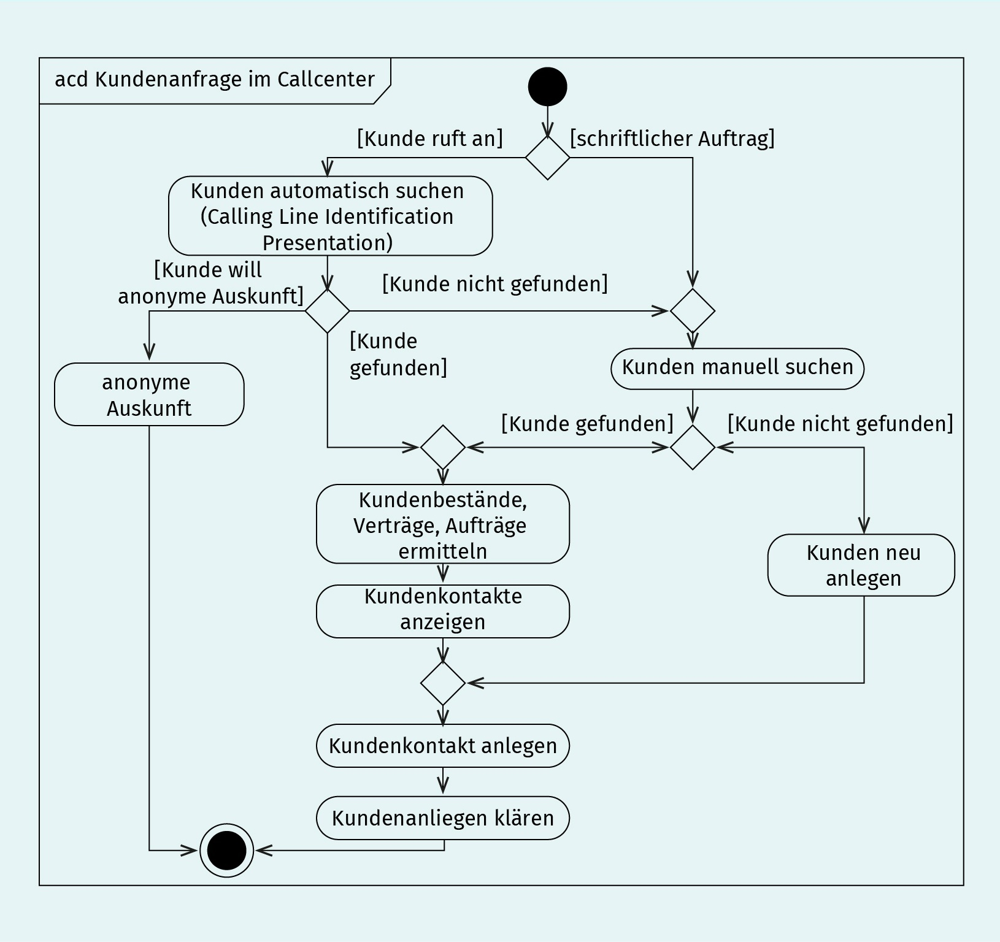
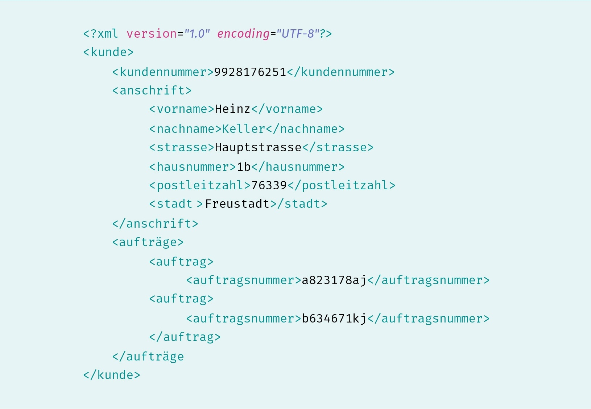

# Requirements Engineering
# L04 Dokumentation von Anforderungen
> Das Ergebnis des Requirements Engineering ist eine Menge dokumentierter Anforderungen, auf deren Grundlage alle weiteren Aktivitäten im Softwareprozess erfolgen. Um eine zielgruppengerechte Dokumentationsform sicherzustellen, muss der Requirements Engineer aus verschiedenen Dokumentationsformen die geeigneten auswählen und die Anforderungen unter Berücksichtigung typischer Elemente von Anforderungsdokumentationen dokumentieren.

LERNZIELE

	<ul>
		<li>Welche konkreten Aktivitäten zur Dokumentation von Anforderungen müssen durchgeführt werden?</li>
		<li>Was es für typische Elemente in Anforderungsdokumenten gibt?</li>
		<li>Welche typischen Dokumentationsformen es gibt und was sie für Vor- und Nachteile haben?</li>
	</ul>

ZUSAMMENFASSUNG

Ziel der „Kernaktivität Dokumentation von Anforderungen“ ist die Sicherung des aktuellen Erkenntnisstands und der Kommunikationsunterstützung zwischen den beteiligten Personen. Die systematische Dokumentation von Anforderungen erfolgt in vier Schritten. Zuerst wird in Abhängigkeit der aktuellen Projektsituation Zweck und Zielgruppe der Dokumentation bestimmt, bevor darauf aufbauend die Detailebene und Dokumentationsform der Anforderungen festgelegt wird. Anschließend werden die Anforderungen dokumentiert und abschließend wird geprüft, ob die erstellte Dokumentation noch zu Zweck und Zielgruppe passt.

Zwar gibt es keine allgemeingültige Dokumentationsstruktur für Anforderungsdokumente, jedoch sollten die vier Elemente Produkt- bzw. Projektvision, Überblicksebene, detaillierte Anforderungen sowie ein Glossar in der Anforderungsdokumentation unbedingt mitberücksichtigt werden.

Zur Dokumentation von Anforderungen kann jede Art der Darstellung verwendet werden, welche die Kommunikation und Verständigung zwischen den beteiligten Stakeholdern erleichtert. Typische und weit verbreitete Dokumentationsformen von Anforderungen sind Softwaremodelle, Prototypen, Skizzen, Tabellen und Text. Je nachdem, ob funktionale Anforderungen, Qualitätseigenschaften oder Randbedingungen dokumentiert werden sollen, muss eine geeignete Dokumentationsform ausgewählt und eingesetzt werden. Im praktischen Einsatz werden Anforderungen an Informationssysteme in der Regel aus einer Mischung von Modellen, ausformuliertem Text und GUI-Prototypen dokumentiert. Auf diese Weise werden Vor- und Nachteile der individuellen Dokumentationsformen ausgeglichen.

---

## 1. Aktivitäten zur Dokumentation von Anforderungen

<dl>
	<dt>Ziel und Eigenschaften von Anforderungen:</dt>
	<dd>- Sicherung des aktuellen Erkenntnisstands.</dd>
	<dd>- Unterstützung der Kommunikation innerhalb des Softwareprojekts.</dd>
	<dd>- Alle weiteren Aktivitäten leiten sich aus den Anforderungen ab.</dd>
	<dd>- Vertrags Basis bei Beauftragung externer Dienstleister.</dd>
	<dd>- Menge ist komplex, IT-Systeme haben oft tausende voneinander Abhängige Anforderungen.</dd>
	<dd>- Verfügbarkeit muss über Projekt- bzw. Systemlaufzeit gewährleistet werden (Einarbeitung neuer Mitarbeiter).</dd>
</dl>

##### Die 4 Schritte zur systematischen Dokumentation von Anforderungen:
1. **Bestimmung von Zweck und Zielgruppe**:  
	- Kommunikationsunterstützung der beteiligten Stakeholder
	- Wissensspeicher und Referenz für Beschlüsse und Definitionen
	- Verbindlichkeit von Aussagen und Klärung im Streitfall
2. **Auswahl der Detailebene und Dokumentationsform**:
	- Vorwissen und Interessen der jeweiligen Stakeholder berücksichtigen.
	- Detailebene: *z.B. Überblick für Kommunikation mit Topmanagement oder detaillierte Darstellung zur Schätzung von Aufwand und Dauer der Umsetzung?*
	- Dokumentationsform: *z.B. Softwaremodelle, Prototypen, Skizzen, Tabellen und Text.*
3. **Dokumentation der Anforderungen**:  
	- Anforderungen in einer für den Zweck und die Zielgruppe geeigneten Form dokumentieren.
4. **Prüfung, ob Dokumentation noch zu Zweck und Zielgruppe passt**:  
	- Kritisches prüfen nach dem Abschluss einer langer Dokumentationszeit.
	- Ursprünglicher Zweck kann während der Dokumentation verloren gehen.
	- Bedienungen im Projekt können sich geändert haben.

##### Typische Risiken:
- Stakeholder geben nicht zu dass sie die eingesetzte Dokumentationsform nicht verstehen.
- Wichtige und ggf. noch nicht abgestimmte Anforderungen in großen Dokumenten mit mehreren hundert Seiten verborgen sind und im Rahmen der Prüfung einfach übersehen werden.
- Wenn Anforderungen nur als Sammlung von User Stories dokumentiert werden, fehlt die Übersicht und deren Abhängigkeiten zueinander.

---
## 2. Typische Elemente der Anforderungsdokumentation

- Keine einheitliche Struktur für die Anforderungsdokumentation die in allen Projekten genutzt wird. Die Art der Dokumentation (*z.B. Backlogs, Tickets, Word-Dokumente*), als auch die konkrete Struktur und deren Inhalt sind abhängig von der Art des Systems, der Organisation des Softwareprojekts und den unternehmensspezifischen Vorgaben.
- Häufig gibt es verbindliche Vorgaben oder Empfehlungen für die Gliederung von Anforderungsdokumentation bzw. ein Template für Anforderungen.  
	- erleichtert die Einarbeitung in die Dokumentation sowie das Zurechtfinden
	- gibt dem Ersteller eine Hilfestellung beim Verfassen
	- dient als Checkliste ob erforderlichen Inhalte in der berücksichtigt wurden
- Beim Erstellen wird mehr Wert auf Vollständigkeit als auf eine einfache
und pragmatische Handhabung im Projekt gelegt. Vorgaben zur Dokumentenstrukturen sollten kontinuierlich beobachtet und auf den praktischen Bedarf hin angepasst werden.

##### die 4 typischen Elemente der Anforderungsdokumentation:
- **Produkt- bzw. Projektvision**:
	- Die Ausformulierung der Vision als Text hilft dem Team bei der Erarbeitung eines gemeinsamen Verständnisses über die Vision und in der Kommunikation mit den Stakeholdern.
	- Die Projektvision sollte der erste Abschnitt innerhalb eines Anforderungsdokuments sein (*ca. 1.600 Zeichen*).
		1. **Was ist das Ziel bzw. der Zweck des Projekts?** (*Was soll mit dem Projekt erreicht werden?*)
		2. **Welche Motivation gibt es für das Projekt?** (*Aus welchen Gründen gibt es dieses Projekt?*)
		3. Festlegung der Ebene der in diesem Dokument beschriebenen Anforderungen, idealerweise gemeinsam mit dem Zweck und der Zielgruppe des Dokuments.
	- Die Produkt- bzw. Projektvision dient neben der Einleitung und Hinführung auf die Inhalte des Dokuments ebenso als Anker und Abholer für Workshops und Besprechungen mit den Stakeholdern.
	- Kann für die abschließende Prüfung, ob Inhalte und Form noch zu Zweck und Zielgruppe passen, eingesetzt werden.
- **Überblicksebene**:
	- Dient zur technischen und fachlichen Einordnung der Anwendung.
	- Nach der Lektüre sollte der Leser einen allgemeinen Überblick über die Hauptfunktionen des Systems bzw. der anzupassenden Systeme, die technischen Schnittstellen, die Nutzer sowie die Einordnung in die Systemlandschaft erlangen können.
	- Je nach Ziel und Kontext des Projekts werden nicht nur ein System, sondern mehrere Systeme verändert. In diesem Fall müssen auch systemübergreifende Anforderungen berücksichtigt und dokumentiert werden:
		- Verortung der Systeme in fachlicher Prozesslandschaft (*eine kurze Beschreibung, welche fachlichen Prozesse und Funktionen durch die Systeme unterstützt werden*).
		- Einbettung der Systeme in die IT-Landschaft der Organisation, damit eine Einordnung der Systeme im Vergleich zu anderen IT-Systemen in der Anwendungslandschaft möglich ist.
		- Kurzbeschreibung der wichtigsten Systemfunktion, damit sich der Leser einen Überblick über die einzelnen Funktionen der Systeme verschaffen kann (*z. B. mit Use Cases*).
		- Technische Schnittstellen zu anderen Systemen, damit allen Beteiligten die technischen Abhängigkeiten rechtzeitig bekannt sind und frühzeitig mit der technischen Integration begonnen werden kann.
		- Kurzbeschreibung der Rollen, die aktiv mit den Systemen arbeiten werden, damit klar ist, welche Stakeholder aktiv bei der Anforderungsermittlung mit einbezogen werden müssen.
- **detaillierte Anforderungen**:
	- Jede im Überblick kurz beschriebene Systemfunktion (*z.B. „Artikel in Bestand aufnehmen“, „Waren durchsuchen“, „Artikel kaufen“*) sollte angemessen beschrieben werden, damit der Leser einen Überblick über die Funktion erhält.
	- Typischerweise setzt sich eine Systemfunktion aus verschiedenen Teilfunktionen zusammen (*z.B. „Artikel kaufen“ eines Onlineshops aus den Teilfunktionen „Artikel in den Warenkorb legen“, „Artikel bezahlen“ und „Versandabwicklung“*).
	- Diese Teilfunktionen werden innerhalb des Abschnitts der Systemfunktion dokumentiert.
	- Zu jeder Teilfunktion werden vor dem Start der Implementierung alle Informationen zusammengestellt, die das Entwicklungsteam benötigt, um mit der Implementierung des Systems zu beginnen.
	- Das schließt insbesondere alle relevanten funktionalen Anforderungen, Qualitätsanforderungen und Randbedingungen ein.
	- Diese Anforderungen können in Form von Texten, als Aufzählungen, Tabellen, fachlichen Modellen, Referenzen auf externe Dokumente und Screenshots von Prototypen dokumentiert werden.
	- Ergänzend zu der Dokumentation der einzelnen Systemfunktionen ist es häufig sinnvoll, ein übergreifendes fachliches Objektmodell zu erstellen. Mit dem Objektmodell können die fachlichen Zusammenhänge und Eigenschaften von Geschäftsobjekten beschrieben und dokumentiert werden (*z.B. UML-Klassendiagramm*).
- **Glossar**:
	- Erläutert Fachbegriffe des Fachbereichs und der IT.
	- Insbesondere fach- und organisationsspezifische sowie technische Abkürzungen.
	- Begriffe die eine projektspezifische Bedeutung haben oder die im Rahmen des Projekts abweichend zu ihrer allgemein bekannten Bedeutung verwendet werden.

---
## 3. Dokumentationsformen
> Dokumentierte Anforderungen sollten möglichst eindeutig formuliert werden, damit das IT-System in den folgenden Aktivitäten genau die Funktionen und Eigenschaften erhält, die bei der Erstellung der Dokumentation auch tatsächlich gemeint waren. Als mögliche Dokumentationsformen kann jede Art der Darstellung verwendet werden, die die Kommunikation und Verständigung zwischen den beteiligten Stakeholdern erleichtert (*z.B. Modelle, Prototypen, Skizzen, Tabellen und Text*).

### Text und Tabellen

- **Vorteile**:
	- einfache Anwendung (*Weder für das Dokumentieren noch für das Lesen ist zusätzlicher Lernaufwand erforderlich*)
	- vielseitig einsetzbar (*zur Beschreibung von allen Arten von Anforderung geeignet*)
- **Nachteile**:
	- hoher Interpretationsspielraum sowie Ungenauigkeiten in der Formulierung von Anforderungen.  
	Beispielsweise wird häufig bei der Beschreibung von Entscheidungen in Abläufen nur der positive Fall berücksichtigt (*z.B. Nach der erfolgreichen Anmeldung am System werden die zur Verfügung stehenden Zahlungsoptionen angezeigt*).  
	Oft wird vergessen, das Verhalten für den Fall zu beschreiben, bei dem die Anmeldung bzw. ein anderes Verhalten nicht funktioniert.  
  
- Tabellen helfen die Anforderungen etwas zu strukturieren (*z. B. Wertebereiche, konkrete Eigenschaften oder fachlich verschiedene, strukturell jedoch ähnliche Aspekte übersichtlich dargestellt werden*)

### Skizzen und einfache Grafiken

- **Vorteile**:
	- einfachen und schnellen Erstellung
	- in der Frühen Phasen der Anforderungsermittlung um fachliche Zusammenhänge herauszustellen
- **Nachteile**:
	- großer Interpretationsspielraum
  
- Können entweder per Hand gezeichnet und fotografiert oder auch z. B. mit Programmen wie PowerPoint oder Visio erstellt und als Grafik in die Anforderungsdokumentation eingebracht werden.
- Was genau die in der Skizze oder der Grafik verwendeten Symbole, Formen und Farben bedeuten, ist in der Regel nur den direkt an der Erstellung beteiligten Personen bekannt. Daher eignen sie sich nur bedingt zur dauerhaften Dokumentation und sollten in jedem Fall durch eine Legende bzw. eine ausführliche Beschreibung ergänzt werden.

### Modelle

- **Vorteile**:
	- geringere Interpretationsspielraum (*Bedeutung der Elemente ist festgelegt*)
	- Information können kompakter dokumentiert werden
	- grafische Modelle erschließen sich dem Leser schneller als ausformulierter Text
- **Nachteile**:
	- Wissen über Notationselemente und deren Verwendung erforderlich
	- Modelle sind nicht universell einsetzbar (*konzentrieren sich auf bestimmte Aspekte*)

##### grafische Modelle
- Sind visuelle Ausgeprägt, deren Notationselemente haben jeweils eine ganz bestimmte Bedeutung.
- Mit grafischen Modellen werden Anforderungen zu Struktur und Verhalten von Systemen dokumentiert.
- **grafische Prozessmodelle**: BPMN (_**B**usiness **P**rocess **M**odel and **N**otation_), EPK (_**E**reignisgesteuerte **P**rozess**k**ette_)
- **grafische Softwaremodelle**: UML (_**U**nified **M**odeling **L**anguage_)  
- Sollten immer durch einen Text erläutert werden. Dabei muss nicht der Inhalt des Modells vollständig beschrieben werden, wichtig ist aber eine kurze Beschreibung darüber, was konkret im Modell dargestellt ist und wie das dort Dargestellte in Bezug zu den anderen dokumentierten Anforderungen steht.
- Alle wichtigen Notationselemente wie Aktionen, Funktionen, Informationsobjekte, Zustände oder Klassen sollten kurz erläutert werden.

*UML-Aktivitätsdiagramm*

##### textuelle Modelle
- XML (_e**X**tensible **M**arkup **L**anguage_): um z.B. Datenstrukturen an technischen Systemschnittstellen zu dokumentiert  

*XML-Datei: Strukturierung von Kundendaten in einem System*

### GUI-Prototypen
- z.B. Skizzen, Wireframes, Mock-ups
- Eignen sich für die Dokumentation von Anforderungen an Benutzerschnittstellen:
	- Nutzeroberfläche (*z. B. Größe, Position, Farbe und Beschriftung von Elementen*).
	- Reihenfolge einzelnen Dialogmasken in Abhängigkeit von Nutzerinteraktion (*z.B. Erscheinung und der Inhalt von Fehlermeldungen*).

### Mischform verschiedener Dokumentationsformen
> Im praktischen Einsatz werden Anforderungen an Informationssysteme in der Regel in
einer Mischung von Modellen, ausformuliertem Text und GUI-Prototypen dokumentiert. 
Diese Kombination gleicht die individuellen Nachteile der einzelnen Dokumentationsformen aus. 

Insbesondere beim Einsatz verschiedener Dokumentationsformen muss bei der Dokumentation und bei allen späteren Überarbeitungen und Anpassungen darauf geachtet werden, dass Text und Modell den gleichen Erkenntnisstand wiedergeben und es keine Inkonsistenzen in der Dokumentation gibt.
