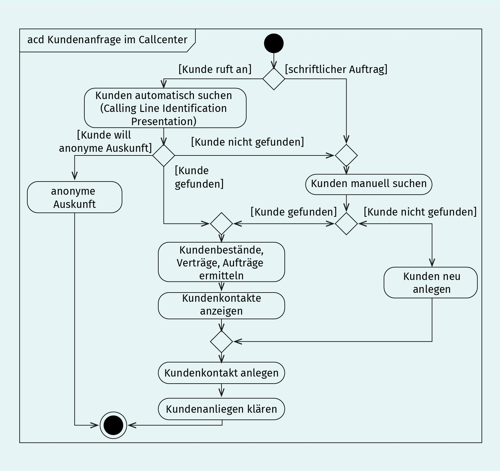
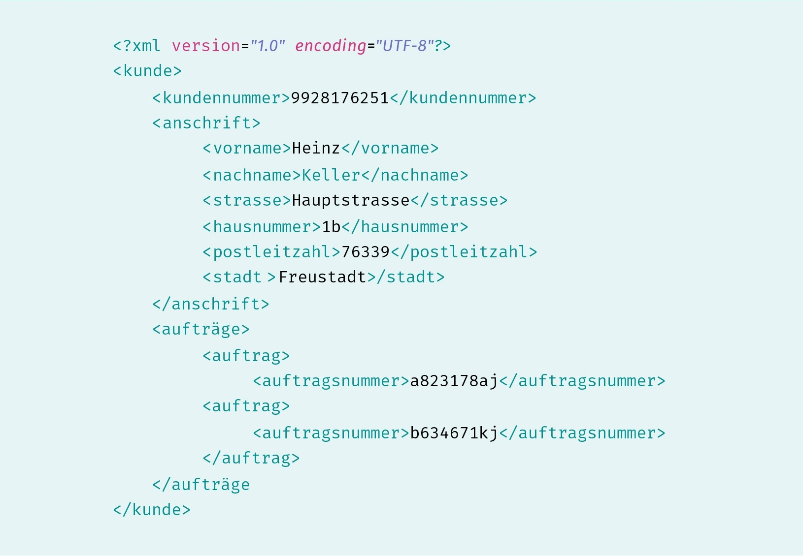

# Requirements Engineering

# L04 Dokumentation von Anforderungen
>Um eine zielgruppengerechte Dokumentationsform sicherzustellen, muss der Requirements Engineer aus verschiedenen Dokumentationsformen die geeigneten auswählen und die Anforderungen unter Berücksichtigung typischer Elemente von Anforderungsdokumentationen dokumentieren.

LERNZIELE

	<ul>
		<li>Welche konkreten Aktivitäten zur Dokumentation von Anforderungen müssen durchgeführt werden?</li>
		<li>Was es für typische Elemente in Anforderungsdokumenten gibt?</li>
		<li>Welche typischen Dokumentationsformen es gibt und was sie für Vor- und Nachteile haben?</li>
	</ul>

ZUSAMMENFASSUNG

Ziel der „Kernaktivität Dokumentation von Anforderungen“ ist die Sicherung des aktuellen Erkenntnisstands und der Kommunikationsunterstützung zwischen den beteiligten Personen. Die systematische Dokumentation von Anforderungen erfolgt in vier Schritten. Zuerst wird in Abhängigkeit der aktuellen Projektsituation Zweck und Zielgruppe der Dokumentation bestimmt, bevor darauf aufbauend die Detailebene und Dokumentationsform der Anforderungen festgelegt wird. Anschließend werden die Anforderungen dokumentiert und abschließend wird geprüft, ob die erstellte Dokumentation noch zu Zweck und Zielgruppe passt.

Zwar gibt es keine allgemeingültige Dokumentationsstruktur für Anforderungsdokumente, jedoch sollten die vier Elemente Produkt- bzw. Projektvision, Überblicksebene, detaillierte Anforderungen sowie ein Glossar in der Anforderungsdokumentation unbedingt mitberücksichtigt werden.

Zur Dokumentation von Anforderungen kann jede Art der Darstellung verwendet werden, welche die Kommunikation und Verständigung zwischen den beteiligten Stakeholdern erleichtert. Typische und weit verbreitete Dokumentationsformen von Anforderungen sind Softwaremodelle, Prototypen, Skizzen, Tabellen und Text. Je nachdem, ob funktionale Anforderungen, Qualitätseigenschaften oder Randbedingungen dokumentiert werden sollen, muss eine geeignete Dokumentationsform ausgewählt und eingesetzt werden. Im praktischen Einsatz werden Anforderungen an Informationssysteme in der Regel aus einer Mischung von Modellen, ausformuliertem Text und GUI-Prototypen dokumentiert. Auf diese Weise werden Vor- und Nachteile der individuellen Dokumentationsformen ausgeglichen.

---

## 1. Aktivitäten zur Dokumentation von Anforderungen

<dl>
	<dt>Ziel und Eigenschaften von Anforderungen:</dt>
	<dd>- Sicherung des aktuellen Erkenntnisstands.</dd>
	<dd>- Unterstützung der Kommunikation innerhalb des Softwareprojekts.</dd>
	<dd>- Alle weiteren Aktivitäten leiten sich aus den Anforderungen ab.</dd>
	<dd>- Vertrags Basis bei Beauftragung externer Dienstleister.</dd>
	<dd>- Menge ist komplex, IT-Systeme haben oft tausende voneinander Abhängige Anforderungen.</dd>
	<dd>- Verfügbarkeit muss über Projekt- bzw. Systemlaufzeit gewährleistet werden (Einarbeitung neuer Mitarbeiter).</dd>
</dl>

##### Die 4 Schritte zur systematischen Dokumentation von Anforderungen:
1. **Bestimmung von Zweck und Zielgruppe**:  
	- Kommunikationsunterstützung der beteiligten Stakeholder
	- Wissensspeicher und Referenz für Beschlüsse und Definitionen
	- Verbindlichkeit von Aussagen und Klärung im Streitfall
2. **Auswahl der Detailebene und Dokumentationsform**:
	- Vorwissen und Interessen der jeweiligen Stakeholder berücksichtigen.
	- Detailebene: *z.B. Überblick für Kommunikation mit Topmanagement oder detaillierte Darstellung zur Schätzung von Aufwand und Dauer der Umsetzung?*
	- Dokumentationsform: *z.B. Softwaremodelle, Prototypen, Skizzen, Tabellen und Text.*
3. **Dokumentation der Anforderungen**:  
	- Anforderungen in einer für den Zweck und die Zielgruppe geeigneten Form dokumentieren.
4. **Prüfung, ob Dokumentation noch zu Zweck und Zielgruppe passt**:  
	- Kritisches prüfen nach dem Abschluss einer langen Dokumentationszeit.
	- Ursprünglicher Zweck kann während der Dokumentation verloren gehen.
	- Bedienungen im Projekt können sich geändert haben.

##### Typische Risiken:
- Stakeholder geben nicht zu dass sie die eingesetzte Dokumentationsform nicht verstehen.
- Wichtige und ggf. noch nicht abgestimmte Anforderungen in großen Dokumenten mit mehreren hundert Seiten verborgen sind und im Rahmen der Prüfung einfach übersehen werden.
- Wenn Anforderungen nur als Sammlung von User Stories dokumentiert werden, fehlt die Übersicht und deren Abhängigkeiten zueinander.

---
## 2. Typische Elemente der Anforderungsdokumentation

##### die 4 typischen Elemente der Anforderungsdokumentation:
- **Produkt- bzw. Projektvision**: (*Einleitung, ca. 1600 Zeichen*)
	1. **Produkt/Projekt**:  
	**Motivation**, **Ziel** und **Zweck** (*Was soll mit dem Projekt erreicht werden?*).  
	Hilft dem Team bei der Erarbeitung eines gemeinsamen Verständnisses über die Vision und in der Kommunikation mit den Stakeholdern.
	2. **Dokument**:  
	Auf welcher **Ebenen**, zu welchem **Zweck** und für welche **Zielgruppe**.
- **Überblicksebene**:
	- Dient zur technischen und fachlichen Einordnung der Anwendung.
	- Der Leser soll einen allgemeinen Überblick über die Hauptfunktionen des Systems bzw. der anzupassenden Systeme, die technischen Schnittstellen, die Nutzer (*Stakeholder*) sowie die Einordnung in die Systemlandschaft erlangen können.
- **detaillierte Anforderungen**:
	- Jede im Überblick kurz beschriebene Systemfunktion sollte angemessen beschrieben werden.
	- Systemfunktion setzen sich aus Teilfunktionen zusammen (*z.B. „Artikel kaufen“ eines Onlineshops aus den Teilfunktionen „Artikel in den Warenkorb legen“, „Artikel bezahlen“ und „Versandabwicklung“*).
	- Zu jeder Teilfunktion werden alle Informationen zusammengestellt, die das Entwicklungsteam benötigt, um mit der Implementierung des Systems zu beginnen (*u.a. funktionalen Anforderungen, Qualitätsanforderungen und Randbedingungen*).
	- Diese Anforderungen können in Form von Texten, als Aufzählungen, Tabellen, fachlichen Modellen, Referenzen auf externe Dokumente und Screenshots von Prototypen dokumentiert werden.
	- Ergänzend zu der Dokumentation der einzelnen Systemfunktionen ist es häufig sinnvoll, ein übergreifendes fachliches [Objektmodell](./M03_glossar.md#objektmodell) zu erstellen (*z.B. UML-Klassendiagramm*).
- **Glossar**:
	- Erläutert Fachbegriffe des Fachbereichs und der IT.
	- Insbesondere fach- und organisationsspezifische sowie technische Abkürzungen.
	- Begriffe die eine projektspezifische Bedeutung haben oder die im Rahmen des Projekts abweichend zu ihrer allgemein bekannten Bedeutung verwendet werden.

---
## 3. Dokumentationsformen
> Dokumentierte Anforderungen sollten möglichst eindeutig formuliert werden, damit das IT-System in den folgenden Aktivitäten genau die Funktionen und Eigenschaften erhält, die bei der Erstellung der Dokumentation auch tatsächlich gemeint waren. Als mögliche Dokumentationsformen kann jede Art der Darstellung verwendet werden, die die Kommunikation und Verständigung zwischen den beteiligten Stakeholdern erleichtert (*z.B. Modelle, Prototypen, Skizzen, Tabellen und Text*).

|Dokumentationsform	|Beschreibung |Vorteile |Nachteile |
|---|---|---|---|
|**Text** |Anforderungen werden in natürlicher Sprache formuliert (Fließtext oder Auflistung) *z.B. User Stories, Satzschablonen.* |- kein Lernaufwand - universell einsetzbar |- hoher Interpretationsspielraum - Ungenauigkeiten und Auslassungen (*z.B. nur positiver Fall wird beschrieben*) |
|**Tabellen** |Anforderungen werden tabellarisch strukturiert, *z.B. mit Attributen* (*ID, Name, Beschreibung, Priorität*).|- einfache Anwendung -  gut für strukturierte Übersichten (*z.B. Wertebereiche, ähnliche Aspekte*) |- hoher Interpretationsspielraum - Zusammenhänge zwischen Anforderungen schwer darstellbar |
|**Skizzen** / **einfache Grafiken** |Handgezeichnete oder einfach erstellte Grafiken (*z.B. PowerPoint, Visio*), die Anforderungen anschaulicher machen. |- präziser und anschaulicher als reiner Text - schnell erstellt - kein spezielles Notationswissen nötig |- kein verbindlicher Standard - schwer formell nachvollziehbar - begrenzte Präzision |
|**Modelle** |**Grafische Modelle** nach einer standardisierten Notation (*z. B. UML-Klassendiagramm, BPMN*).  **Textuelle Modelle** *z.B. XML: Datenstrukturen an technischen Systemschnittstellen zu dokumentiert*. |- präzise, eindeutig, schnell erfassbar - geringe Interpretationsspielräume - standardisiert |- Schulungsaufwand erforderlich (*Notationselemente müssen bekannt sein*) - nicht universell einsetzbar – jeder Diagrammtyp deckt nur bestimmte Aspekte ab |
|**GUI-Prototypen** |Visuelle Darstellung der Benutzeroberfläche, von Handskizzen über Wireframes bis zu vollständigen Mock-ups. |- sehr präzise für UI-Anforderungen (*Größe, Position, Farbe, Fehlermeldungen*) - intuitiv verständlich für Stakeholder |- aufwändig in der Erstellung - kann falsche Erwartungen wecken (*Prototyp wirkt bereits „fertig"*) |
|**Mischform** |Kombination aus Text, Modellen und GUI-Prototypen – in der Praxis die häufigste Form. |- gleicht Nachteile der einzelnen Formen aus - grafische Modelle werden durch Text ergänzt |- Koordinationsaufwand - Konsistenz zwischen den Formen muss sichergestellt werden |

*UML-Aktivitätsdiagramm*

_XML-Datei (e**X**tensible **M**arkup **L**anguage): Strukturierung von Kundendaten in einem System_

