# Requirements Engineering
# L05 Modellierung von Prozessen

LERNZIELE

	<ul>
		<li>Was unter Unternehmensmodellierung, Aufbauorganisation und Ablauforganisation verstanden wird.</li>
		<li>Was ein Geschäftsprozess ist und aus welchen Teilen er besteht.</li>
		<li>Auf welchen Abstraktionsebenen Geschäftsprozesse modelliert werden können.</li>
		<li>Was die Grundelemente der Business Process Model and Notation sind.</li>
		<li>Was die Grundelemente erweiterter Ereignisgesteuerter Prozessketten sind.</li>
	</ul>

ZUSAMMENFASSUNG

In der Unternehmensmodellierung wird eine Bestandsaufnahme durch das Erstellen einer Ist-Übersicht über die Organisation von Unternehmen durch die Darstellung von Abläufen (Geschäftsprozessen) und Strukturen (Aufbauorganisation) erzeugt. Die Aufbauorganisation bildet die Struktur einer Organisation ab. Diese Struktur ist in den meisten Fällen hierarchisch aufgebaut und legt die Rahmenbedingungen für die Bearbeitung von Aufgaben in einem Unternehmen fest. Die Ablauforganisation steht im Abhängigkeitsverhältnis zur Aufbauorganisation, denn sie behandelt die gleichen Objekte, jedoch aus einer anderen Perspektive. Die Ablauforganisation drückt aus, wie Arbeitsabläufe (Geschäftsprozesse) der Aufbauorganisation durch die Verkettung einzelner Arbeitsschritte unter Nutzung der Ressourcen (Stellen, Abteilungen, Rollen, Instanzen, Aufgaben) der Aufbauorganisation gestaltet sind.  

Ein Geschäftsprozess ist eine Reihe von Aktivitäten in einer bestimmten Reihenfolge, die ggf. unter Zuhilfenahme von IT durch mehrere Organisationseinheiten (Stelle, Rolle, Abteilung, Bereich, Organisation) bearbeitet wird. Elemente eines Geschäftsprozesses sind Nutzer, Aktivitäten, Rollen und Organisationseinheiten. Ein Prozess kann durch andere (Teil-)Prozesse und Aktivitäten verfeinert werden, die einer oder mehreren Geschäftsregeln folgen. Prozesse und Aktivitäten lösen Ereignisse aus und umgekehrt. Ein Prozess hat, genau wie Geschäftsobjekte, einen bestimmten Zustand.  

Um Abläufe zu modellieren, kann die Business Process Model and Notation (BPMN) verwendet werden. Außerdem kann die Ablauforganisation eines Unternehmens mit Ereignisgesteuerten Prozessketten (EPK) modelliert werden. Die EPK wird, genau wie die BPMN, eingesetzt, um betriebliche Abläufe zu modellieren. Erweiterte Ereignisgesteuerte Prozessketten (eEPK) erhöhen durch zusätzliche Notationselemente die Ausdrucksmächtigkeit der EPK.

---
## 1. Grundlagen und Begriffe

- Unternehmensmodellierung
	- Aufbauorganisation
	- Ablauforganisation
	- die Bestandteile von Geschäftsprozessen

In diesem Lernzyklus werden die Grundlagen und Begriffe zur Unternehmensmodellierung erläutert. Dazu zählen neben der Aufbauorganisation auch die Ablauforganisation und die Bestandteile von Geschäftsprozessen.

- Die Bestandteile eines Prozesses können verwendet werden, um die Geschäftsprozesse zu modellieren.

Da Geschäftsprozesse die Grundlage des betrieblichen Handelns bilden, stellen sie eine elementare Grundlage für das Requirements Engineering für betriebliche Informationssysteme dar. 

In einem Geschäftsprozess werden Aufgaben durch bestimmte Organisationseinheiten erledigt. In diesen Aufgaben werden Entscheidungen getroffen und Geschäftsobjekte bearbeitet. Die Bearbeitung dieser Aufgaben kann durch IT-Systeme unterstützt werden, sodass die Angemessenheit und Korrektheit der Anforderungen an dieses System einen wesentlichen Einfluss auf den Erfolg des Unternehmens haben.

Im Folgenden wird zuerst erläutert, wie Organisationen strukturell aufgebaut sein können (sogenannte Aufbauorganisation), um daraufhin die Ziele von Geschäftsprozessen in der Ablauforganisation und die Elemente von Geschäftsprozessen sowie deren Beziehungen zueinander zu erläutern.

### Aufbauorganisation (*Organisationsstruktur eines Unternehmens*)
- Hierarchischer Aufbau, legt die Rahmenbedingungen für die Bearbeitung von Aufgaben in einem Unternehmen fest (*welche Aufgaben von welchen Menschen mit welchen Sachmitteln erledigt werden sollen*).
- Ziel ist die arbeitsteilige Gliederung und Ordnung der betrieblichen Handlungsprozesse durch Bildung und Verteilung von Aufgaben.
- In einer Hierarchie werden Führungsstrukturen und damit Weisungsbefugnisse gebildet, die eine
Zuordnung von Aufgaben und Verantwortlichkeiten möglich machen.

##### Organisationsformen

- **Einliniensystem**:
	- In jeder Hierarchieebene herrscht Vollkompetenz.
	- Die obere Ebene ist den untergeordneten Ebenen gegenüber weisungs- und entscheidungsbefugt.
	- Die untergeordneten Ebenen haben gegenüber ihrer übergeordneten Ebene Vorschlagsrecht.
	- Eine Linie von oben nach unten (z. B. Hauptabteilungsleiter → Abteilungsleiter → Teamleiter) heißt Dienstweg, dessen Einhaltung obligatorisch ist (*z.B Damit zwei Teamleiter miteinander arbeiten, ist die Einbeziehung des übergeordneten Abteilungsleiters verpflichtend*).
	- **Vorteile**:
		- klaren Befugnisse und Verantwortungsbereiche
	- **Nachteile**:
		- langen Informationswege
		- Vorgesetzte werden überlastet (*müssen jede Entscheidung treffen, können Entscheidungskompetenz nicht delegieren*).
- **Mehrliniensystem**:
	- Aufgebaut wie Einliniensystem, außer dass gleichrangig Vorgesetzte auch teamübergreifende Weisungsbefugnis haben (*Teamleiter von Team A ist auch den Mitarbeitern von Team B gegenüber weisungsbefugt bzw. die Mitarbeiter von Team B können sich auch an den Teamleiter von Team A wenden*).
	- **Vorteile**:
		- kürzere Kommunikationswegen
		- Spezialisierung der Leitung durch Funktionsverteilung
		- Durch direkte Kommunikationswege können sich Vorgesetzte mehr auf ihre Kernkompetenz konzentrieren, da Verwaltungsaufgaben, die im Einliniensystem zu erfüllen wären, wegfallen (*-> Betonung der Fachautorität*).
	- **Nachteile**:
		- Abgrenzungsprobleme der Zuständigkeiten und somit Kompetenzkonflikte
- **Stabliniensystem**:
	- Ist um eine Stabstelle erweitertes Einliniensystem zur Entlastung der Linieninstanzen.
	- Ein Stab ist ein Experte für bestimmte Gebiete. Vergibt keine Arbeitsanweisungen sondern Steht nur beratend zu Seite.
	- **Vorteile**:
		- die gleichen wie beim Einliniensystem
		- zunehmende Entscheidungsqualität durch Spezialisten
	- **Nachteile**:
		- eine Konzentration des spezialisierten Wissens in der Leitungsebene
		- verstärkter autoritärer Führungsstil und Gefahr einer selektiven Informationsweitergabe
		- zusätzliche Kosten für Stabstellen
- Projekte sind als temporäre Organisation häufig etwas anders organisiert. Die dauerhaft bestehenden Bereiche und Abteilungen im Unternehmen folgen in der Regel jedoch den hier gezeigten Organisationsmodellen.

### Ablauforganisation
> Beschreibt den Ablauf innerhalb der Organisationsstruktur. Sie dokumentiert die Gestaltung der Arbeitsabläufe der Aufbauorganisation durch die Verkettung einzelner Arbeitsschritte unter Nutzung der Ressourcen der Aufbauorganisation. Im Mittelpunkt stehen dabei die zielbezogene menschliche Handlung und die Ausstattung von Arbeitsprozessen mit Sachmitteln und Informationen (sogenannter Leistungserstellungsprozess).

##### Ziele:
- Die Auslastung der Leistungserstellung soll maximal sein.
- Bei maximaler Auslastung sollen Durchlaufzeiten so gering wie möglich sein. Gleiches gilt für Wartezeiten, in denen der Leistungserstellungsprozess stillsteht.
- Die Kosten der Leistungserstellung sollen so gering wie möglich sein.
- Die Qualität der Vorgangsbearbeitung und die Arbeitsbedingungen sollen verbessert werden.
- Die Ablauforganisation ist durch Geschäftsprozesse definiert.

#### Elemente in Geschäftsprozessen
>„Ein Geschäftsprozess (GP) ist eine zielgerichtete, zeitlich-logische Abfolge von Aufgaben, die arbeitsteilig von mehreren Organisationen oder Organisationseinheiten unter Nutzung von IKT (**I**nformations- und **K**ommunikations**t**echnologie) ausgeführt werden können.  
Er dient der Erstellung von Leistungen entsprechend den vorgegebenen, aus der Unternehmensstrategie abgeleiteten Prozesszielen.  
Der Geschäftsprozess kann formal auf unterschiedlichen Detaillierungsebenen aus mehreren Sichten beschrieben werden. Ein maximaler Detaillierungsgrad der Beschreibung ist dann erreicht, wenn die ausgewiesenen Aufgaben je in einem Zug von einem Mitarbeiter ohne Wechsel des Arbeitsplatzes ausgeführt werden können“.

- In einem Geschäftsprozess wird also eine Reihe von Aktivitäten in einer bestimmten Reihenfolge unter Zuhilfenahme von IT durch mehrere Organisationseinheiten (Stelle, Rolle, Abteilung, Bereich, Organisation) bearbeitet.

- Ein Nutzer (*z.B. Herr Klein*) führt eine Aktivität (*z.B. Schadenakte öffnen*) in einer bestimmten Rolle (*z.B. Schadensachbearbeiter*) aus. Die Rolle gehört zu einer Organisationseinheit (*z.B. Schaden- und Leistungsabteilung*).

*Bestandteile und Zusammenhänge der Bestandteile eines Geschäftsprozesses*
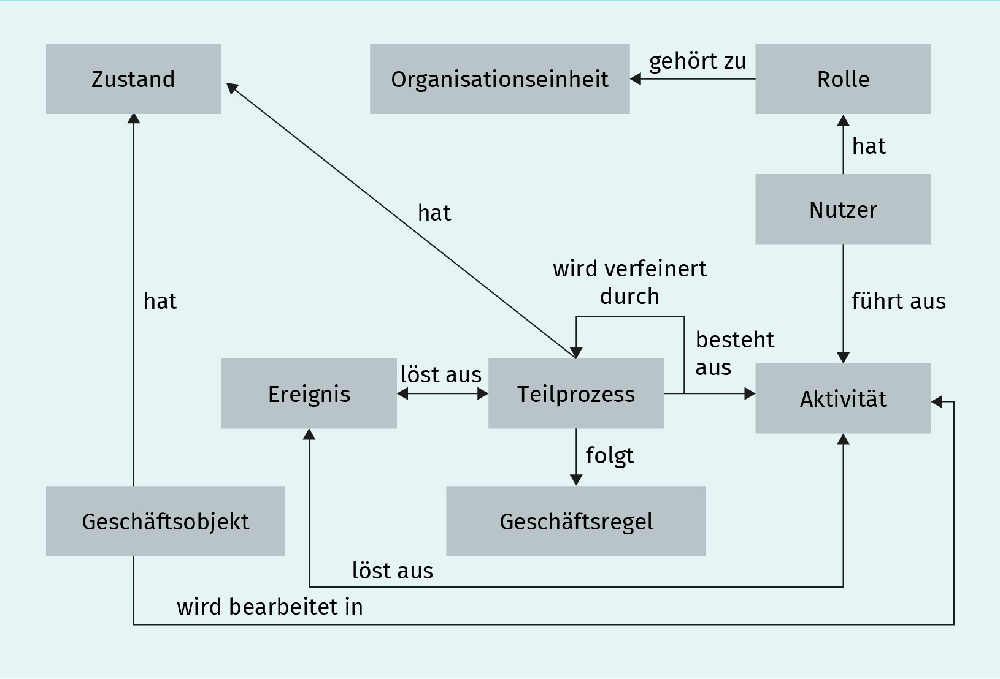

*Elemente eines Geschäftsprozesses*
|Element|Beschreibung|Beispiel|
|---|---|---|
|Prozess|Aktivitätsfolge mit möglichen Vorgängern und Nachfolgern|Antragsbearbeitung
|Aktivität|ausführbare Einheit, die nicht sinnvoll weiter zerlegt werden kann|Adressbearbeitung|
|Geschäftsobjekt|materieller oder immaterieller Gegenstand|Antrag|
|Zustand|Status von Geschäftsobjekten, Prozessen|offener Antrag|
|Ereignis|Auslöser/Resultat für einen Prozess/eine Aktivität|Antragseingang|
|Rolle|Position mit bestimmten Aufgaben|Sachbearbeiter|
|Nutzer|Rolleninhaber mit bestimmtem Zweck im Prozess, Mensch oder Maschine|Karl Meier|
|Geschäftsregeln|Vorschriften, nach denen Prozesse ablaufen|Versicherungssumme > 250.000.000 € → separate Risikoprüfung durchführen|
|Organisationseinheit|Zuordnungsbereich von Kompetenz für einen oder mehrere Aufgabenträger|IT-Abteilung, IT-Sicherheits-beauftragter|

- Geschäftsprozesse bestehen aus einer Menge von Teilprozessen. Teilprozesse können durch Aktivitäten verfeinert werden, die einer oder mehreren Geschäftsregeln folgen (*z.B. wenn die Schadenhöhe mehr als 100.000 € beträgt, erfolgt die Prüfung des Schadens durch einen Gutachter*).

- Teilprozesse und Aktivitäten lösen Ereignisse (*z.B. Schaden gemeldet*) aus, genauso wie Ereignisse Teilprozesse auslösen können. Ein Teilprozess hat einen bestimmten Zustand (*z.B. Schadenbearbeitung ausgeführt*), genau wie Geschäftsobjekte (*z.B. ein Schaden*) einen bestimmten Zustand haben (*z.B. Schaden gemeldet*). Ein Geschäftsobjekt wird im Rahmen einer Aktivität bearbeitet.

*Strukturierung von Geschäftsprozessen*
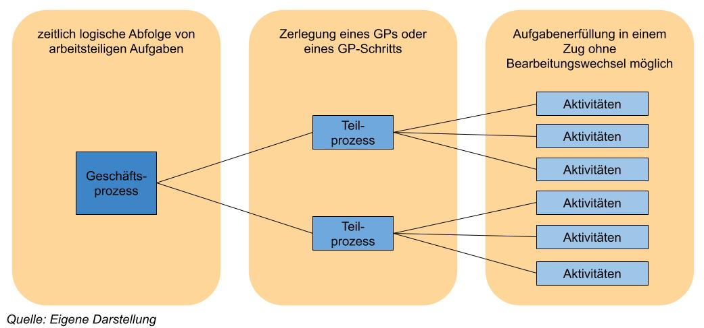

---
## 2. Modellierung mit der Business Process Model and Notation
> Die Business Process Model and Notation (BPMN) ist eine Notation zur Modellierung von Geschäftsprozessen und wird von der Object Management Group (OMG) verwaltet und weiterentwickelt. Die OMG selber ist ein Konsortium, das aus über 800 Mitgliedsunternehmen besteht und herstellerneutrale Industriestandards erstellt und pflegt. Die OMG stellt mit der BPMN einen Modellierungsstandard bereit, der die Bedeutung grafischer Notationselemente und deren Zusammenspiel definiert. Da die BPMN eine sehr ausdrucksmächtige Sprache ist, würde eine vollständige Einführung den Umfang dieses Lernskripts sprengen.

|Name|Bedeutung|Darstellung|
|---|---|---|
|Aktivität|Aktivitäten repräsentieren Aufgaben, die im Prozess ausgeführt werden, und sind atomar, also nicht sinnvoll weiter zerlegbar. Aktivitäten werden aktiv formuliert und nach dem Pattern [Objekt] + [Verb] benannt (*z.B. Antrag unterschreiben*).|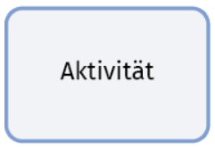|
|Teilprozess|Diese Teilprozesse verfeinern Geschäftsprozesse und können durch ein weiteres BPMN-Diagramm verfeinert werden. Die Darstellung mit einem „+“ blendet den internen Ablauf im Teilprozess aus. Teilprozesse werden aktiv formuliert und nach dem Pattern [Objekt] + [Verb] benannt (*z.B. Schaden bearbeiten, auf Klausur vorbereiten*).|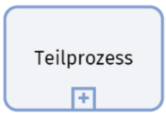|
|Ereignisse|Ein Ereignis ist etwas, das im Verlauf eines Prozesses passiert und den Ablauf beeinflusst. Ereignisse haben in der Regel eine Ursache (trigger) und Auswirkungen (results). Die BPMN kennt drei Ereignistypen, die durch interne Marker weiter unterschieden werden können. Die drei Typen besitzen jeweils verschiedene Varianten (*z.B. Nachrichten, Zeit, Bedingung, Signal, Fehler*). Das Startereignis kennzeichnet den Beginn eines Prozesses. Jeder (Teil-)Prozess besitzt zwingend mindestens ein Startereignis. Das  Zwischenereignis tritt im Prozessverlauf ein, das Endereignis beendet einen Prozess. Jedes Ereignis kann untypisiert sein, d. h., es besitzt keine interne Markierung. Solche Ereignisse werden auch Blanko-Ereignisse genannt. Interne Marker können Nachrichten oder Bedingungen sein. Ein Ereignis wird nach dem Muster [Objekt] und passiviertes [Verb] beschrieben (*z.B. Schaden gemeldet*).|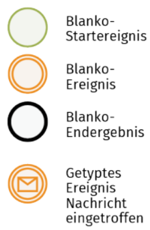|
|Datenobjekte|Datenobjekte werden zur Ausführung von Aktivitäten gebraucht oder erzeugt. Sie können einzelne Objekte (*z.B. Schadenakte*) oder ganze Sammlungen (*z.B. Antragsdaten*) davon repräsentieren. Datenobjekte werden mit dem sie umschließenden Prozess instanziiert und zerstört – sie besitzen keine Persistenz über den Prozess hinaus. Es gibt auch Datenspeicher, die beispielsweise Datenbanken darstellen können (siehe hierzu Allweyer 2020).||
|Pools|Pools repräsentieren die Teilnehmer und Verantwortlichen eines Prozesses (*z.B. der Helpdesk*). Dies können Organisationen, Personen, Rollen oder Systeme sein. Ein Pool dient dazu, Prozesse zu partitionieren. Pools können auch als Black Boxes (*unter Ausblendung innerer Abläufe*) dargestellt werden. Jeder Pool kennzeichnet einen Teilprozess und benötigt daher ein Start- und ein Endereignis. Pools werden eingesetzt, um den Wechsel der Verantwortlichkeit in einem Geschäftsprozess zu modellieren.|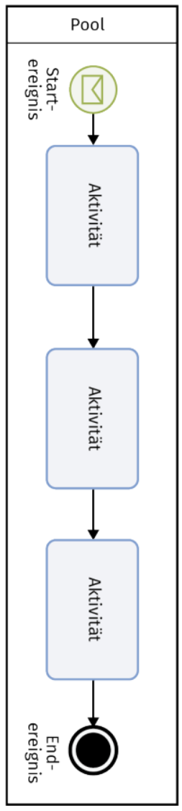|
|Lanes|Eine Lane (Schwimmbahn) weist Aufgabenträgern Zuständigkeiten für Aufgaben zu und befindet sich immer innerhalb eines bestimmten Pools. Aufgabenträger können beispielsweise Personen (*z.B.Heinz Müller*), Rollen (*z.B. Sachbearbeiter*), Anwendungen (*z.B.Schadenmanagementsystem*) sein. Lanes können beliebig verschachtelt werden, um eine Verfeinerung der Zuständigkeiten darzustellen. Ein Flussobjekt (Aktivität, Ereignis) darf immer nur in genau einer Lane positioniert sein.||
|Nachrichten|Nachrichten symbolisieren den Inhalt einer Kommunikation und werden entweder an Nachrichtenflüsse assoziiert oder sie sind Bestandteil eines Ereignisses.||
|Annotationen|Annotationen ermöglichen weiterführende Angaben, Kommentare oder Notizen und können an jedes Flussobjekt geheftet werden.||

### Verbindungen
> Die Verbindungstypen der BPMN heißen Sequenzfluss, Nachrichtenfluss und Assoziation.

- Der **Sequenzfluss**:  
gibt die Reihenfolge der Aktivitäten vor und kann zwar über Lane-Grenzen, jedoch nicht über Pool-Grenzen hinweg gehen.
- Der **Nachrichtenfluss**:  
verbindet Pools miteinander, deren Kommunikation über Nachrichten läuft.
- Die **Assoziation**:  
verbindet Datenobjekte und Annotationen mit Flussobjekten.

*Beispiel für ein BPMN-Modell*
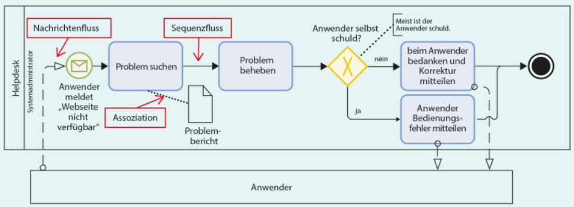

In der Abbildung wird ein Geschäftsprozess mit einer Interaktion zwischen der Rolle Anwender und der Rolle Systemadministrator als Bestandteil der Organisationseinheit Helpdesk dargestellt. Von den internen Abläufen der Rolle Anwender wird abstrahiert, deswegen ist diese als zugeklappter Pool (Black Box) modelliert. Der Prozess in der Organisationseinheit Helpdesk (modelliert als Pool) beginnt, indem bei einem Systemadministrator (modelliert als Lane) die Nachricht „Webseite nicht verfügbar“ eintrifft. Die Nachricht wird über einen Nachrichtenfluss vom Anwender zum Helpdesk übermittelt. Die Kommunikation zwischen Pools darf nur über Nachrichtenflüsse geschehen. Der Systemadministrator führt die Aktivität „Problem suchen“ aus und nutzt dazu einen „Problembericht“, der als Datenobjekt dargestellt ist. Außerdem behebt er in der folgenden Aktivität das Problem und muss entscheiden, ob der Anwender die Ursache für das Problem ist. Als Kommentar ist an die Entscheidung notiert, dass dies häufig der Fall ist.  Ist der Anwender schuld, wird ihm der Bedienfehler über eine Nachricht mitgeteilt, sodass er daraufhin das Problem selbst lösen kann. Ist der Anwender nicht schuld, wird das Problem vom Systemadministrator behoben, der sich beim Anwender mit einer Nachricht bedankt. Nachrichten müssen nicht explizit modelliert werden. Egal ob der Anwender schuld ist oder nicht, endet danach der Prozess, was durch ein Endereignis dargestellt wird.

### Gateways
> Gateways leiten Verzweigungen im Sequenzfluss eines Diagramms ein und beenden Verzweigungen. Die interne Markierung des Gateways legt dessen Bedeutung fest. Wir unterscheiden zwischen exklusiven, inklusiven, parallelen und ereignisbasierten Gateways.

- **Exklusive Verzweigungen (XOR)**:  
teilen den Sequenzfluss in echte Alternativen (**exklusives ODER**). Entweder wird der eine oder der andere Sequenzfluss ausgeführt, jedoch niemals mehr als einer.
- **Inklusive Gateways (OR)**:  
teilen den Sequenzfluss ebenso in Alternativen mit dem Unterschied, dass auch mehrere Flüsse ausgeführt werden können (**logisches ODER**).  

*Beispiel: BPMN - XOR und OR Gateway*
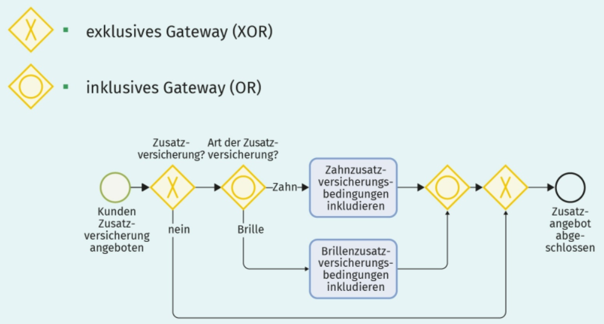
Die Abbildung zeigt ein einfaches Beispiel für die Verwendung von exklusiven und inklusiven Entscheidungen. Die Entscheidung, ob eine Zusatzversicherung abgeschlossen wird, kann entweder mit ja oder mit nein beantwortet werden. Wenn entschieden wurde, dass eine Zusatzversicherung abgeschlossen werden soll, kann entweder eine Zahn- oder eine Brillenzusatzversicherung abgeschlossen werden oder beide.

- Das **parallele Gateway (AND)**:  
führt zu einer Aufspaltung des Sequenzflusses in mehrere gleichzeitig ausgeführte Sequenzflüsse.
- Ein **ereignisbasiertes Gateway**:  
steuert den Sequenzfluss in Abhängigkeit vom Eintritt eines bestimmten Ereignisses (*z.B. dem Eintreffen einer Bestellung*).  

*Beispiel: BPNN - AND und event-driven Gateway*
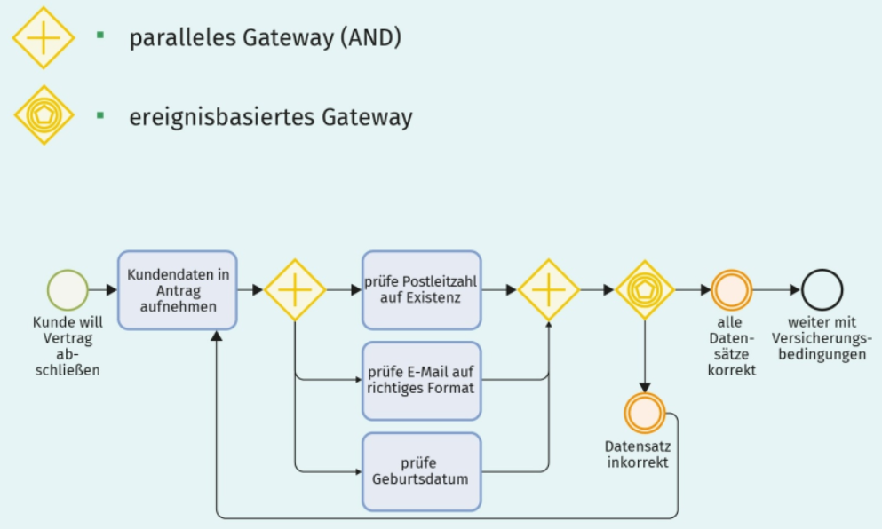
Die Abbildung zeigt die Verwendung von parallelen und ereignisbasierten Gateways. Die dargestellten Prüfaktivitäten können parallel abgearbeitet werden. Sobald alle Prüfungen abgeschlossen sind, wird durch das Ereignis „Prüfergebnis fertig“ entschieden, wie der Ablauf weitergeht. Sind alle Daten korrekt, ist der Prozess abgeschlossen. Falls der Datensatz inkorrekt ist, muss die Aktivität „Kundendaten in Antrag aufnehmen“ erneut ausgeführt werden. Der Eingang zweier Sequenzflüsse in eine Aktivität ist in der BPMN erlaubt, ohne dass dies etwas Spezielles bedeutet. Entweder führt der eine Sequenzfluss zur Ausführung der Aktivität oder der andere. Dies ist nicht in allen Notationen so (*wie z.B. in UML-Aktivitätsdiagrammen*). Daher ist es empfehlenswert, immer zusammenführende Gateways zu modellieren, sodass beim Wechsel der Notation nicht versehentlich Fehler unterlaufen.

### Übersicht über die BPMN-Elemente
Zu Beginn des RE-Prozesses kann eine vollumfängliche Nutzung der BPMN hinderlich sein, denn die Stakeholder müssen die Anforderungen verstehen, um deren Korrektheit und Angemessenheit beurteilen zu können. Je weiter der RE-Prozess fortschreitet, desto konkreter und stabiler werden die Anforderungen und desto sinnvoller kann ein Einsatz weiterer Notationselemente der BPMN sein.

*Zuordnung BPMN zu Geschäftsprozesselementen*
|Element|Beispiel|Symbol(e) BPMN|
|---|---|---|
|Prozess|Antragsbearbeitung||
|Aktivität|Adressprüfung||
|Geschäftsobjekt|Antrag||
|Zustand|Schaden gemeldet  Schaden reguliert||
|Ereignis|Antragseingang||
|Rolle|Sachbearbeiter|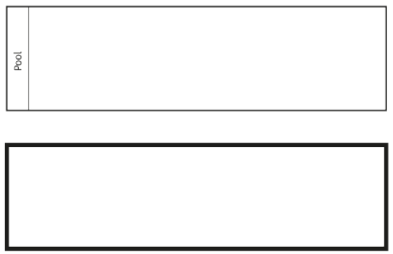|
|Nutzer|Karl Meier|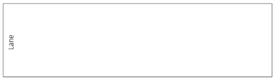|
|Geschäftsregeln|Versicherungssumme >  250.000.000 € →  separate Risikoprüfung  durchführen||
|Organisationseinheit|IT-Abteilung, IT-Sicherheitsbeauftragter|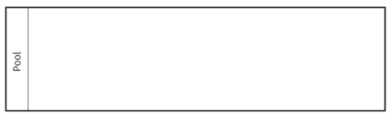|
|Kontrollfluss und -steuerung|Sequenzfluss, Kontrollfluss, Parallelisierung, Entscheidung|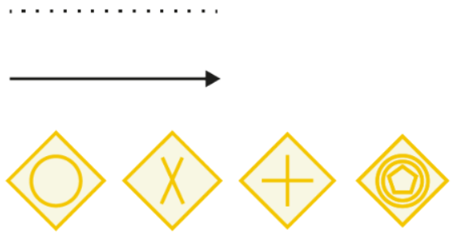|
|System|Antragssystem||
|Kommentare und Notizen|Gruppierung, Annotation, Kommentar||

---
## 3. Modellierung mit Ereignisgesteuerten Prozessketten
> Ereignisgesteuerte Prozessketten (EPK) sind im deutschsprachigen Raum weit verbreitet. Sie haben ihren Ursprung im Saarland. Dort wurden sie 1992 unter der Leitung von August Wilhelm Scheer von seiner Arbeitsgruppe an der Universität des Saarlandes entwickelt. Die EPK wird, genau wie die BPMN, eingesetzt, um betriebliche Abläufe zu modellieren. Erweiterte Ereignisgesteuerte Prozessketten (eEPK) erhöhen durch zusätzliche Notationselemente die Ausdrucksmächtigkeit der EPK.  

*Beispiel: EPK*
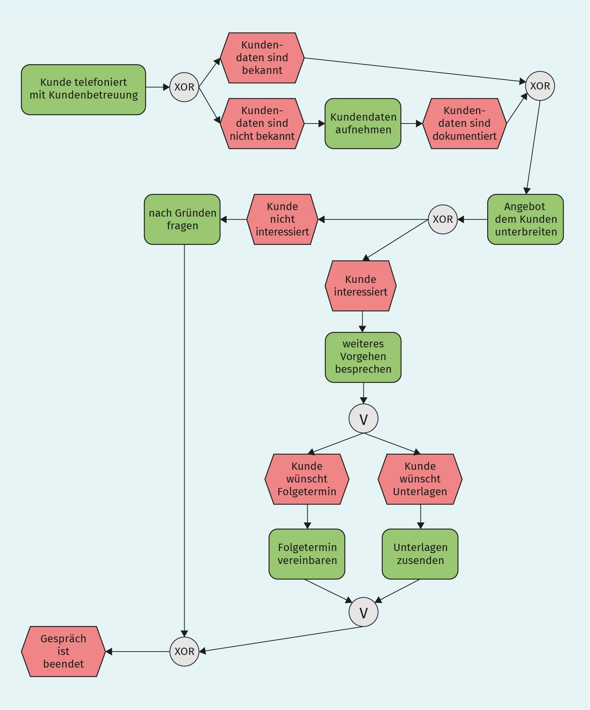
Die Abbildung zeigt folgenden Sachverhalt: Ein potenzieller Kunde telefoniert mit der Kundenbetreuung. Sind die Kundendaten nicht bekannt, werden diese zunächst dokumentiert. Sind die Kundendaten bekannt, wird ein Angebot unterbreitet. Ist der Kunde nicht am Angebot interessiert, werden die Gründe dazu erfragt. Dann ist das Gespräch beendet. Ist der Kunde hingegen interessiert, wird das weitere Vorgehen besprochen. Zur Auswahl stehen die Vereinbarung eines Folgetermins und das Versenden von Unterlagen. Beide Optionen können einzeln oder gemeinsam gewählt werden. Je nach Entscheidung wird der Termin vereinbart und/oder die Unterlagen versendet. Anschließend ist das Gespräch zu Ende. An diesem Beispiel fällt eine Besonderheit der EPK auf.  
Funktionen und Ereignisse wechseln sich immer ab, dies ist von der Notation vorgeschrieben.

*Basisnotationselemente der EPK ohne Konnektoren*
|Name|Bedeutung|Darstellung|
|---|---|---|
|Ereignis|Ein Ereignis ist etwas, das im Verlauf eines Prozesses passiert und den Ablauf beeinflusst. Ereignisse haben in der Regel eine Ursache (trigger) und Auswirkungen (results). Es ist jedoch selber passiv und trifft keine Entscheidungen. Das heißt, Ereignisse verbrauchen weder Ressourcen noch Zeit. Jeder Geschäftsprozess hat mindestens ein Start- und ein Endereignis. Mehrere Startereignisse treten insbesondere in Teilprozessen auf. Beispiel: Ein Kundenkontakt kann die unterschiedlichsten Gründe für das Zustandekommen besitzen und genauso mit vielen differenzierten Ereignissen enden. Ein Ereignis wird nach dem Muster [Objekt] und passiviertes [Verb] beschrieben (*z.B.Schaden gemeldet*).|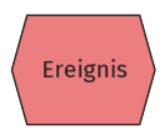|
|Funktion|Eine Funktion ist eine fachliche Tätigkeit oder Aufgabe. Sie nimmt meist Zeit in Anspruch und kann Ressourcen verbrauchen. Sie kann über den weiteren Verlauf des Prozesses entscheiden, ist also aktiv und sollte auch so benannt werden. Die Funktion ist der Aktivität in BPMN gleichzusetzen. Funktionen werden aktiv formuliert und nach dem Pattern [Objekt] + [Verb] benannt (z. B. Antrag unterschreiben).|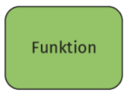|
|Kontrollfluss|Kontrollflusskanten bringen Funktionen und Ereignisse in zeitliche und logische Abfolgen. Ereignisse und Funktionen folgen einander dabei streng abwechselnd, d. h., das Element nach einem Ereignis muss immer eine Funktion sein und umgekehrt. Jedes Element der Notation ist durch eine Kante verbunden. Es gibt keine losgelösten Ereignisse oder Funktionen; EPK sind immer zusammenhängende Graphen. Eine Kante verbindet immer genau zwei Elemente miteinander, d. h., ein Element hat nie zwei ausgehende Kanten.|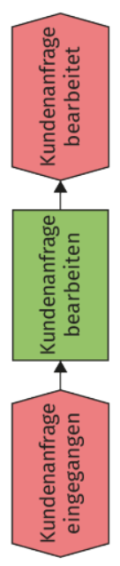|

### Konnektoren
> Analog zu den Gateways der BPMN gibt es in EPK Konnektoren. Diese Konnektoren leiten Verzweigungen ein (sogenannter Split) oder beenden sie (sogenannter Join). Ein Konnektor ist entweder ein Split oder ein Join, jedoch nie beides gleichzeitig. Konnektoren sind die einzigen Symbole, die Kontrollflüsse verzweigen oder zusammenführen. Ereignisse und Funktionen haben nie mehr als einen Ein- und einen Ausgang.  

*Beispiel: EPK Konnektoren*
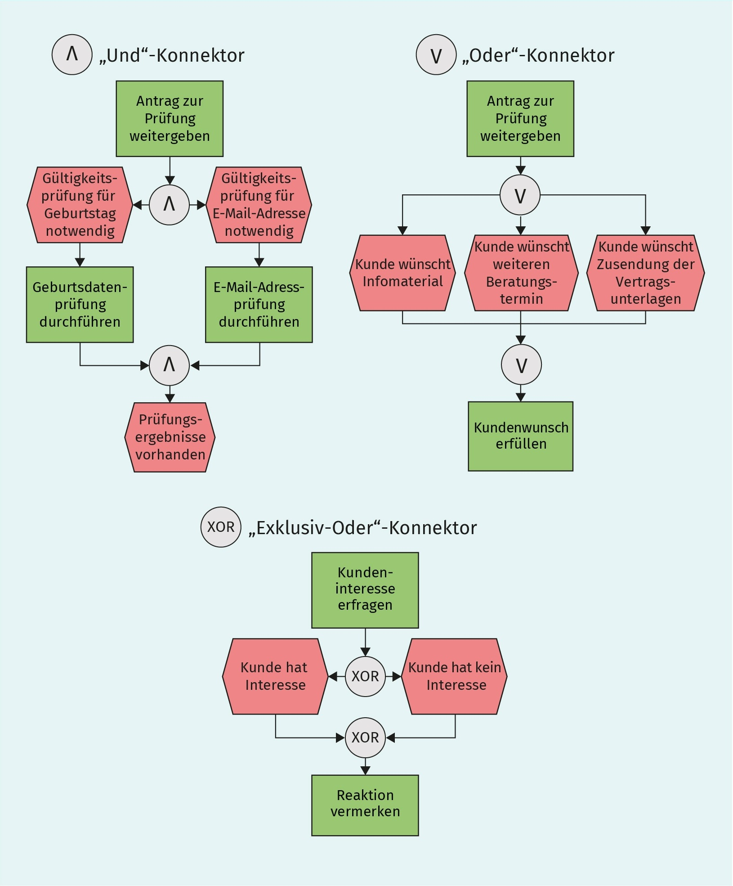
- **„Und“-Konnektoren `^`**:  
umschließen Teilprozesse, die gleichzeitig bzw. unabhängig voneinander ausgeführt werden.
- **„Oder“-Konnektoren `v`**:  
umschließen alternative Pfade, wobei mehrere Alternativen gleichzeitig ausgeführt werden können.
- **„Exklusiv-Oder“-Konnektoren `XOR`**:  
umschließen Alternativen, von denen jeweils nur eine ausgeführt werden darf.

### Wichtige Regeln zur Modellierung
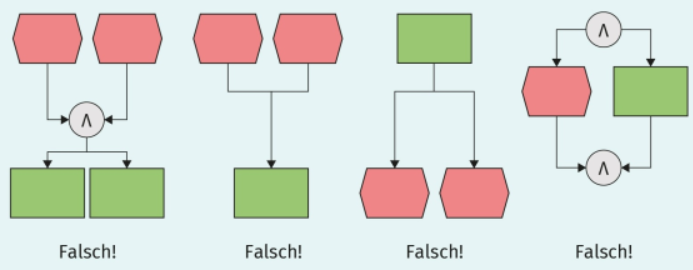  
Die Abbildung zeigt Negativbeispiele, die im Folgenden von links nach rechts erläutert werden.  
- **1:** In der ersten EPK werden zwei Ereignisse mit einem Und-Konnektor verbunden. Der Join wird jedoch gleichzeitig wieder als Split benutzt, was in der EPK nicht zulässig ist.
- **2-3:** Auch die beiden Kontrollflüsse von den zwei Ereignissen zu der Funktion in der zweiten EPK sind nicht zulässig, genau wie der umgekehrte Fall in der dritten EPK.
- **4:** Die EPK ganz rechts zeigt eine parallele Ausführung, die durch einen Und-Konnektor dargestellt ist. Der Diagrammausschnitt verstößt gegen die Regel, dass Ereignis und Funktion streng abwechselnd aufeinanderfolgen müssen, da vor dem verzweigenden Konnektor entweder ein Ereignis oder eine Funktion modelliert sein muss. Gleiches gilt für das Notationselement nach dem zusammenführenden Konnektor. Außerdem darf auf ein Ergeignis keine Entscheidung folgen. Einer Entscheidung muss eine Funktion vorangestellt sein.  
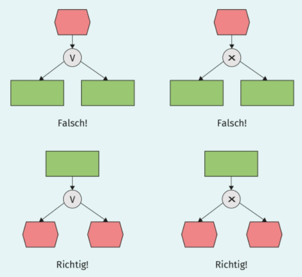

### Erweiterte EPK
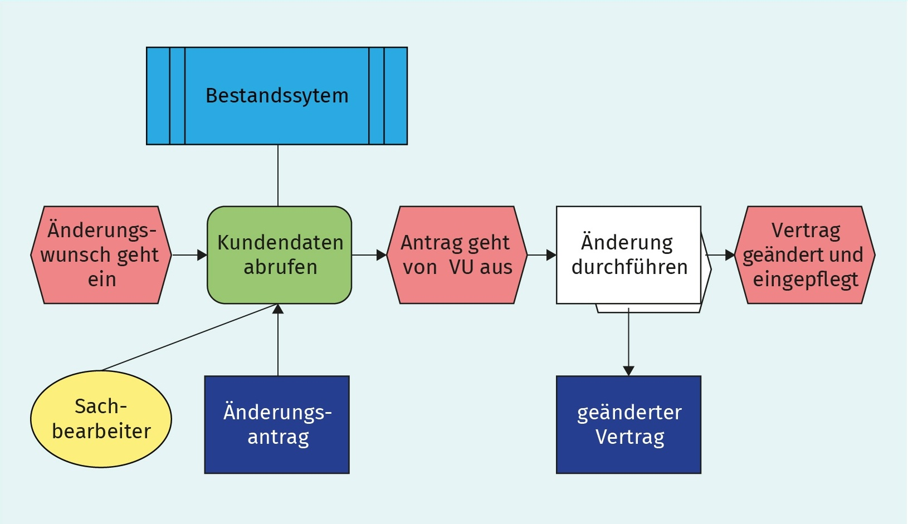
Die Abbildung zeigt die Notationselemente der erweiterten Ereignisgesteuerten Prozessketten, die der Notation mehr Ausdrucksmöglichkeit verleihen.
- Das **gelbe Oval** kennzeichnet eine Organisationseinheit und ist den Pools bzw. Lanes der BPMN gleichzusetzen.
- Anwendungssysteme werden in einem **hellblauen Rechteck** mit doppelten vertikalen Strichen an den Seiten dargestellt.
- Informationsobjekte werden im **dunkelblauen Rechteck** dargestellt und können Datenobjekte bzw. eine Sammlung von Datenobjekten oder sonstigen Datenspeichern darstellen.
- Mit Informationsobjekten können also auch persistente Datenspeicher modelliert werden, was sie von den Datenobjekten der BPMN unterscheidet.
- Prozesswegweiser können als Hinweise auf andere Prozesse verstanden werden. Sie werden durch ein Rechteck symbolisiert, hinter dem sich ein Sechseck verbirgt. Mit Prozesswegweiser ist es also möglich, andere Prozesse zu referenzieren und Prozesshierarchien zu bilden.
