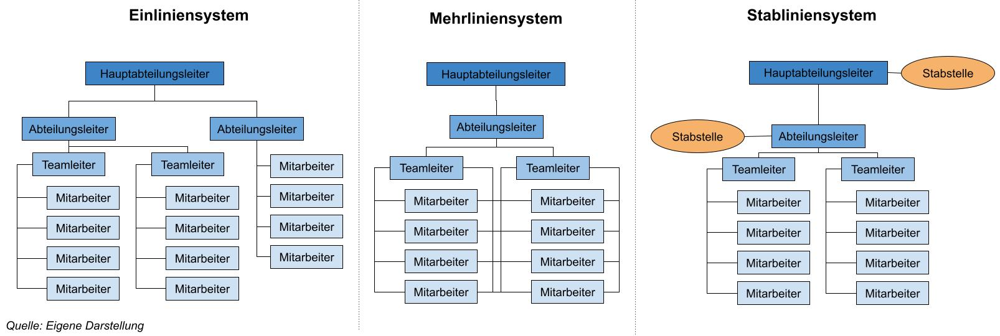

# Requirements Engineering
# L05 Modellierung Von Prozessen

LERNZIELE

	<ul>
		<li>Was unter Unternehmensmodellierung, Aufbauorganisation und Ablauforganisation verstanden wird.</li>
		<li>Was ein Geschäftsprozess ist und aus welchen Teilen er besteht.</li>
		<li>Auf welchen Abstraktionsebenen Geschäftsprozesse modelliert werden können.</li>
		<li>Was die Grundelemente der Business Process Model and Notation sind.</li>
		<li>Was die Grundelemente erweiterter Ereignisgesteuerter Prozessketten sind.</li>
	</ul>

ZUSAMMENFASSUNG

---
## 1. Grundlagen und Begriffe

- Unternehmensmodellierung
	- Aufbauorganisation
	- Ablauforganisation
	- die Bestandteile von Geschäftsprozessen

In diesem Lernzyklus werden die Grundlagen und Begriffe zur Unternehmensmodellie-
rung erläutert. Dazu zählen neben der Aufbauorganisation auch die Ablauforganisation
und die Bestandteile von Geschäftsprozessen.

- Die Bestandteile eines Prozesses können
verwendet werden, um die Geschäftsprozesse zu modellieren.

Da Geschäftsprozesse die Grundlage des betrieblichen Handelns bilden, stellen sie eine elementare Grundlage für das Requirements Engineering für betriebliche Informationssysteme dar. 

In einem Geschäftsprozess werden Aufgaben durch bestimmte Organisationseinheiten erledigt. In
diesen Aufgaben werden Entscheidungen getroffen und Geschäftsobjekte bearbeitet. Die
Bearbeitung dieser Aufgaben kann durch IT-Systeme unterstützt werden, sodass die Ange-
messenheit und Korrektheit der Anforderungen an dieses System einen wesentlichen Ein-
fluss auf den Erfolg des Unternehmens haben.

Im Folgenden wird zuerst erläutert, wie
Organisationen strukturell aufgebaut sein können (sogenannte Aufbauorganisation), um
daraufhin die Ziele von Geschäftsprozessen in der Ablauforganisation und die Elemente
von Geschäftsprozessen sowie deren Beziehungen zueinander zu erläutern.

### Aufbauorganisation (*Organisationsstruktur eines Unternehmens*)
- Hierarchischer Aufbau, legt die Rahmenbedingungen für die Bearbeitung von Aufgaben in einem Unternehmen fest (*welche Aufgaben von welchen Menschen mit welchen Sachmitteln erledigt werden sollen*).
- Ziel ist die arbeitsteilige Gliederung und Ordnung der betrieblichen Handlungsprozesse durch Bildung und Verteilung von Aufgaben.
- In einer Hierarchie werden Führungsstrukturen und damit Weisungsbefugnisse gebildet, die eine
Zuordnung von Aufgaben und Verantwortlichkeiten möglich machen.
- In der Aufbauorganisation gibt es mehrere Organisationsformen. Das Einlinien- und das Mehrliniensystem sowie die Stablinienorganisation werden im Folgenden erläutert.

##### Organisationsformen

- **Einliniensystem**:
	- In jeder Hierarchieebene herrscht Vollkompetenz.
	- Die obere Ebene ist den untergeordneten Ebenen gegenüber weisungs- und entscheidungsbefugt.
	- Die untergeordneten Ebenen haben gegenüber ihrer übergeordneten Ebene Vorschlagsrecht.
	- Eine Linie von oben nach unten (z. B. Hauptabteilungsleiter → Abteilungsleiter → Teamleiter) heißt Dienstweg, dessen Einhaltung obligatorisch ist (*z.B Damit zwei Teamleiter miteinander arbeiten, ist die Einbeziehung des übergeordneten Abteilungsleiters verpflichtend*).
	- **Vorteile**:
		- klaren Befugnisse und Verantwortungsbereiche
	- **Nachteile**:
		- langen Informationswege
		- Vorgesetzte werden überlastet (*müssen jede Entscheidung treffen, können Entscheidungskompetenz nicht delegieren*).
- **Mehrliniensystem**:
	- Aufgebaut wie Einliniensystem, außer dass gleichrangig Vorgesetzte auch teamübergreifende Weisungsbefugnis haben (*Teamleiter von Team A ist auch den Mitarbeitern von Team B gegenüber weisungsbefugt bzw. die Mitarbeiter von Team B können sich auch an den Teamleiter von Team A wenden*).
	- **Vorteile**:
		- kürzere Kommunikationswegen
		- Spezialisierung der Leitung durch Funktionsverteilung
		- Durch direkte Kommunikationswege können sich Vorgesetzte mehr auf ihre Kernkompetenz konzentrieren, da Verwaltungsaufgaben, die im Einliniensystem zu erfüllen wären, wegfallen (*-> Betonung der Fachautorität*).
	- **Nachteile**:
		- Abgrenzungsprobleme der Zuständigkeiten und somit Kompetenzkonflikte
- **Stabliniensystem**:
	- Ist um eine Stabstelle erweitertes Einliniensystem zur Entlastung der Linieninstanzen.
	- Ein Stab ist ein Experte für bestimmte Gebiete. Vergibt keine Arbeitsanweisungen sonder Steht nur beratend zu Seite.
	- **Vorteile**:
		- die gleichen wie beim Einliniensystem
		- zunehmende Entscheidungsqualität durch Spezialisten
	- **Nachteile**:
		- eine Konzentration des spezialisierten Wissens in der Leitungsebene
		- verstärkter autoritärer Führungsstil und Gefahr einer selektiven Informationsweitergabe
		- zusätzliche Kosten für Stabstellen
- Projekte sind als temporäre Organisation häufig etwas anders organisiert. Die dauerhaft bestehenden Bereiche und Abteilungen im Unternehmen folgen in der Regel jedoch den hier gezeigten Organisationsmodellen.

### Ablauforganisation
> Beschreibt den Ablauf innerhalb der Organisationsstruktur. Sie dokumentiert die Gestaltung der Arbeitsabläufe der Aufbauorganisation durch die Verkettung einzelner Arbeitsschritte unter Nutzung der Ressourcen (Stellen, Abteilungen, Rollen, Instanzen, Aufgaben) der Aufbauorganisation. Im Mittelpunkt stehen dabei die zielbezogene menschliche Handlung und die Ausstattung von Arbeitsprozessen mit Sachmitteln und Informationen (sogenannter Leistungserstellungsprozess).

##### Ziele:
- Die Auslastung der Leistungserstellung soll maximal sein.
- Bei maximaler Auslastung sollen Durchlaufzeiten so gering wie möglich sein. Gleiches gilt für Wartezeiten, in denen der Leistungserstellungsprozess stillsteht.
- Die Kosten der Leistungserstellung sollen so gering wie möglich sein.
- Die Qualität der Vorgangsbearbeitung und die Arbeitsbedingungen sollen verbessert werden.
- Die Ablauforganisation ist durch Geschäftsprozesse definiert.

#### Elemente in Geschäftsprozessen
>„Ein Geschäftsprozess (GP) ist eine zielgerichtete, zeitlich-logische Abfolge von Aufgaben, die arbeitsteilig von mehreren Organisationen oder Organisationseinheiten unter Nutzung von IKT (**I**nformations- und **K**ommunikations**t**echnologie) ausgeführt werden können.  
Er dient der Erstellung von Leistungen entsprechend den vorgegebenen, aus der Unternehmensstrategie abgeleiteten Prozesszielen. Der Geschäftsprozess kann formal auf unterschiedlichen Detaillierungsebenen aus mehreren Sichten beschrieben werden. Ein maximaler Detaillierungsgrad der Beschreibung ist dann erreicht, wenn die ausgewiesenen Aufgaben je in einem Zug von einem Mitarbeiter ohne Wechsel des Arbeitsplatzes ausgeführt werden können“.

- In einem Geschäftsprozess wird also eine Reihe von Aktivitäten in einer bestimmten Reihenfolge unter Zuhilfenahme von IT durch mehrere Organisationseinheiten (Stelle, Rolle, Abteilung, Bereich, Organisation) bearbeitet.

Ein Nutzer (z. B. Herr Klein) führt eine Aktivität (z. B. Schadenakte öffnen) in einer bestimmten
Rolle (z. B. Schadensachbearbeiter) aus. Die Rolle gehört zu einer Organisationseinheit (z.
B. Schaden- und Leistungsabteilung). Geschäftsprozesse bestehen aus einer Menge von
Teilprozessen. Teilprozesse können durch Aktivitäten verfeinert werden, die einer oder
mehreren Geschäftsregeln folgen (z. B. wenn die Schadenhöhe mehr als 100.000 € beträgt,
erfolgt die Prüfung des Schadens durch einen Gutachter). Teilprozesse und Aktivitäten
lösen Ereignisse (z. B. Schaden gemeldet) aus, genauso wie Ereignisse Teilprozesse auslö-
sen können. Ein Teilprozess hat einen bestimmten Zustand (z. B. Schadenbearbeitung
ausgeführt), genau wie Geschäftsobjekte (z. B. ein Schaden) einen bestimmten Zustand
haben (z. B. Schaden gemeldet). Ein Geschäftsobjekt wird im Rahmen einer Aktivität bear-
beitet.
