# Requirements Engineering
# L05 Modellierung von Prozessen

LERNZIELE

	<ul>
		<li>Was unter Unternehmensmodellierung, Aufbauorganisation und Ablauforganisation verstanden wird.</li>
		<li>Was ein Geschäftsprozess ist und aus welchen Teilen er besteht.</li>
		<li>Auf welchen Abstraktionsebenen Geschäftsprozesse modelliert werden können.</li>
		<li>Was die Grundelemente der Business Process Model and Notation sind.</li>
		<li>Was die Grundelemente erweiterter Ereignisgesteuerter Prozessketten sind.</li>
	</ul>

ZUSAMMENFASSUNG

In der Unternehmensmodellierung wird eine Bestandsaufnahme durch das Erstellen einer Ist-Übersicht über die Organisation von Unternehmen durch die Darstellung von Abläufen (Geschäftsprozessen) und Strukturen (Aufbauorganisation) erzeugt. Die Aufbauorganisation bildet die Struktur einer Organisation ab. Diese Struktur ist in den meisten Fällen hierarchisch aufgebaut und legt die Rahmenbedingungen für die Bearbeitung von Aufgaben in einem Unternehmen fest. Die Ablauforganisation steht im Abhängigkeitsverhältnis zur Aufbauorganisation, denn sie behandelt die gleichen Objekte, jedoch aus einer anderen Perspektive. Die Ablauforganisation drückt aus, wie Arbeitsabläufe (Geschäftsprozesse) der Aufbauorganisation durch die Verkettung einzelner Arbeitsschritte unter Nutzung der Ressourcen (Stellen, Abteilungen, Rollen, Instanzen, Aufgaben) der Aufbauorganisation gestaltet sind.  

Ein Geschäftsprozess ist eine Reihe von Aktivitäten in einer bestimmten Reihenfolge, die ggf. unter Zuhilfenahme von IT durch mehrere Organisationseinheiten (Stelle, Rolle, Abteilung, Bereich, Organisation) bearbeitet wird. Elemente eines Geschäftsprozesses sind Nutzer, Aktivitäten, Rollen und Organisationseinheiten. Ein Prozess kann durch andere (Teil-)Prozesse und Aktivitäten verfeinert werden, die einer oder mehreren Geschäftsregeln folgen. Prozesse und Aktivitäten lösen Ereignisse aus und umgekehrt. Ein Prozess hat, genau wie Geschäftsobjekte, einen bestimmten Zustand.  

Um Abläufe zu modellieren, kann die Business Process Model and Notation (BPMN) verwendet werden. Außerdem kann die Ablauforganisation eines Unternehmens mit Ereignisgesteuerten Prozessketten (EPK) modelliert werden. Die EPK wird, genau wie die BPMN, eingesetzt, um betriebliche Abläufe zu modellieren. Erweiterte Ereignisgesteuerte Prozessketten (eEPK) erhöhen durch zusätzliche Notationselemente die Ausdrucksmächtigkeit der EPK.

---
## 1. Grundlagen und Begriffe

- Unternehmensmodellierung
	- Aufbauorganisation (*wie Unternehmen Strukturiert sind*)
	- Ablauforganisation (*wie Aufgaben gelöst werden*)

### Aufbauorganisation (*Organisationsstruktur eines Unternehmens*)
- Hierarchischer Aufbau, legt die Rahmenbedingungen für die Bearbeitung von Aufgaben in einem Unternehmen fest (*welche Aufgaben von welchen Menschen mit welchen Sachmitteln erledigt werden sollen*).
- Ziel ist die arbeitsteilige Gliederung und Ordnung der betrieblichen Handlungsprozesse durch Bildung und Verteilung von Aufgaben.
- In einer Hierarchie werden Führungsstrukturen und damit Weisungsbefugnisse gebildet, die eine
Zuordnung von Aufgaben und Verantwortlichkeiten möglich machen.

##### Organisationsformen
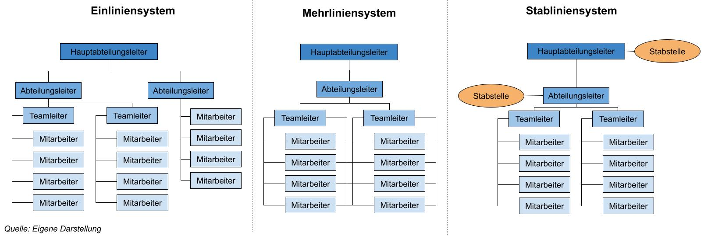

|System Beschreibung |Vorteile |Nachteile |
|---|---|---|
|**Einliniensystem**:  - in jeder Hierarchieebene herrscht Vollkompetenz  - obere Ebene ist den untergeordneten Ebenen gegenüber weisungs- und entscheidungsbefugt  - untergeordneten Ebenen haben gegenüber ihrer übergeordneten Ebene Vorschlagsrecht  - eine Linie von oben nach unten (*z. B. Hauptabteilungsleiter → Abteilungsleiter → Teamleiter*) heißt Dienstweg, dessen Einhaltung obligatorisch ist (*z.B. Damit zwei Teamleiter miteinander arbeiten, ist die Einbeziehung des übergeordneten Abteilungsleiters verpflichtend*) |- klaren Befugnisse und Verantwortungsbereiche |- langen Informationswege  - Vorgesetzte werden überlastet (*müssen jede Entscheidung treffen, können Entscheidungskompetenz nicht delegieren*) |
|**Mehrliniensystem**:  - wie Einliniensystem, außer dass gleichrangig Vorgesetzte auch teamübergreifende Weisungsbefugnis haben (*z.B. Teamleiter von Team A ist auch den Mitarbeitern von Team B gegenüber weisungsbefugt bzw. die Mitarbeiter von Team B können sich auch an den Teamleiter von Team A wenden*) |- kürzere Kommunikationswegen   - Spezialisierung der Leitung durch Funktionsverteilung   - Durch direkte Kommunikationswege können sich Vorgesetzte mehr auf ihre Kernkompetenz konzentrieren, da Verwaltungsaufgaben, die im Einliniensystem zu erfüllen wären, wegfallen (-> Betonung der Fachautorität). |- Abgrenzungsprobleme der Zuständigkeiten und somit Kompetenzkonflikte |
| **Stabliniensystem**:   - wie Einliniensystem, nur um eine Stabstelle erweitertes zur Entlastung der Linieninstanzen.   - Ein Stab ist ein Experte für bestimmte Gebiete. Vergibt keine Arbeitsanweisungen sondern Steht nur beratend zu Seite. |- die gleichen wie beim Einliniensystem   - zunehmende Entscheidungsqualität durch Spezialisten |- eine Konzentration des spezialisierten Wissens in der Leitungsebene   - verstärkter autoritärer Führungsstil und Gefahr einer selektiven Informationsweitergabe   - zusätzliche Kosten für Stabstellen |

- Projekte sind als temporäre Organisation häufig etwas anders organisiert. Die dauerhaft bestehenden Bereiche und Abteilungen im Unternehmen folgen in der Regel jedoch den hier gezeigten Organisationsmodellen.

### Ablauforganisation
> Beschreibt den Ablauf innerhalb der Organisationsstruktur. Sie dokumentiert die Gestaltung der Arbeitsabläufe der Aufbauorganisation durch die Verkettung einzelner Arbeitsschritte unter Nutzung der Ressourcen der Aufbauorganisation.  
**Leistungserstellungsprozess**: im Mittelpunkt stehen die zielbezogene menschliche Handlung und die Ausstattung von Arbeitsprozessen mit **Sachmitteln** und **Informationen**.

##### Ziele:
- Die Auslastung der Leistungserstellung soll maximal sein:
	- bei maximaler Auslastung oder bei Wartezeiten, sollen Durchlauf- bzw. Wartezeiten so gering wie möglich sein.
- Die Kosten der Leistungserstellung sollen so gering wie möglich sein.
- Die Qualität der Vorgangsbearbeitung und die Arbeitsbedingungen sollen verbessert werden.
- Die Ablauforganisation ist durch Geschäftsprozesse definiert.

#### Elemente in Geschäftsprozessen
>„Ist eine zielgerichtete, zeitlich-logische Abfolge von Aufgaben, die arbeitsteilig von mehreren Organisationen oder Organisationseinheiten unter Nutzung von IKT (**I**nformations- und **K**ommunikations**t**echnologie) ausgeführt werden können. 
Er dient der Erstellung von Leistungen entsprechend den vorgegebenen, aus der Unternehmensstrategie abgeleiteten Prozesszielen.  
Der Geschäftsprozess kann formal auf unterschiedlichen Detaillierungsebenen aus mehreren Sichten beschrieben werden.  
Ein maximaler Detaillierungsgrad der Beschreibung ist dann erreicht, wenn die ausgewiesenen Aufgaben je in einem Zug von einem Mitarbeiter ohne Wechsel des Arbeitsplatzes ausgeführt werden können“.

- In einem Geschäftsprozess wird also eine Reihe von Aktivitäten in einer bestimmten Reihenfolge unter Zuhilfenahme von IT durch mehrere Organisationseinheiten (Stelle, Rolle, Abteilung, Bereich, Organisation) bearbeitet.

- Ein Nutzer (*z.B. Herr Klein*) führt eine Aktivität (*z.B. Schadenakte öffnen*) in einer bestimmten Rolle (*z.B. Schadensachbearbeiter*) aus. Die Rolle gehört zu einer Organisationseinheit (*z.B. Schaden- und Leistungsabteilung*).

*Bestandteile und Zusammenhänge der Bestandteile eines Geschäftsprozesses*
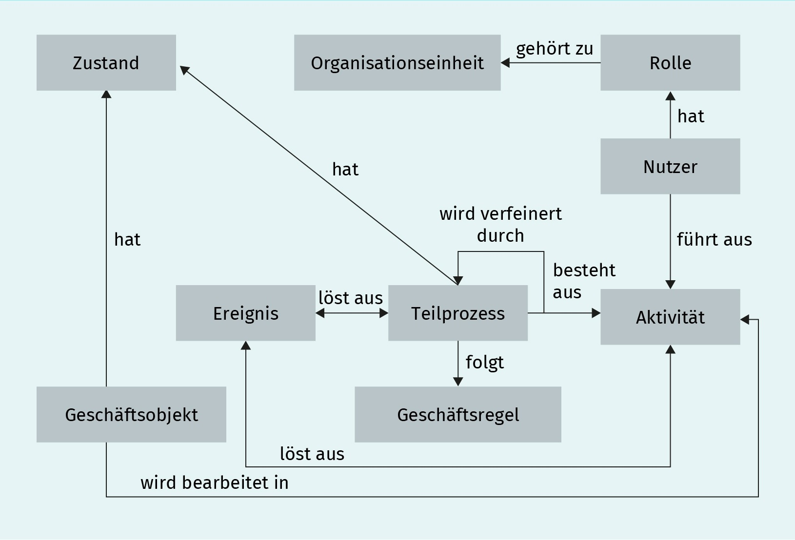

*Elemente eines Geschäftsprozesses*
|Element|Beschreibung|Beispiel|
|---|---|---|
|Prozess|Aktivitätsfolge mit möglichen Vorgängern und Nachfolgern|Antragsbearbeitung
|Aktivität|ausführbare Einheit, die nicht sinnvoll weiter zerlegt werden kann|Adressbearbeitung|
|Geschäftsobjekt|materieller oder immaterieller Gegenstand|Antrag|
|Zustand|Status von Geschäftsobjekten, Prozessen|offener Antrag|
|Ereignis|Auslöser/Resultat für einen Prozess/eine Aktivität|Antragseingang|
|Rolle|Position mit bestimmten Aufgaben|Sachbearbeiter|
|Nutzer|Rolleninhaber mit bestimmtem Zweck im Prozess, Mensch oder Maschine|Karl Meier|
|Geschäftsregeln|Vorschriften, nach denen Prozesse ablaufen|Versicherungssumme > 250.000.000 € → separate Risikoprüfung durchführen|
|Organisationseinheit|Zuordnungsbereich von Kompetenz für einen oder mehrere Aufgabenträger|IT-Abteilung, IT-Sicherheits-beauftragter|

- Geschäftsprozesse bestehen aus einer Menge von Teilprozessen. Teilprozesse können durch Aktivitäten verfeinert werden, die einer oder mehreren Geschäftsregeln folgen (*z.B. wenn die Schadenhöhe mehr als 100.000 € beträgt, erfolgt die Prüfung des Schadens durch einen Gutachter*).

- Teilprozesse und Aktivitäten lösen Ereignisse (*z.B. Schaden gemeldet*) aus, genauso wie Ereignisse Teilprozesse auslösen können. Ein Teilprozess hat einen bestimmten Zustand (*z.B. Schadenbearbeitung ausgeführt*), genau wie Geschäftsobjekte (*z.B. ein Schaden*) einen bestimmten Zustand haben (*z.B. Schaden gemeldet*). Ein Geschäftsobjekt wird im Rahmen einer Aktivität bearbeitet.

*Strukturierung von Geschäftsprozessen*
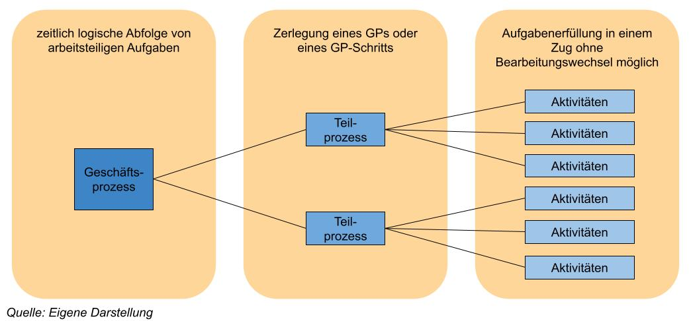

---
## 2. Elemente der BPMN und EPK Prozess Modelle

|Beschreibung: Elemente in Geschäftsprozessen |Darstellung  BPMN |Darstellung  (E)EPK |
|---|---|---|
|**Aktivität** (*BPMN*) *bzw.* **Funktion** (*EPK*)  - Aufgaben die im Prozess ausgeführt werden  - nicht weiter zerlegbar (*atomar*)  - Benennung: **[Objekt]** + (*aktives*) **[Verb]** (*z.B. Antrag unterschreiben*)     **Aktivität** (*BPMN*)  - zwei Sequenzflüsse können in eine Aktivität übergehen |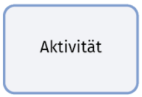 | 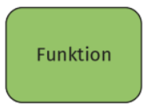 |
|**Teilprozess** (*BPMN*) *bzw.* **Prozesswegweiser** (*erweitertes EPK*)  - verweist auf Teilprozesse ohne dabei mehr Komplexität zu erzeugen  - Benennung: **[Objekt]** + (*aktives*) **[Verb]** (*z.B. Schaden bearbeiten*)    **Teilprozess** (*BPMN*)  - wird durch ein weiteres BPMN dargestellt welches durch das `+` Zeichen geöffnet bzw. geschlossen wird     **Prozesswegweiser** (*erweitertes EPK*)  - kann nicht geöffnet werden verweist aber auf einen Teilprozess |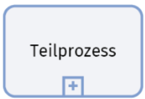 |*Erweitertes EPK*  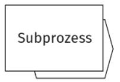 |
|**Ereignis** (*BPMN + EPK*)  - entsteht im Verlauf eines (*Teil-*) Prozess   - haben in der Regel eine Ursache (*trigger*) und Auswirkung (*result*)  - Jeder (*Teil-*) Prozess muss mindestens einen Start-Ereignis & End-Ereignis besitzen  - Benennung: **[Objekt]** + (*passiviertes*) **[Verb]** (*z.B. Schaden gemeldet -> ist bereits eingetreten*)    **Ereignis** (*BPMN*)  - 3 Typen mit eigenen Symbolen (*Start-, Zwischen-, Endereignis*) welche jeweils typisiert (*z.B. Nachricht, Signal, Fehler*) oder untypisiert (*keine interne Markierung = "Blanko"*) sein können   - kann aktive den Ablauf steuern (*ereignisbasiertes Gateway*)    **Ereignis**  (*EPK*)  - hat keine Handlungsfähigkeit, weshalb auch keine Entscheidung von ihm ausgehen darf|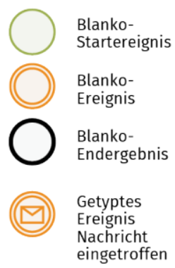 |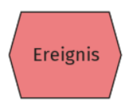 |
|**Sequenzfluss** (*BPMN*) *bzw.* **Kontrollfluss** (*EPK*)   - bringen Aktivitäten/Funktionen und Ereignisse in zeitliche und logische Abfolge, sind niemals losgelöst  - eine Kante verbindet immer nur zwei Elemente miteinander    **Kontrollfluss** (*EPK*)  - Funktionen und Ergebnisse müssen sich immer abwechseln | | |
|**Datenobjekte** (*BPMN + Erweiterte EPK*)  - werden zur Ausführung von Aktivitäten/Funktionen gebraucht bzw. erzeugt  - können einzelne Objekte (*z.B. Schadenakte*) oder Sammlungen (*z.B. Antragsdaten*) repräsentieren  - werden mit dem sie umschließenden Prozess instanziiert und zerstört    **Informationsobjekte** (*Erweiterte EPK*)  - können auch persistente Datenspeicher darstellen| |*Erweiterte EPK*  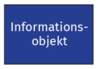 |
|**Pools** (*BPMN*)  - sind Teilnehmer oder Verantwortliche eines Prozess und können Organisationen, Rollen, Personen oder Systeme sein (*z.B. Helpdesk*)   - kennzeichnen einen Teilprozess, benötigt d.h. ein Start- und ein Endereignis   - werden eingesetzt, um den Wechsel der Verantwortlichkeit in einem Geschäftsprozess zu modellieren   - können auch als Black Boxes (unter Ausblendung innerer Abläufe) dargestellt werden    **Organisationseinheit** (*Erweiterte EPK*)  - durch einen Strich mit der Betreffenden Funktion verbunden  - hat keine Unterteilungen und beschreibt nur OE |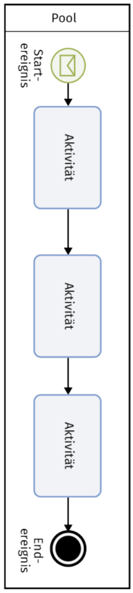 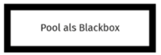 |*Erweiterte EPK*  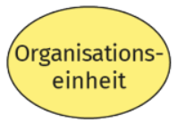 |
|**Lanes** (*Schwimmbahn*) (*BPMN*)  - Unterteilung **innerhalb** eines Pools   - weist Aufgabenträgern Zuständigkeiten für Aufgaben zu  - können verschachtelt sein  - Der Sequenzfluss (`->`) darf Lane-Grenzen überschreiten, nicht aber Pool-Grenzen     **Organisationseinheit** (*Erweiterte EPK*)  - durch einen Strich mit der Betreffenden Funktion verbunden| |*Erweiterte EPK*  |
|**Nachrichten** (*BPMN*)  - symbolisieren den Inhalt einer Kommunikation  - entweder an Nachrichtenflüsse assoziiert oder sie sind Bestandteil eines Ereignisses || *keine Nachrichten* |
|**Annotationen** (*BPMN*)  - Kommentare oder Notizen  - durch Assoziation (`...`) mit dem Flussobjekt (*Aktivität, Ereignis, Gateway*) verbunden | | *Keine Annotationen* |

|Beschreibung: Gateways (*BPMN*) & Konnektoren (*EPK*) |Darstellung  BPMN |Darstellung  EPK |
|---|---|---|
|**AND** (*parallel*) (*BPMN + EPK*)  - der Prozess gabelt sich am **AND-Split** in alle ausgehenden Pfade gleichzeitig auf, und wird erst fortgesetzt, wenn **"alle Pfade"** am **AND-Join** abgeschlossen sind    **AND** (*EPK*)  - ist der einzige Split-Konnektor vor dem entweder eine Funktion oder ein Ereignis stehen darf. |*"paralleles Gateway"*   |*"UND Konnektor"*  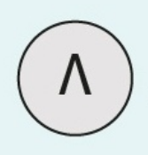 |
|**OR** (*BPMN + EPK*)  - der Prozess gabelt sich am **OR-Split**, von dort aus muss mindestens 1 Pfad (*können aber auch mehrere oder alle*) fortgesetzt werden, der Prozess geht erst weiter wenn **"alle fortgesetzten Pfade"** am **OR-Join** abgeschlossen sind     **OR** (*EPK*)  - im Gegensatz zum BPMN, kann ein Split-Konnektor nur auf eine Funktion folgen und nie auf ein Ereignis |*"inklusives Gateway"*   |*"Oder-Konnektor"*  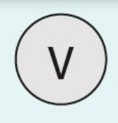 |
|**XOR** (*BPMN + EPK*)  - der Prozess gabelt sich am **XOR-Split**, von dort aus wird je nach den Bedingungen nur ein Pfad fortgesetzt, der Prozess geht erst weiter wenn **"der eine Pfad"** am **XOR-Join** abgeschlossen ist     **XOR** (*BPMN*)  - müssen nicht geschlossen werden wenn Pfad in ein End-Ereignis führt     **XOR** (*EPK*)  - im Gegensatz zum BPMN, kann ein Split-Konnektor nur auf eine Funktion folgen und nie auf ein Ereignis |*"exklusive Gateway"*   |*"Exklusiv-Oder Konnektor"*  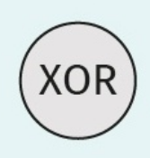 |
|**ereignisbasiertes Gateway** (*BPMN*)  - nach dem Gateway sind die **Ereignisse** notiert auf welche das Gateway wartet, es wird nur der Pfad nach dem zuerst eintreffende Ereignisse fortgesetzt  - demnach muss dem Gateway immer mindestens 1 Ereignis folgen (*logisch wären aber mindestens 2*)  - im gegensatz zu den anderen Gateways und Konnektoren gibt es hier **nur ein Gateway** |*"ereignisbasiertes Gateway"*   | *kein "ereignisbasierter Konnektor"* |

---
## 3. Modellierung mit dem "Business Process Model Notation" BPMN
- zur detailernteren Darstellung von Geschäftsprozessen
- wird von der **O**bject **M**anagement **G**roup (*OMG*) verwaltet und weiterentwickelt, welche ein Konsortium aus über 800 Mitgliedsunternehmen ist
- die OMG stellt mit der BPMN einen Modellierungsstandart bereit, der die Bedeutung grafischer Notationselemente und deren Zusammenspiel definiert
- für den fortgeschrittenen RE-Prozess geeignet (*konkrete und stabile Anforderungen vorhanden*)

### Verbindungen
- **Sequenzfluss**: 
gibt die Reihenfolge der Aktivitäten vor und kann zwar über Lane-Grenzen, jedoch nicht über Pool-Grenzen hinweg gehen.
- **Nachrichtenfluss**:  
verbindet Pools miteinander, deren Kommunikation über Nachrichten läuft.
- **Assoziation**:  
verbindet Datenobjekte und Annotationen mit Flussobjekten.

*Beispiel: Ausschnitt aus BPMN-Modell*

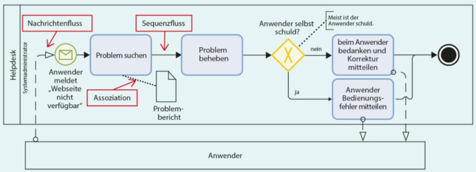

- die Abbildung stellt ein Geschäftsprozess mit einer Interaktion zwischen der Rolle Anwender und der Rolle Systemadministrator (*welcher Bestandteil der Organisationseinheit Helpdesk ist*) dar
- von den internen Abläufen der Rolle Anwender wird abstrahiert, deswegen ist diese als zugeklappter **Pool (Black Box)** modelliert
- der Prozess in der Organisationseinheit Helpdesk (**Pool**) beginnt, indem bei einem Systemadministrator (**Lane**) die **Nachricht** „Webseite nicht verfügbar“ eintrifft, die **Nachricht** wird über einen Nachrichtenfluss vom Anwender zum Helpdesk übermittelt
- die Kommunikation zwischen **Pools** darf nur über **Nachrichtenflüsse** geschehen
- der Systemadministrator führt die **Aktivität** „Problem suchen“ aus und nutzt dazu einen „Problembericht“, der als **Datenobjekt** dargestellt ist
- er behebt in der folgenden **Aktivität** das Problem und muss entscheiden, ob der Anwender die Ursache für das Problem ist
- als **Kommentar** ist an die Entscheidung notiert, dass dies häufig der Fall ist
- Ist der Anwender schuld, wird ihm der Bedienfehler über eine **Nachricht** mitgeteilt, sodass er daraufhin das Problem selbst lösen kann
- ist der Anwender nicht schuld, wird das Problem vom Systemadministrator behoben, der sich beim Anwender mit einer **Nachricht** bedankt. **Nachrichten** müssen nicht explizit modelliert werden
- Egal ob der Anwender schuld ist oder nicht, endet danach der Prozess, was durch ein **Endereignis** dargestellt wird

*Beispiel: BPMN-Modell, Beschaffungsprozess*

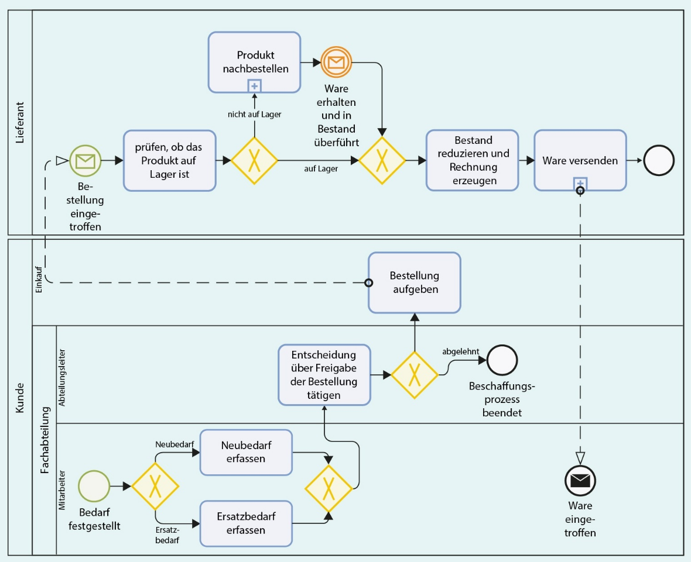
- Organisationseinheit **Kunde** (**Pool**) *ist unterteilt in*:
	- **Fachabteilung** (**Pool**) *welche wiederum unterteilt ist in*:
		- die Rolle **Mitarbeiter** (**Lane**)
		- die Rolle **Abteilungsleiter** (**Lane**)
	- die Rolle **Einkauf** (**Lane**)
- **Lieferant** (**Pool**)

1. Der Geschäftsprozess beginnt damit dass ein Bedarf beim **Mitarbeiter** aufgetreten ist (**Start-Ereignis**).
	- dies kann entweder ein "Neubedarf" oder "Ersatzbedarf" sein (**XOR Gateway**)
	- Der **Abteilungsleiter** entweder bewilligt die Bestellung oder lehnt sie ab (**XOR Gateway**) womit der Beschaffungsprozess endet (**End-Ereignis**).
	- Der **Einkauf** gibt die Bestellung auf (**Aktivität**) und sendet dazu eine Nachricht zum **Lieferanten**.
2. Beim **Lieferant** wird das **Start-Ereignis** "Bestellung eingetroffen" ausgelöst.
	- löst eine Verfügbarkeitsprüfung (**Aktivität**) der Lagerbestände für das bestellte Produkt aus.
	- Bei Verfügbarkeit (**XOR Gateway**) wird der Lagerbestand um die bestellte Anzahl reduziert, die entsprechende Rechnung erstellt und mit der Ware in den Versandprozess (**Teilprozess**) übergeben.
	- Sollte die Ware nicht auf Lager sein (**XOR Gateway**), wird ein Wiederbeschaffungsprozess (**Teilprozess**) initiiert. Der Geschäftsprozess steht so lange, bis das **Ereignis**, dass "die Ware eingetroffen und dem Bestand hinzugefügt ist", eintritt.
	- Der Gesamtprozess ist beendet, wenn die Ware beim Mitarbeiter des Kunden angekommen ist (**End-Ergebnis** *es gibt zwei, eins für jeden Pool*).

### Gateways
> Leiten Verzweigungen im Sequenzfluss eines Diagramms ein (*...-Split*) und beenden (*...-Join*) Verzweigungen.  

*Beispiel: XOR und OR Gateway*

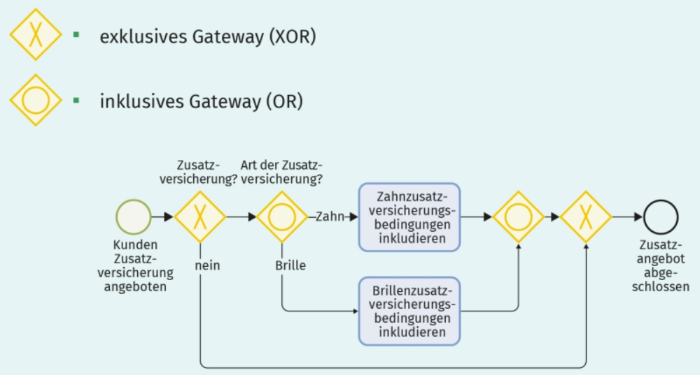

- die Entscheidung, ob eine Zusatzversicherung abgeschlossen wird, kann entweder mit ja oder mit nein beantwortet werden
- wenn entschieden wurde, dass eine Zusatzversicherung abgeschlossen werden soll, kann entweder eine Zahn- oder eine Brillenzusatzversicherung abgeschlossen werden oder beide 

*Beispiel: paralleles (AND) und ereignisbasiertes (*event-driven*) Gateway*

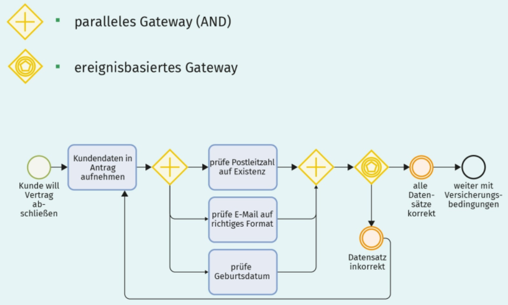

- der Prozess startet mit dem Sartereignis "*Kunde will Vertrag abschließen*"
- darauf folgt die Aktivität "*Kundendaten in Antrag aufnehmen*", welche in ein AND-split führt 
- die in der Mitte dargestellten Prüfaktivitäten werden zunächst **parallel** abgearbeitet:
	- sobald alle Prüfungen abgeschlossen sind (*alle Pfade im AND-join eingetroffen*) wird ein Ereignis ausgelöst
- **eines der Ereignis nach dem "ereignisbasiertem Gateway"** wird ausgeführt:
	- **Ereignis**: "*alle Datensätze korrekt*" -> **Endereignis**: "*weiter mit Versicherungsbedingungen*"
	- **Ereignis**: "*Datensatz inkorrekt*" -> **Aktivität**: "*Kundendaten in Antrag aufnehmen*" -> ...
	- Anmerkung: das Ereignis dass zuerst eintrifft, in diesem Fall kann nur eins eintreffen
- der Eingang zweier Sequenzflüsse in eine Aktivität ("*Kundendaten in Antrag aufnehmen*") ist in der BPMN erlaubt, Entweder führt der eine Sequenzfluss zur Ausführung der Aktivität oder der andere

---
## 4. Modellierung mit Ereignisgesteuerten Prozessketten EPK
- zu einfachen Darstellung von Geschäftsprozessen
- Im Saarland 1992 unter Leitung von August Wilhelm Scheer an der Universität des Saarlands entwickelt.
- Im deutschsprachigen Raum weit verbreitet.
- Die **e**rweiterte **E**reignisgesteuerte **P**rozess**k**etten (eEPK) erhöhen durch zusätzliche Notationselemente die Ausdrucksmächtigkeit der EPK.
- Müssen mit mindestens einem **Start-Ereignis** starten und mit mindestens einem **End-Ereignis** enden. 
- Funktionen und Ereignisse wechseln sich immer ab, dies ist von der Notation vorgeschrieben!

*Beispiel: EPK*

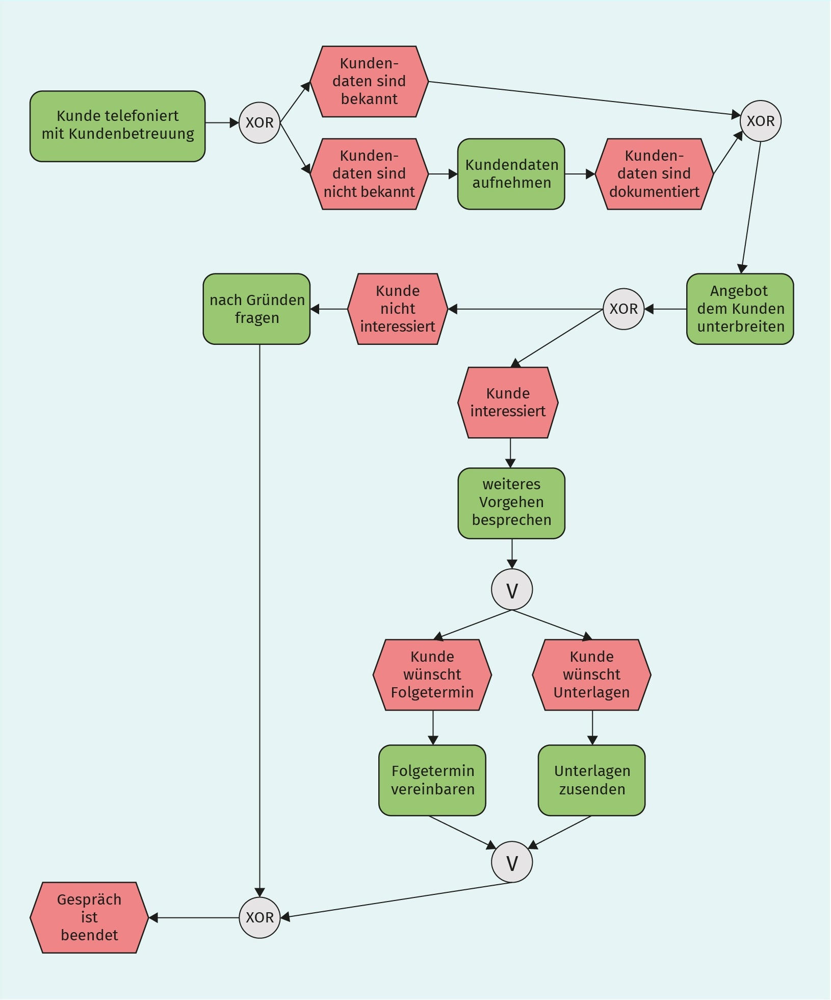
- *Start-Ereignis: "__Kundengespräch gestartet__"* __NICHT IM DIAGRAMM DARGESTELLT!__ 

- *Funktion: "__Kunde telefoniert mit der Kundenbetreuung__"*  

**XOR** **nur eine Auswahl Möglichkeit erlaubt**  
	- *Ereignis: "__Kundendaten sind bekannt__"*
	- *Ereignis: "__Kundendaten sind nicht bekannt__"* -> *Funktion: "__Kundendaten aufnehmen__"* -> *Ereignis: "__Kundendaten sind dokumentiert__"*

- *Funktion: "__Angebot dem Kunden unterbreiten__"*

**XOR** **nur eine Auswahl Möglichkeit erlaubt**
	- *Ereignis: "__Kunde nicht interessiert__"* -> *Funktion: "__nach Gründen fragen__"* -> _End-Ereignis: "**Gespräch ist beendet**"_
	- *Ereignis: "__Kunde interessiert__"* -> *Funktion: "__weiteres Vorgehen besprochen__"*

		**OR** **eine, mehrere oder alle Auswahl Möglichkeiten erlaubt** 
			- *Ereignis: "__Kunde wünscht Folgetermin__"* -> *Funktion: "__Folgetermin vereinbaren__"*
			- *Ereignis: "__Kunde wünscht Unterlagen__"* -> *Funktion: "__Unterlagen zusenden__"*  

- -> _End-Ereignis: "**Gespräch ist beendet**"_

### Konnektoren (*Entscheidungen*)
- leiten Verzweigungen ein (*Split*), welche nachher wieder zusammen geführt werden sollten (*Join*)
- ein Konnektor kann entweder ein Split oder ein Join aber nicht beides sein
- einem Entscheidungs Konnektor  (*OR, XOR*) muss immer auf eine Funktion folgen, während ein Und-Konnektor auch einem Ereignis folgen darf
- Ereignisse und Funktionen haben nie mehr als einen Ein- und einen Ausgang

*Beispiel: EPK Konnektoren*

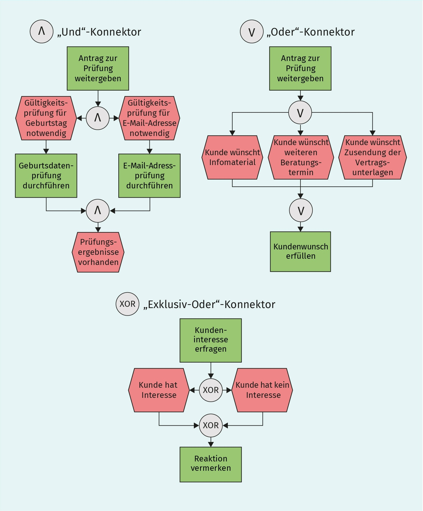

*Beispiel: Negative Beispiele für Konnektoren*

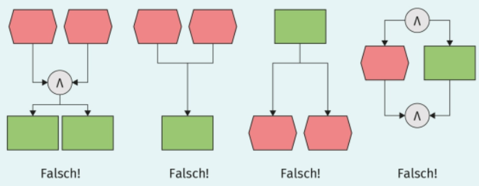  
*von links nach rechts*
- **1. Und-Konnektor fungiert als Join und Split gleichzeitig:**  
zwei Ereignisse sind mit einem Und-Join-Konnektor verbunden, welcher gleichzeitig wieder als Split benutzt wird
- **2. & 3. Ereignis bzw. Funktion haben mehr als 1 Eingang bzw. Ausgang:**  
der Kontrollfuss kann sich nur durch einen Konnektor teilen bzw. vereinen
- **4. Ereignisse und Funktionen müssen sich immer abwechseln:**  
können sich nicht abwechseln, weil vor und nach dem UND-Konnektor entweder eine Wiederholung durch ein Ereignis oder eine Funktion auftritt

---
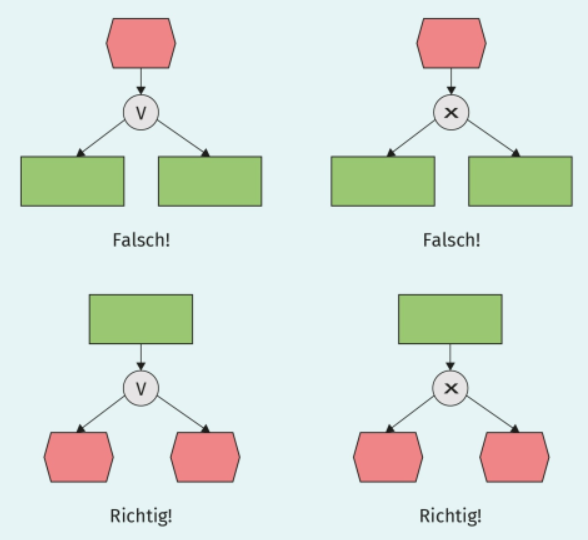
- Auf eine Ereignis darf kein Entscheidungs-Konnektor (*OR, XOR*) folgen, sondern nur nach einer Funktion.

*Beispiel: erweiterte EPK*

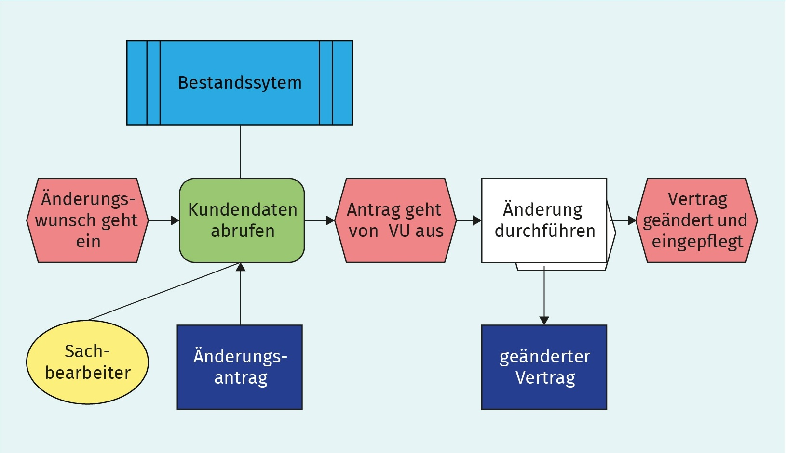

