# Requirements Engineering

## L06 Modellierung von Systemen

LERNZIELE

	<ul>
		<li>Was die Begriffe UML-Modell und UML-Diagramm bedeuten und wie diese zusammenhängen.</li>
		<li>Wozu UML-Use-Case-Diagramme im Requirements Engineering eingesetzt werden und was deren wichtigste Notationselemente sind.</li>
		<li>Wozu UML-Aktivitätsdiagramme im Requirements Engineering eingesetzt werden und was deren wichtigste Notationselemente sind.</li>
		<li>Wie UML-Klassendiagramme im Requirements Engineering eingesetzt werden und was deren wichtigste Notationselemente in diesem Zusammenhang sind.</li>
		<li>Wozu UML-Zustandsdiagramme im Requirements Engineering eingesetzt werden und was deren wichtigste Notationselemente sind.</li>
	</ul>

ZUSAMMENFASSUNG

Die Unified Modeling Language (kurz: UML) ist eine grafische Modellierungssprache im Softwareengineering. Sie umfasst 14 verschiedene Diagrammtypen, mit denen sowohl die Struktur als auch das Verhalten von Systemen dokumentiert werden kann.

Das **Use-Case-Diagramm ist ein Verhaltensdiagramm** und wird zur Darstellung der wichtigsten Funktionen eines Systems und dessen Schnittstellen in die Systemumgebung eingesetzt. Es enthält keine Details über das System und eignet sich somit als Dokumentationsform für den Systemüberblick.

Das **UML-Aktivitätsdiagramm ist ein Verhaltensdiagramm**. Mit ihm werden Abläufe modelliert. Es wird eingesetzt, wenn Aufgaben in ihre einzelnen Schritte zerlegt und detaillierte Abläufe mit Bedingungen, Schleifen und Verzweigungen dokumentiert werden sollen, beispielsweise zur Detaillierung von identifizierten Use Cases aus dem Use-Case-Diagramm.

Das **UML-Zustandsdiagramm ist ein Verhaltensdiagramm**, mit dem fachliche Zustände von Objekten oder Systemen dokumentiert werden können. Es legt fest, welche Zustände ein Objekt oder ein System annehmen kann und welche Abhängigkeiten bzw. Reihenfolgen es zwischen den Zuständen gibt und wann diese erreicht werden können. Es wird eingesetzt, um Lebenszyklen oder bestimmte fachliche Zustände von Geschäftsobjekten und fachlichen Entitäten oder auch Aufrufreihenfolgen von Bildschirmmasken zu dokumentieren.

Das **UML-Klassendiagramm ist ein Strukturdiagramm**, das zur Modellierung von Geschäftsobjekten und Systemen eingesetzt werden kann. Es wird im Requirements Engineering zur Darstellung statischer Strukturen fachlicher Konzepte eingesetzt. Eine UML-Klasse entspricht dabei einem fachlichen Konzept, also einer Menge von Objekten mit den gleichen Eigenschaften, Beispielsweise Kunde, Artikel oder Bestellung.

---
## 1. Grundlagen Unified Modeling Language
>Die **U**nified **M**odeling **L**anguage (*UML*) ist eine grafische Modellierungssprache, die etwa zeitgleich mit der Objektorientierung in den frühen 1990er-Jahren entwickelt wurde. Die UML umfasst mittlerweile 14 verschiedene Diagrammtypen, mit denen verschiedene Aspekte eines Systems modelliert werden können. 

- Sind weltweit verbreitet, sie werden in der Industrie und Forschung zur Modellierung, Dokumentation, Spezifikation und Visualisierung von komplexen Softwaresystemen eingesetzt.
- Können in allen Phasen des Softwareentwicklungsprozesses eingesetzt werden, von frühen Phasen der Anforderungsermittlung bis hin zur detaillierten technischen Spezifikation und der Dokumentation des implementierten Systems.
- Sind unabhängig davon, in welchem Fachgebiet oder welcher Branche das System eingesetzt werden soll.
- Ist ein von der Object Management Group (OMG) veröffentlichter und gepflegter Industriestandard, welcher die Bedeutung grafischer Notationselemente und deren Zusammenspiel definiert.
- Die UML ist jedoch weder eine Programmiersprache noch ein Vorgehensmodell.
- Unter dem Namen UML wurden verschiedene Modellierungskonzepte der Softwaretechnik zusammengefasst und deren Begriffe, Namen sowie Notationselemente vereinheitlicht.

##### UML-Modell vs. UML-Diagramm
- **UML-Modell**:  
Ist das Gesamtbild eines Systems. Es besteht aus der Menge aller UML-Diagramme, die zu einem System gehören. Eine Information, die nicht in mindestens einem Diagramm dargestellt ist, existiert im Modell schlicht nicht.
- **UML-Diagramm**:  
Zeigt immer nur eine bestimmte Sicht auf das System. Zum Beispiel:
	- Ein Klassendiagramm zeigt Geschäftsobjekte und ihre Eigenschaften.
	- Ein Aktivitätsdiagramm zeigt interne Abläufe des Systems.
	- Beide sind Bestandteil desselben UML-Modells.

##### UML Diagrammtypen Kategorien
- **Strukturdiagramme**:  
woraus ein System besteht (*Aufbau, Elemente, Zusammensetzung sowie Schnittstellen von Systemen*).
- **Verhaltensdiagramme**:  
was in einem System und an seinen Schnittstellen abläuft.  

##### Trennung von Bedeutung und Darstellung
- **Modellelement**:  
Teil des darzustellenden Modells mit einer bestimmten Bedeutung (*z.B. "Bestellung"*).
- **UML-Standard**:  
Legt die Menge möglichen Modellelements fest, die bei der Erstellung eines UML-Modells verwendet werden können. Die Bedeutung eines Modellelements wird einmalig und eindeutig für das gesamte UML-Model definiert. 
- **Darstellung**:  
Das grafische Aussehen eines Modellelements kann je nach Diagrammtyp variieren. 
- **Vorteile**:
	1. **Automatische Transformation**:  
	UML-Modelle können dadurch automatisch in andere Modelltypen oder sogar direkt in Programmcode umgewandelt werden.
	2. **Erweiterbar**:  
	UML-Modell kann an das Projekt angepasst werden ohne die Grundbedeutung zu verlieren.

---
## 2. UML-Use-Case-Diagramm (*auch Anwendungsfalldiagramm*)
>Wird zur Darstellung der wichtigsten Funktionen eines Systems und dessen Schnittstellen in die Systemumgebung eingesetzt. Es bietet damit einen Überblick über das System und seine direkte Umgebung.  

*Beispiel für ein UML-Use-Case-Diagramm*
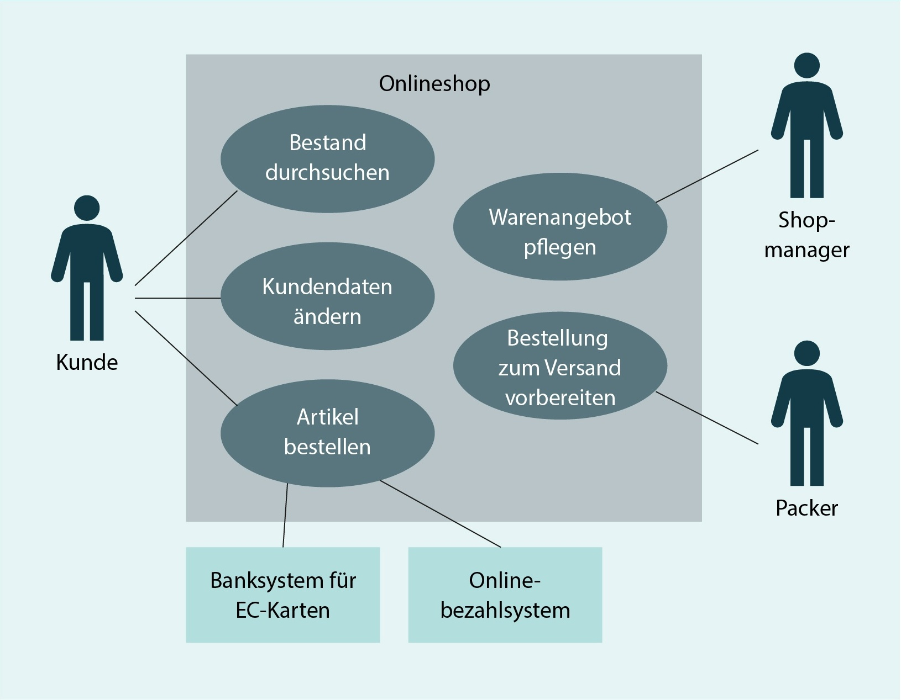
Use-Case-Diagramme werden eingesetzt, um den Systemkontext zu bestimmen und zu dokumentieren sowie um notwendige Schnittstellen des Systems zu identifizieren. Dabei wird auf einer sehr abstrakten Ebene das Verhalten des Systems aus Sicht der Nutzer bzw. aus Sicht der über technische Schnittstellen angebundenen Umsysteme dargestellt. Es werden jedoch keine Reihenfolgen, Aufrufbeziehungen oder Datenstrukturen dokumentiert.

#### Wichtige Notationselemente
|Name|Bedeutung|Darstellung|
|---|---|---|
|Anwendungsfall  (*use case*)|Hauptfunktion eines Systems, die ausgeführt werden muss, um ein bestimmtes Ergebnis zu erzielen.||
|System, Systemgrenze|Das System stellt den Gegenstand der Betrachtung dar. Der Funktionsumfang eines Systems wird durch die Systemgrenze und die darin enthaltenen Anwendungsfälle festgelegt. Alle Elemente außerhalb der Systemgrenze befinden sich auch außerhalb des Systems.|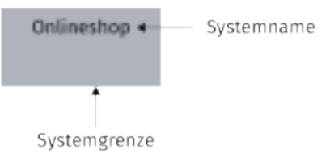|
|Akteur  (*actor*)|Ein Akteur ist eine Rolle oder ein anderes System, die/das mit dem betrachteten System interagiert. Dabei kann ein Akteur der Auslöser für Anwendungsfälle sein, der mit dem System ein bestimmtes Ergebnis erzielen kann, oder er ist zur Erreichung des Ergebnisses erforderlich, jedoch selbst nicht der Auslöser. Grundsätzlich befinden sich Akteure immer außerhalb der Systemgrenze.||
|Kommunikation zwischen Akteur und System|Akteure, die bei der Ausführung eines Use Case mit dem System interagieren, werden direkt mit dem betreffenden Use Case verbunden.|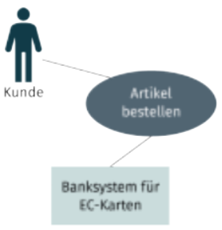|

##### Einsatz im Requirements Engineering
- zur einfachen Darstellung der Funktionen des Systems nach außen
- zur Kommunikation mit dem Anwender oder dem Management
- als Dokumentationsform für den Systemüberblick und zur Bestimmung des Systemkontexts

##### Identifikation von Anwendungsfällen
- in der Praxis fällt schwer, die richtige Ebene zu identifizieren, auf der Anwendungsfälle beschrieben werden können (*oft werden zu kleine und dadurch zu viele Use Cases dokumentiert*) - in der Regel ist ein Anwendungsfall eine Aufgabe, die in mehreren Schritten erledigt wird und mit welcher der Akteur ein bestimmtes Ergebnis erzielen möchte
- **Faustregel**: Für einen Anwendungsfall meldet sich der Nutzer am System an bzw. begibt sich zum System.
- bei der Benennung der Use Cases sollte darauf geachtet werden, dass es sich immer um eine Aktivität handelt, die mit einem Verb beschrieben wird  
*Beispiele für geeignete und ungeeignete Use Cases*
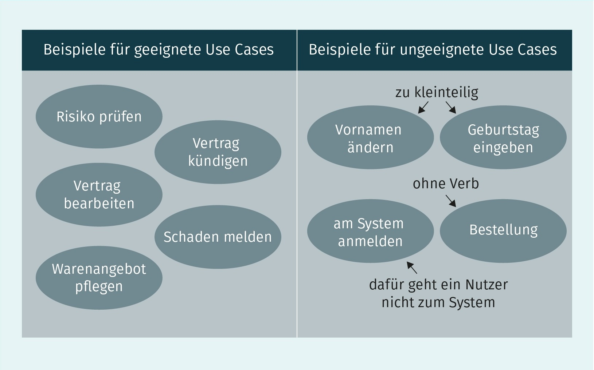

---
## 3. UML-Aktivitätsdiagramm
> Ist ein Verhaltensdiagramm, mit dem Abläufe modelliert werden. Ein Ablauf kann dabei beispielsweise ein Geschäftsprozess sein, eine Folge von Nutzerinteraktionen mit dem System oder auch systeminterne Abläufe. Ganz allgemein wird das Aktivitätsdiagramm dann eingesetzt, wenn Aufgaben in ihre einzelnen Schritte zerlegt werden sollen. So eignet es sich beispielsweise, Anwendungsfälle eines Use-Case-Diagramms zu detaillieren. Während im Use-Case-Diagramm explizit keine Reihenfolgen oder Bedingungen modelliert werden, ist die Hauptaufgabe des Aktivitätsdiagramms die Visualisierung von detaillierten Abläufen mit Bedingungen, Schleifen und Verzweigungen. Die dabei eingesetzten Notationselemente ähneln den Notationselementen von Prozessmodellen wie EPK und BPMN.  

*Beispiel für ein UML-Aktivitätsdiagramm, "Bestellvorgang in einem Onlineshop"*
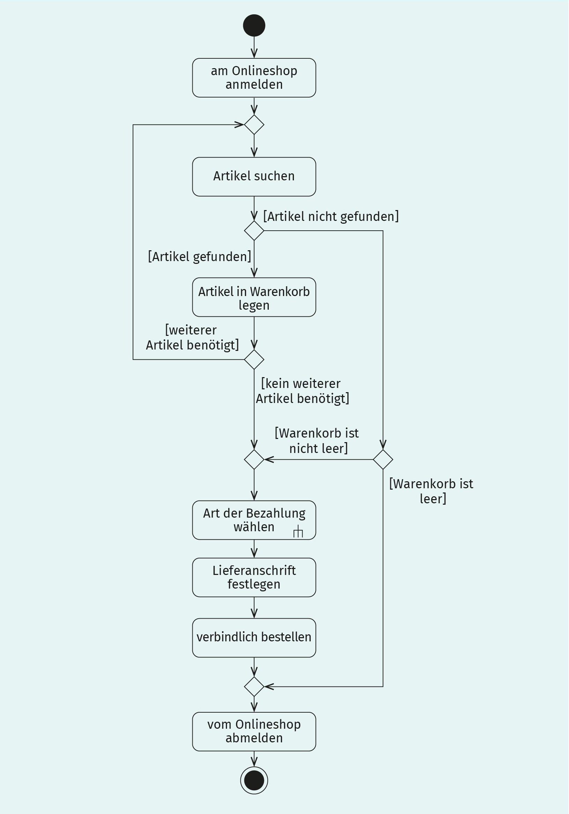

#### Wichtige Notationselemente
|Name|Bedeutung|Darstellung|
|---|---|---|
|Aktion  (*action*)|Eine Aktion entspricht dem Aufruf oder der Durchführung eines bestimmten Verhaltens. Die Menge aller Aktionen bestimmt das Verhalten der Aktivität.||
|Kontrollfluss  (*control flow*)|gerichtete Kante mit einer Pfeilspitze, die den logischen Ablauf zwischen den Aktionen einer Aktivität festlegt||
|Startknoten|Dieser legt den Startpunkt der Aktivität fest. An ihm beginnt der Kontrollfluss. Der Startknoten hat keine weitere Bedeutung.||
|Endknoten für Aktivitäten|Dieser legt das Ende der Aktivität fest. Sobald ein solcher Endknoten erreicht ist, wird die Aktivität beendet.||
|Aktivitäten  (*activity*)|Dies sind komplexe Aktionen, die noch weiter detailliert werden können, werden als Aktivität modelliert. Das Notationssymbol entspricht dem einer Aktion, das um ein kleines Symbol in Form einer Gabel ergänzt wird. Die Details einer Aktivität können in einem separaten Aktivitätsdiagramm modelliert werden.||
- Aktionen und Aktivitäten werden in ihrer festgelegten Reihenfolge abgearbeitet. Sobald mit der Durchführung einer Aktion gestartet wurde, können die Nachfolger dieser Aktion erst dann durchgeführt werden, wenn die Aktion beendet wurde. Es sei denn, es wurde explizit die parallele Durchführung von Aktionen modelliert.

#### Verzweigungen und Zusammenführungen
|Name|Bedeutung|Darstellung|
|---|---|---|
|Bedingung|Der Kontrollfluss wird nur dann berücksichtigt, wenn die Bedingung erfüllt ist. Ist die Bedingung nicht erfüllt, stoppt der Ablauf an dieser Stelle.|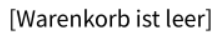|
|Verzweigungs-  knoten  (*decision node*)|Dieser spaltet eine Kante in mehrere Alternativen auf. Der Ablauf geht auf genau einer der ausgehenden Kanten weiter. Dieser Knoten entspricht einem logischen XOR.|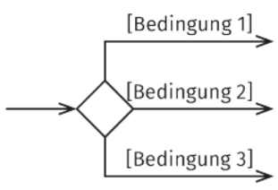|
|Verbindungs-  knoten  (*merge node*)|Dieser führt alle eingehenden Kanten zusammen. Der Ablauf geht weiter, sobald der Fluss einer Kante den Knoten erreicht. Es findet keine Synchronisation statt, d. h., es wird nicht auf die anderen eingehenden Kanten gewartet.|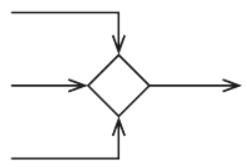|
|Parallelisie-  rungsknoten|Dieser teilt die eingehende Kante in mehrere parallele Abläufe auf. Entspricht einem logischen AND. Dieser Knoten kann zu einem logischen OR erweitert werden, sobald die ausgehenden Kanten mit Bedingungen versehen werden.|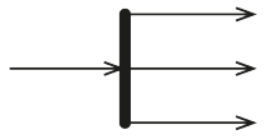|
|Synchronisati-  onsknoten|Dieser führt eingehende Kanten zu einem gemeinsamen Ablauf zusammen. Dabei wird so lange gewartet, bis alle Flüsse an allen eingehenden Kanten ankommen.|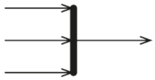|
- eine Verzweigung wird immer mit einer Zusammenführung wieder geschlossen
- eine Parallelisierung wird immer mit einer Synchronisation wieder geschlossen

##### Einsatz im Requirements Engineering
- Wird im RE zur Verfeinerung und Detaillierung von Anwendungsfällen eingesetzt.
- Eignet sich zur Darstellung von Abläufen im Zusammenspiel mit fachlichen Ausführungsbedingungen, Insbesondere können im Aktivitätsdiagramm auch erforderliche Aktionen beschrieben werden, die im Fehlerfall oder in Ausnahmesituationen wichtig sind.
- Grundsätzlich können Abläufe an Stelle eines Aktivitätsdiagramms auch mit BPMN oder
EPK modelliert werden.

---
## 4. UML-Klassendiagramm
- **Diagrammtype**: Strukturdiagramm
- **Verwendung**: zur Modellierung von Geschäftsobjekten und Systemen
- **Ebene**:  
	- Überblicksebene (*um allgemeine Zusammenhänge darzustellen*)
	- systemnahen Ebene (*um detailliert die Attribute und Methoden zu Klassen in objektorientierten Systemen zu spezifizieren bzw. zu dokumentieren*)
- **Nutzung im RE**:  
	- Bei fachlichen Anforderungen, wird in der Regel nur eine sehr reduzierte Form des Klassendiagramms eingesetzt. Dabei werden implementierungsnahe Informationen wie Sichtbarkeiten oder technische Datentypen bewusst weggelassen.
	- Bei der Dokumentation von Geschäftsobjekten und anderen fachlichen Entitäten sowie deren Eigenschaften und Beziehungen untereinander wird auf die Modellierung von Details wie Methoden und Datentypen im Klassendiagramm bewusst verzichtet.
	- Ist eine der am häufigsten genutzten Dokumentationsformen bei der objektorientierten Systementwicklung.
	- Kann grundsätzlich zur Analyse und Dokumentation fachlicher Aspekte eingesetzt werden, ohne dass am Ende ein objektorientiertes System daraus erstellt wird.

*Beispiel für UML-Klassendiagramm, zur Dokumentation fachlicher Anforderungen*
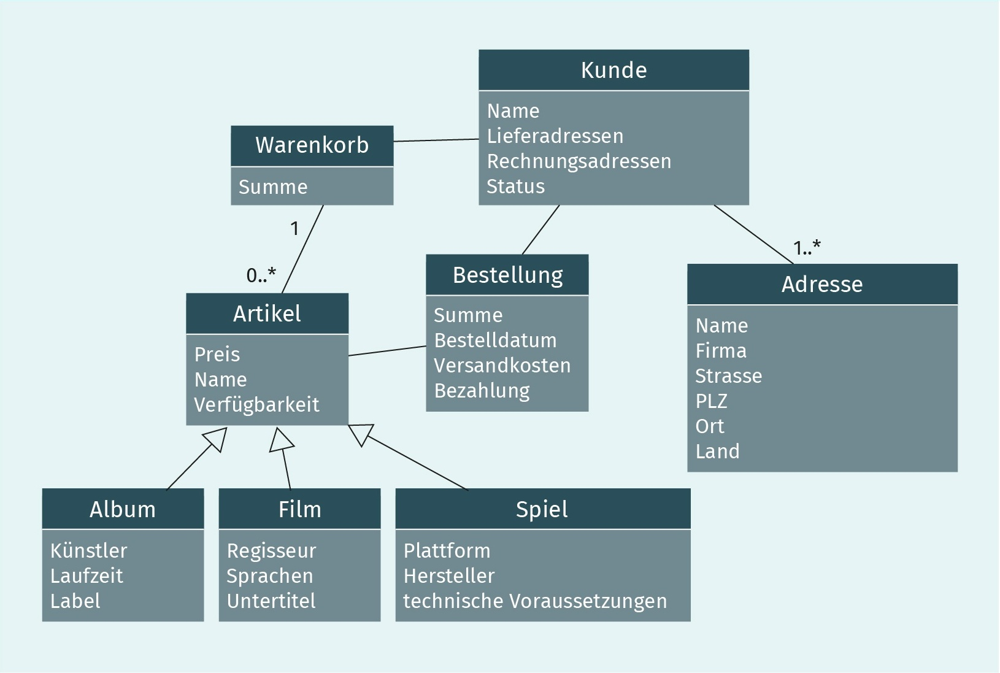

#### Klassen im UML-Klassendiagramm
|Name|Bedeutung|Darstellung|
|---|---|---|
|Klasse|Eine Klasse entspricht einer fachlichen Entität oder einem Geschäftsobjekt.|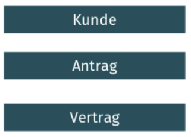|
|Klasse mit Eigenschaften|Die zu einer Klasse relevanten Eigenschaften werden als Attribute in einem Rechteck unter dem Klassennamen modelliert. Weitere Eigenschaften, wie Datentyp und Defaultwerte, können bereits angegeben werden, oder erst im Verlauf des Entwicklungsprozesses festgelegt werden.|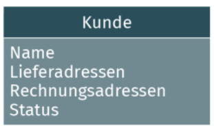|

#### Notationselemente: Beziehungen zwischen Klassen
>Fachliche Abhängigkeiten und Beziehungen zwischen Klassen können durch sogenannte
Beziehungen (auch: Assoziationen) zwischen Klassen beschrieben werden.  

|Beziehungstypen|Beschreibung|Beispiele|
|---|---|---|
|„hat/kennt“|Dieser Beziehungstyp drückt aus, dass eine Klasse eine andere Klasse „hat“ oder „kennt“.|Ein Versicherungsnehmer hat Kinder. Ein Vertrag hat Versicherungsbedingungen. Ein Kalender hat Monate. Ein Verkäufer kennt seine Kunden.|
|„besteht aus“|Dieser Beziehungstyp drückt aus, dass eine Klasse ein Bestandteil einer anderen Klasse ist. Er wird genutzt, wenn eine Klasse ein größeres Konstrukt ist, dessen Elemente nicht durch einfache Attribute beschrieben werden können.|Ein Auto besteht aus einem Motor, 4 Rädern, 3 Türen, 1 Getriebe und 2 Sitzen. Ein Haus besteht aus einem Dach, 23 Fenstern, 2 Türen, 6 Räumen und 1 Treppenhaus.|
|„ist ein“|Dieser Beziehungstyp drückt aus, dass eine Klasse A von der Art her eine Klasse B ist, aber eine spezifischere Bedeutung hat und sich ggf. um bestimmte Attribute und Methoden von Klasse B unterscheidet.|Ein Pkw ist ein Auto. Ein Lkw ist ein Auto. Ein Kunde ist eine Person. Ein Buch ist ein Artikel. Ein Igel ist ein Säugetier.|

#### Darstellung von Beziehungen zwischen Klassen
> Um die Beziehungen grafisch darzustellen, werden Linien bzw. Pfeile zwischen den entsprechenden Klassen modelliert.  

|Darstellung der Beziehung|Bedeutung|
|---|---|
|  *durchgezogene Linie, ohne Pfeilspitze und ohne Beschriftung*|Vertrag und Adresse stehen in einer nicht näher beschriebenen Beziehung zueinander.|
|  *durchgezogene Linie, Beschriftung der Linie mit einem Namen für die Beziehung*|Vertrag und Adresse sind über eine benannte Assoziation verbunden; die beiden Klassen sind verbunden durch die Beziehung „Rechnungsanschrift“.|
|  *durchgezogene Line mit einer Pfeilspitze, ggf. Benennung der Beziehung*|Durch die Pfeilspitze wird eine Navigationsrichtung vorgeben: vom Vertrag zur Adresse. Das bedeutet, dass der Vertrag eine Adresse kennt und man sich vom Vertrag zur Adresse durchhangeln kann, jedoch nicht von der Adresse zum Vertrag: Ein Vertrag kennt seine Adresse, aber die Adresse weiß nichts von und über die Existenz des Vertrags.|
|  *An den Enden der Beziehung werden Multiplizitäten modelliert und damit Aussagen über die Anzahl der assoziierten Objekte gemacht.*|Ein Vertrag hat genau eine Rechnungsanschrift, eine Adresse kann jedoch die Rechnungsanschrift zu mindestens einem, aber maximal beliebig vielen Verträgen sein.|
|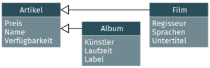  *Vererbungsbeziehung: durchgezogene Linie, geschlossene Pfeilspitze an einem Ende*|Dies ist die Klasse, auf welche die Pfeilspitze zeigt (hier: Artikel), vererbt alle Attribute auf die Klassen am anderen Ende der Beziehung (hier: Film und Album). Die Vererbung ist eine „ist ein“-Beziehung. Die Klassen Film und Album haben ebenfalls die Attribute Preis, Name und Verfügbarkeit, ohne diese jedoch extra als eigenes Attribut zu haben.|

#### Multiplizitäten im Klassendiagramm
>Zu Beziehungen können mit Multiplizitäten (auch: Kardinalitäten) Mengenangaben festgelegt werden. Diese Angaben werden jeweils an das Ende und die Spitze einer Beziehung notiert: Links von „..“ steht die Untergrenze und rechts von „..“ die Obergrenze der Mengenangaben. Davon ausgenommen sind jedoch die Vererbungsbeziehungen. Zu ihnen können keine Mengenangaben modelliert werden.

|Notation|Erklärung|Beispiel|
|---|---|---|
|0..1|optionale Assoziation|  *Zu einem Auto gehören 0..1 Anhänger.*  *Zu einem Anhänger gehören 0..1 Autos.*|
|1|obligatorische Assoziation|  *Zu einem Auto gehört genau 1 Fahrer.*  *Ein Fahrer gehört zu genau 1 Auto.*|
|0..*|optional beliebig|  _Ein Student kann 0..*Kurse belegen._  _Ein Kurs kann von 1..* Studenten belegt sein._|
|1..*|beliebig, aber mindestens 1|  _Ein Tutor kann 1..* Kurse machen._  _Ein Kurs wird von genau 1 Tutor durchgeführt._|
|n..m|mindestens n und maximal m|  _Ein Auto hat mindestens 3 und maximal 5 Türen._  _Eine Tür gehört zu genau 1 Auto._|
||Keine Angabe entspricht 1, sollte aber vermieden werden, um Missverständnisse zu vermeiden.|  _Ein Auto hat genau 1 Motor._  _Ein Motor gehört zu genau 1 Auto._|

#### Einsatz im Requirements Engineering

- Im Umfeld des RE wird das Klassendiagramm genutzt, um statische Konzepte eines Anwendungsbereichs zu dokumentieren.
- Das umfasst Geschäftsobjekte, fachliche Entitäten (branchenspezifische Dinge der realen Welt, die mit Informationssystemen verwaltet werden sollen), Personen, Objekte, Systeme und deren relevante Eigenschaften sowie Beziehungen und Abhängigkeiten zueinander.
- Das vordergründige Ziel ist dabei die Dokumentation, das Verstehen und die Kommunikation des fachlichen Problems. Das bedeutet, die Klassen im Klassendiagramm werden als Konzepte der fachlichen Umgebung betrachtet und nicht als Elemente eines Systems.
- Eine UML-Klasse entspricht dabei einem fachlichen Konzept, also einer Menge von Objekten mit den gleichen Eigenschaften, beispielsweise Kunde, Artikel oder Bestellung. Für die Darstellung von Verhalten oder Abläufen ist das Klassendiagramm nicht geeignet.

---
## 5. UML-Zustandsdiagramm
>Ist ein Verhaltensdiagramm, mit dem fachliche Zustände von Objekten oder Systemen dokumentiert werden können. Im Gegensatz zu Aktionen und Abläufen, die im Aktivitätsdiagramm modelliert werden, legt das Zustandsdiagramm fest, welche Zustände ein Objekt oder ein System annehmen kann und welche Abhängigkeiten bzw. Reihenfolgen es zwischen den Zuständen gibt und wann diese erreicht werden können. 

*Beispiel für UML-Zustandsdiagramm, Verlauf einer Bestellung anhand einer Abfolge von Zuständen*
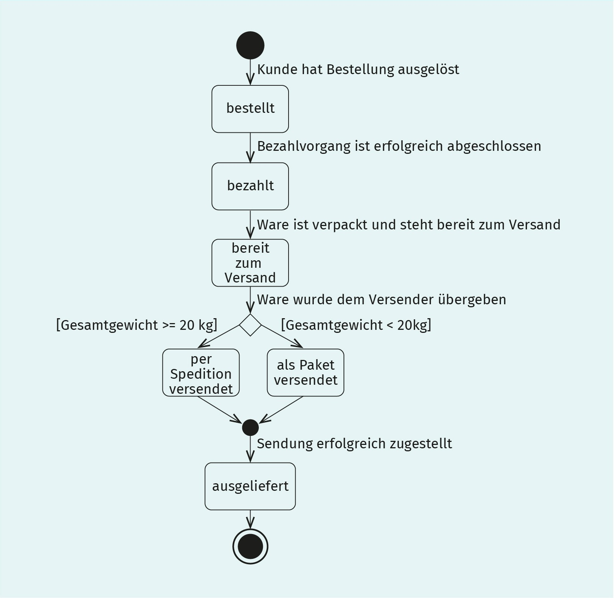  
- Im Gegensatz zu Abläufen beschreibt ein Zustandsdiagramm keine Aktionen, sondern die
Konsequenzen bzw. Auswirkungen von Aktionen oder Aktivitäten.

#### Wichtige Notationselemente
|Name|Bedeutung|Darstellung|
|---|---|---|
|Zustand  (*state*)|Ein Zustand ist eine bestimmte fachliche Situation eines Objektes oder eines Systems, aus der sich fachliche Aussagen oder notwendige Aktivitäten ableiten lassen.|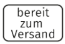|
|Startzustand|Dieser markiert den Startpunkt im Zustandsdiagramm. Alle direkten Nachfolgezustände dieses Startzustands sind mögliche erste fachliche Zustände. Das Symbol Startzustand hat sonst keine weitere Bedeutung.||
|Endzustand|Dieser markiert den Endpunkt im Zustandsdiagramm. Alle direkten Vorgängerzustände des Endzustands sind mögliche letzte Zustände des Objekts bzw. des Systems. Das Symbol Endzustand hat sonst keine weitere Bedeutung.||
|Zustandsübergang, Transition  (*transition*)|Dieser bestimmt die Reihenfolge der Zustände.||
|Entscheidung|Eine Entscheidung ermöglicht es, die Auswahl der nächsten Transition von einem aktuellen Ergebnis abhängig zu machen.|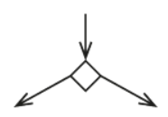|
|Zusammenführung|Eine Zusammenführung erlaubt die Zusammenfassung mehrerer Transitionen, wenn jeweils der Nachfolgezustand identisch ist.|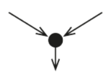|
|Trigger [Guard]/Aktivität|Die Elemente Trigger, Guard und Aktivität können zusätzlich an eine Transition modelliert werden:  - Trigger sind Auslöser von Transitionen.  - Der Guard ist eine Bedingung, die wahr sein muss, damit die Transition ausgelöst wird.  - Die Aktivität ist eine konkrete Aktivität, die beim Durchlaufen der Transition ausgelöst wird.|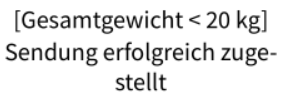|  

  
*Beispiel für Trigger, Guard und Aktivität im Zustandsdiagramm*
  
*Diese zusätzlichen Eigenschaften werden häufig bei der Modellierung von eingebetteten Systemen verwendet, deren Verhalten stark auf die Reaktion von Sensoreingaben ausgerichtet ist. Im Umfeld der Informationssysteme wird diese Darstellung nicht sehr häufig verwendet.*

#### Einsatz im Requirements Engineering
- Zustandsdiagramme werden im Requirements Engineering eingesetzt, um Lebenszyklen oder bestimmte fachliche Zustände von Geschäftsobjekten und fachlichen Entitäten zu dokumentieren. Da Zustandsdiagramme insbesondere keine Aktivitäten, sondern deren Auswirkungen auf den fachlichen Zustand modellieren, kann beispielsweise anhand eines Zustandsdiagramms dokumentiert werden, welche Aktivitäten in welchen Zuständen überhaupt erlaubt sind. Da mit fachlichen Zustandsübergängen der gesamte Lebenszyklus eines Geschäftsobjekts in einer sehr kompakten Form dargestellt werden kann, eignen sie sich als Ergänzung und als Überblick zu den in der Regel recht komplexen Prozess- oder Ablaufdiagrammen.
- Ein weiterer Anwendungsfall für Zustandsdiagramme ist die Modellierung von Aufrufreihenfolgen von Bildschirmmasken. Dabei entspricht jeder Zustand einer Bildschirmmaske bzw. Bildschirmseite. Die Zustandsübergänge bilden dann die Klickfolge des Nutzers ab.
