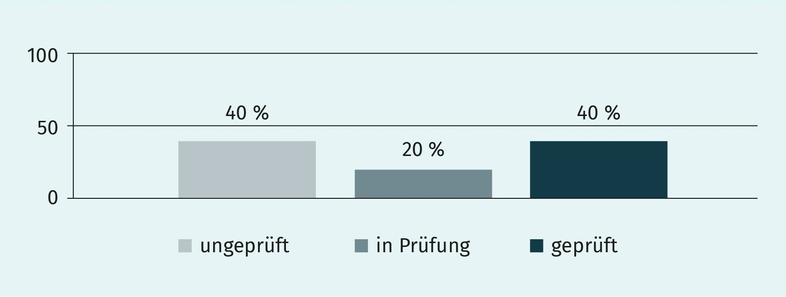
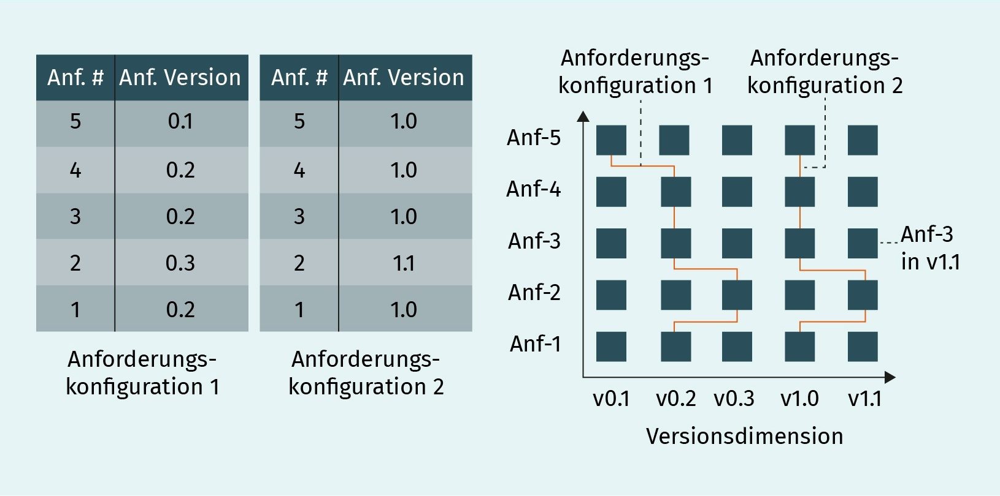
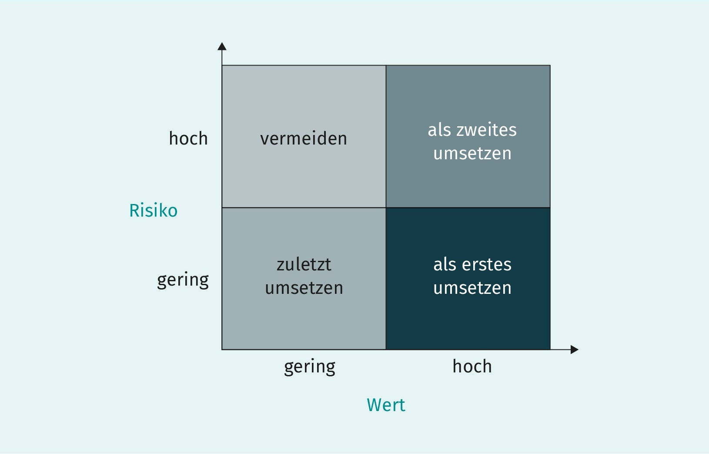
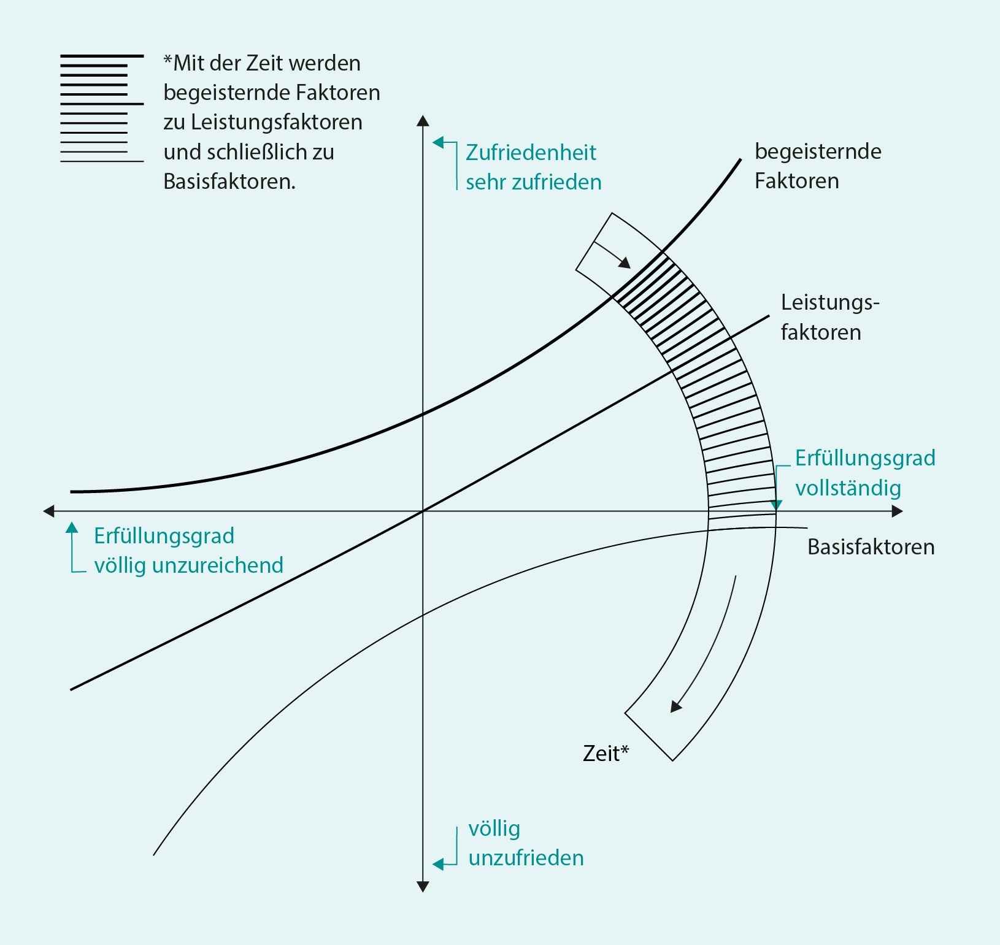

# Requirements Engineering

## L08 Management von Anforderungen und Techniken zur Priorisierung

LERNZIELE

	<ul>
		<li>Welche Eigenschaften Anforderungen haben.</li>
		<li>Wie Sichten auf Anforderungen erzeugt werden können.</li>
		<li>Was Versionierung von Anforderungen bedeutet.</li>
		<li>Welche Techniken zur Anforderungspriorisierung genutzt werden können und wie diese funktionieren.</li>
		<li>Was unter dem Lebenszyklus von Anforderungen verstanden wird.</li>
	</ul>

ZUSAMMENFASSUNG

Softwareengineering ist ein erkenntnisgetriebener Prozess. Das Wissen der Stakeholder über das System und die Erfahrung reift und verändert sich mit jeder ausgelieferten Systemversion. Daher entwickeln sich Anforderungen im Laufe eines Projekts weiter und haben unterschiedliche Status, die je nach Stabilität der Anforderung variieren.

Darüber hinaus haben Anforderungen Attribute, die zu Metadaten aggregiert werden. Auf Basis dieser Metadaten können Sichten auf Anforderungen erzeugt werden. Die selektive Sicht zeigt gewisse Anforderungen, die nach bestimmten Attributen gefiltert werden. Die verdichtende Sicht liefert eine aggregierte Sichtweise auf die Anforderungen, und mit ihrer Hilfe können Aussagen über die Gesamtheit aller Anforderungen getroffen werden. Die Sichten lassen sich kombinieren.

Die Entwicklung von Anforderungen im Softwareprozess kann durch eine Versionierung ausgedrückt werden. Ein Abbild einer Kombination von Anforderungen, jede in einer bestimmten Version, wird Anforderungskonfiguration genannt. Anforderungen werden zunächst spezifiziert. Die folgende Umsetzung und der anschließende Test transformieren Anforderungen zu Software, welche nach erfolgreicher Abnahme durch den Kunden in seiner Umgebung produktiv gesetzt wird. Es wird von einem Lebenszyklus von Anforderungen gesprochen.

Eine typische und projektbegleitende Aufgabe ist die Priorisierung von Anforderungen und das Festlegen, welche Aktivitäten im Projekt als nächstes erfolgen sollen. Das ist bei Softwareprojekten nicht nur am Anfang relevant, wenn eine erste Priorisierung der zu Beginn des Projekts bekannten Anforderungen durchgeführt wird. Im Verlauf eines Projekts ändert sich in der Regel noch die Menge der fachlichen Anforderungen und manchmal auch die technischen oder organisatorischen Rahmenbedingungen. Durch die Kombination verschiedener Techniken
kann eine große Menge von Anforderungen in vergleichsweise kurzer Zeit priorisiert werden.

---
## 1. Verwalten von Anforderungen
- In der Praxis werden oft mehrere hundert bis mehrere tausend Anforderungen in einem Projekt ermittelt, dokumentiert, geprüft, abgestimmt und verwaltet.
- Softwaresysteme werden über Jahre hinweg durch verschiedene Personen immer wieder angepasst und weiterentwickelt.
- Anforderungen müssen nicht nur zum Zeitpunkt der Erstellung eines Systems, sondern über dessen gesamten Lebenszyklus verwaltet werden.

### Eigenschaften von Anforderungen
>Um Anforderungen nachvollziehbarer zu machen, werden diese mit Metadaten beschrieben (*Eigenschaften, Attribute*). Es muss immer einen Namen und eine eindeutige ID geben, alle weiteren Attribute können variieren. Diese können je nach Projektgröße manuell oder mit Werkzeugunterstützung verwaltet werden.

##### Metadaten:
Typische Attribute können sein:
- **Identifizierer (ID)**: *eindeutige Kennung*
- **Name**: *kurzer, aussagekräftiger Titel*
- **Autor**
- **Versionsnummer**: *Anforderungen entwickeln sich weiter um die Nachvollziehbarkeit von Änderungen zu gewährleisten*
- **Quelle**: *woher die Anforderung ermittelt wurde*
- **Beschreibung**: *was die Anforderung fordert*
- **Stabilität**: *wie veränderlich oder festgelegt eine Anforderung zu einem bestimmten Zeitpunkt ist*
- **Status**: *z. B. in Abstimmung oder umgesetzt*
- **Kritikalität & Priorität**: *wie wichtig ist die Anforderung für den Projekterfolg?*

*Beispiel für eine tabellarische Darstellung von Anforderungsattributen*
|ID| Anf. 1| Anf. 2| Anf. 3|
|---|---|---|---|
|**Name**| „Tastatureingabe“ … |„Spracheingabe“ … |„Empfang von“ …|
|**Kurze Beschreibung**| „Das System“ … |„Das System“ … |„Das System“ …|
|**Autor**| Meier |Müller |Müller|
|**Quelle** |PM |Altsystem |Altsystem|
|**Verantwortlicher** |Schulze |Schulze |Schulze|
|**Stabilität** |fest |gefestigt |gefestigt|
|**Status Inhalt** |Konzept |Idee |Idee|
|**Status Überprüfung** |ungeprüft |geprüft |In Prüfung|
|**Querbezüge**| Anf. 2; Anf. 5 |Anf. 1; Anf. 5 |Anf. 21; Anf. 7|

### Sichten auf Anforderungen
- Eine Sicht auf eine Menge von Anforderungen dient immer einem bestimmten Darstellungszweck (*z.B. das Zeigen aller abgestimmten Anforderungen*) und kann speziell für einen bestimmten Adressaten erstellt werden (*z.B. das Management*). 

#### selektive Sicht
>Filtered die Anforderungen nach bestimmten Kriterien sowie für dem Zweck nur nötigen Attribute.

#### verdichtende Sicht
>Die Daten über die Anforderungen werden aggregiert (*zusammengeführt*), damit Aussagen über diese getroffen werden können.

- Beide Sichten können kombiniert werden und automatisch durch Werkzeuge oder manuell erzeugt werden.

*Beispiel: Wie viele Anforderungen wurden bereits umgesetzt?*

### Versionierung von Anforderungen
- zur Nachvollziehbarkeit von Änderungen und zum Zugriff auf spezifische Änderungszustände
- Identifikation der Anforderungen durch eindeutige Versionsnummer
	- kleineren Änderungen werden im Dezimalbereich inkrementiert
	- größeren Veränderungen werden vor dem Komma inkrementiert
- **Anforderungskonfiguration**: 
	- Setzt sich aus einer Kombination von Anforderungen (*Produktdimension*) sowie ihren jeweiligen Versionen (*Versionsdimension*) zusammen.
	- Nicht jede Anforderung muss in einer Konfiguration vorhanden sein.
	- Ist immer widerspruchsfrei, lässt sich eindeutig identifizieren und ist nicht veränderbar. Wenn eine Konfiguration verändert wird, entsteht zwangsläufig eine neue Konfiguration.

*Beispiel für Anforderungskonfigurationen*

### Lebenszyklus von Anforderungen im Softwareprozess
1. **in Ausschreibung enthalten**: *sie sind als Projektvision abstrakt formuliert*
2. **grob spezifiziert**: *erhoben und dokumentiert*
3. **fein spezifiziert**: *Anforderungen mit der höchsten Priorität werden verfeinert und im Detail spezifiziert. Erforderlich ist dabei der Detailgrad, den das Entwicklungsteam benötigt, um die Anforderungen zu verstehen und umzusetzen. Die dokumentierten Anforderungen bilden die Grundlage des zu liefernden Ergebnisses.*
4. **umgesetzt**: *werden als program code implementiert*
5. **getestet**: *auf Basis der Spezifikation, werden die implementierten Anforderungen getestet*
6. **im Kundenrelease integriert**: *implementierte Anforderungen werden in die Software integriert*
7. **abgenommen**: *Software wird in eine Testumgebung durch den Kunden getestet*
8. **produktiv gesetzt**: *erfolgreiche Abnahme durch den Kunden*

---
## 2. Techniken zur Priorisierung von Anforderungen
>Um die Reihenfolge der umzusetzenden Aufgaben zu bestimmen.

##### Gründe für das ändern von Prioritäten von Anforderungen
- **Projekt Beginn**: *erste Priorisierung der Anforderungen*
- **Während der Entwicklung**:
	- fachlichen Anforderungen ändern sich oder neue kommen hinzu
	- technische oder organisatorischen Rahmenbedingungen ändern sich
- In **agilen Prozessen**:  
	- Anforderungen werden in der Vorbereitung und Durchführung von Sprintplanungen neu priorisiert.
- **Letzte Projektphase**:
	- Behebung der wichtigsten Fehler unter Berücksichtigung der verbleibenden Ressourcen.

### Faktoren zur Festlegung der Priorität einer Anforderung
*Die 4 Faktoren welche die Priorität von Anforderungen beeinflussen.*
|Faktor|Bedeutung|
|---|---|
|**Wert/Kosten**  (*finanzielle*)|Wie viel trägt die Anf. zum Geldverdienst oder zu den Kosten bzw. Kosteneinsparungen bei?  (*Kundenzufriedenheit beeinflusst den Wert*).|
|**Kundenzufriedenheit**|Wie sehr freuen sich Kunden, wenn sie umgesetzt wird bzw. wie unzufrieden sind sie, wenn nicht?|
|**Risiko**|Wie groß ist das Risiko, wenn die Anf. gar nicht oder falsch umgesetzt wird?|
|**Abhängigkeiten**  (*zwischen Anforderungen*)|Muss diese Anf. vor anderen umgesetzt werden?|

#### Wie beeinflussen sich diese gegenseitig?
Im Idealfall haben alle vier Faktoren gleiches Gewicht. Aber es gibt Sonderfälle in denen die Priorität einer Anforderung die Priorität anderer übersteigt obwohl sie eventuell einen niedrigen Wert/Kosten Faktor hat.
- hohes Risiko,
- viele Abhängigkeiten

*Beispiel: Bewertung mit den Werten: "niedrig = 1", "normal = 2", "hoch = 3"*
||Anforderung 1|Anforderung 2|Anforderung 3|Anforderung 4|
|---|---|---|---|---|
|Wert/Kosten|**1 (+2**)|*2*|*3*|**2 (+1)**|
|*Kundenzufri.*|*2*|*2*|*2*|*2*|
|**Risiko**|**3**|*2*|*2*|*2*|
|**Abhängigkeit**|*2*|*2*|*2*|**3**|
|Priorität|**10**|*8*|*9*|**10**|  

*Trotz niedrigem "Wert/Kosten" Faktor haben Anforderungen 1 und 4 eine höhere Priorität.*

### Methoden zur Priorisierung von Anforderung
#### MoSCoW-Methode
Anforderungen werden in eine von vier Prioritätskategorien eingeordnet:
- **Muss** (*engl.* __m__*ust*):  
Anforderungen sind essenziell und nicht verhandelbar. Für einen erfolgreichen Projektabschluss müssen sie umgesetzt werden.  
	- Falls es mehr als eine Muss-Anforderung gibt, müssen alle Muss-Anforderungen priorisiert werden, damit klar ist, mit welcher denn nun das Projekt gestartet wird (*z.B durch Wert-Risiko-Matrix*)
- **Soll** (*engl.* __s__*hould*):  
Anforderungen sind zwar nicht kritisch, jedoch spielen sie für den Erfolg des Projekts eine sehr große Rolle.
- **Kann** (*engl.* __c__*ould*):  
Anforderungen sind für den Projekterfolg nicht relevant und werden dann berücksichtigt, falls alle Soll-Anforderungen bearbeitet sind.
- **Nicht umsetzen** (*engl.* __w__*on’t*):  
Anforderungen werden momentan nicht umgesetzt, jedoch vielleicht im späteren Verlauf des Projekts.

  
- **Vorteile**:  
	- eine große Menge von Anforderungen lassen sich mit wenigen Personen relativ schnell kategorisieren
- **Nachteile**: 
	- insbesondere bei der Einbeziehung von Anwendern und Auftraggebern bei der Priorisierung, dass am Ende fast alle Anforderungen als Muss- und Soll-Anforderungen kategorisiert werden

#### Wert-Risiko-Matrix
- Die Faktoren Kundenzufriedenheit und Abhängigkeiten werden nicht explizit berücksichtigt.
- Nur der Wert (*der durch die Umsetzung der Anforderungen geschaffen wird*) und  
das Risiko (*dass es bei der Umsetzung zu großen Problemen kommt*) führen zu ihrer Priorität. 
- Der Wert wird dem Risiko gegenübergestellt.
- Die Granularität, in der Wert und Risiko beziffert werden, kann variabel gestaltet werden.
	- mehr Abstufungen -> genauere Bestimmung der Priorität -> mehr Aufwand und größerer Gefahr einer Fehleinschätzung  

*Beispeil: Wert-Risiko-Matrix*

- **Vorteile**:  
	- ist einfach umzusetzen
- **Nachteile**:  
	- Kundenzufriedenheit und Abhängigkeiten werden nicht explizit mit berücksichtigt
	- keine klare Priorität wenn viele Anforderungen "als erstes umgesetzte" werden müssen (*kann durch Kano-Typen weiter priorisiert werden*)

#### Kundenzufriedenheit nach Kano
> Klassifiziert Anforderungen hinsichtlich der Wichtigkeit für Stakeholder.
- **Basisfaktoren**:  
werden von Stakeholdern als selbstverständlich vorausgesetzt und führen zu extremer Unzufriedenheit, wenn diese nicht umgesetzt werden (*z.B. Undo-Funktion*). 
- **Leistungsfaktoren**:  
sind grundlegende, aber explizit geforderte Anforderungen, deren Umsetzung zur Zufriedenheit der
Stakeholder führt (*z.B. Drag-and-Drop*).
- **Begeisterungsfaktoren**:  
sind unerwartete Anforderungen, die der Stakeholder als angenehme Überraschung wahrnimmt und ihn begeistern (*z.B. Sprachsteuerung*).  

Die Definition, was Basis-, Leistungs- und Begeisterungsfaktoren sind, verändert sich im Laufe der Zeit, denn Stakeholder gewöhnen sich an Funktionalität und setzen diese nach gewisser Zeit als selbstverständlich voraus.

#### Team Estimation Game
- Mehrere Personen sortieren möglichst schnell, eine Liste von Anforderungen nach Priorität.
- Das Sortierkriterium kann frei festgelegt werden (*z.B. Relevanz, Aufwand, Größe oder Komplexität*).
- Dies Aktivität kann in einem Priorisierungsworkshops durchgeführt werden:
	1. die zu priorisierenden Anforderungen werden auf eine Karteikarte geschrieben
	2. diese werden als verdeckter Stapel auf den Tisch gelegt
	3. die erste Karte wird aufgedeckt auf den Tisch gelegt
	4. der erste Spieler deckt die nächste Karte auf und legt sie entweder links oder rechts neben die bereits liegende Karte auf den Tisch, je nachdem ob er die zweite Karte für wichtiger oder weniger wichtig hält
	5. die nächsten Mitspieler haben dann jeweils die folgenden Optionen:  
	**A** Entweder sie ziehen eine neue Karte vom Stapel und sortiert diese in die ihrer Meinung nach richtige Stelle zwischen die bereits aufgedeckten Karten ein, oder  
	**B** sie tauscht zwei bereits offenliegende Karten, von denen sie glauben, dass sie nicht richtig liegen
	6. Sobald die letzte Karte vom Stapel der verdeckten Karten eingereiht wurde, haben die Spieler nur noch die Möglichkeit, jeweils Karten zu tauschen. Das geschieht so lange, bis keiner der Spieler mehr tauschen möchte.

#### Zusammenspiel der Techniken zur Priorisierung von Anforderungen
Falls sehr viele Anforderungen in eine Reihenfolge gebracht werden müssen, können die vorgestellten Techniken kombiniert werden.
1. Die Wichtigkeit der Anforderungen kann mit der **MoSCoW-Methode** vorkategorisiert werden.
2. Die "Muss-Anforderungen" werden in eine **Wert-Risiko-Matrix** eingetragen.
3. Die wertvollsten und risikoreichsten Anforderungen können dann nach **Kano** klassifiziert werden.
4. Falls nötig können die Wichtigsten Anforderungen noch mit **Team Estimation** geordnet werden.
