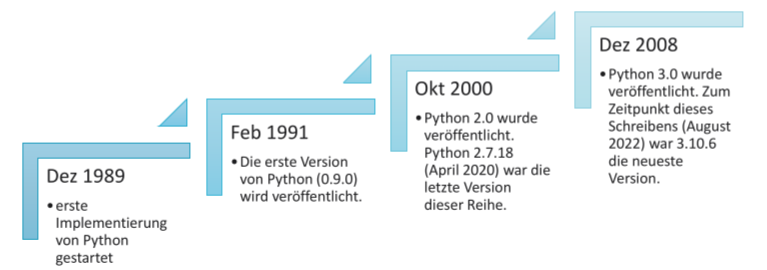

# M04 Einführung in die Programmierung mit Python
## L01 Einführung in Python

LERNZIELE

	<ul>
		<li>Die Gründe für die wachsende Beliebtheit von Python in der Softwareentwicklung zu nennen.</li>
		<li>Die Stärken und Schwächen von Python zu erläutern.</li>
		<li>Python herunterzuladen und zu installieren.</li>
		<li>Die verschiedenen Komponenten einer Python-Entwicklungsumgebung zu beschreiben und einzusetzen.</li>
	</ul>

ZUSAMMENFASSUNG

Python gewinnt in der Softwareentwicklung immer mehr an Popularität, nicht zuletzt wegen seiner leicht lesbaren, kompakten Syntax. Die Programmiersprache wird also nicht nur von Lehrkräften und Studierenden der Informatik geschätzt, sondern hat innerhalb kurzer Zeit auch in der globalen Softwareentwicklung weite Verbreitung gefunden. In beiden Bereichen besticht Python zum einen durch Benutzerfreundlichkeit, robuste Lauffähigkeit und vielfältige Features, zum anderen durch ein breites Angebot an kostenlos verfügbaren Tools und die Unterstützung einer ebenso großen wie aktiven Entwickler-Community.

Insbesondere ist Python heute die Programmiersprache der Wahl für datenwissenschaftliche und KI-bezogene Projekte, da die Python-Community extrem leistungsstarke und effiziente Bibliotheken für mathematische und statistische Anwendungen, die Verwaltung, Verarbeitung und Visualisierung von Daten sowie Deep Learning und andere Formen des maschinellen Lernens entwickelt hat.

Python ist eine interpretierte Programmiersprache, was bedeutet, dass der Python-Interpreter den eingegebenen Code liest, ausführt und die Ausgabe an die Benutzer zurückliefert. Dabei stehen den Letzteren mit IPython und Jupyter einige attraktive Erweiterungen der klassischen Python-Installation zur Verfügung. So nutzen Jupyter Notebook und JupyterLab die leistungsstarke IPython-Shell zur Bereitstellung einer funktionsstarken Entwicklungsumgebung, die Projektteams die Möglichkeit bietet, an mehreren Dateien parallel zu arbeiten, und sowohl Python-Code und formatierten Text als auch Terminalfenster und andere Tools miteinander zu kombinieren.

---
### Übersicht

- Python ist eine Open-Source-Programmiersprache.
- Wurde von Guido van Rossum Ende der 1980er-Jahre entwickelt.
- Ist eine interpretierte Programmiersprache, d. h., ihre Codes werden während der Laufzeit verarbeitet, ohne dass eine Kompilierung erforderlich ist.

### Geschichte der Entwicklung

| Schwächen                                                    | Stärken                                                      |
| ------------------------------------------------------------ | ------------------------------------------------------------ |
| Manche Fehler werden erst entdeckt, wenn der Code tatsächlich ausgeführt wird. | Ist kostenlos und quell offen.                               |
| Überprüft Datentypen erst zur Laufzeit, nicht schon beim Schreiben des Codes. | Es ist interpretiert (muss nicht erst kompiliert werden) und interaktiv (*IPython, Python in terminal, Jupyter -Notebook -Lab*). |
| Es verbraucht eine große Menge an Speicher.                  | Es hat eine große Anzahl von Bibliotheken, insbesondere für Data Science (Künstliche Intelligenz). |
| Langsam im Vergleich zu anderen Programmiersprachen wie Java, C++. | Es hat eine prägnante Syntax und ist leicht zu erlernen und zu schreiben (Gut für schnelles Prototypen). |
| Es fehlt die Unterstützung für die Entwicklung mobiler Anwendungen. | Es hat eine große und aktive Entwicklergemeinde (Tools, Bibliotheken, Dokumentation und Hilfe). |
| Es fehlt die Unterstützung für relationale Datenbanken.      | Es ist plattformübergreifend kompatibel mit Windows, MacOS und Linux. |
|                                                              | Unterstützt das prozedurale, objektorientierte und funktionale Programmierparadigma |
|                                                              | Es unterstützt Webentwicklung (Django, Flask).               |

### Ressource

- Kann direkt von der Python Website aus installiert werden, Pakete müssen manuell installiert werden.
- Oder als Distribution, wie z.B. Anaconda welches Tools (Jupyter Notbook, Jupyter Lab) und Pakete (NumPy, SciPy, Pandas) enthält.  

#### IPython

- starte zunächst die virtuelle environment z.B. `source ~/Apps/anaconda3/bin/aktivate` und danach `ipython`
- interaktive Shell Umgebung die auch Linux befehle wie `ls` oder `cd` unterstützt.
- eine `?`nach einem Befehl oder Objekt zeigt die Dokumentation dazu.
- Code komplettieren durch `Tab` 
- grafische Hervorhebungen und Feedbackfunktionen

#### Jupyter Notebook und Jupyter Lab

- starte zunächst die virtuelle environment z.B. `source ~/Apps/anaconda3/bin/aktivate` und danach `jupyter notebook `bzw. `jupyter lab`
- startet eine server der durch einen angezeigten Link im Browser erreicht werden kann
- nutzen IPython als Backend bzw. Jupyter-Kernel um Python Code zu verarbeiten
- Jupyter Notebooks können mathematische Formeln, Markdown (Bilder), Inlinecode, Kurvplots, Diagramme und ausführbaren Python Code enthalten
- Jupyter Lab ist eine Weiterentwicklung und enthält zusätzlich noch Tools
