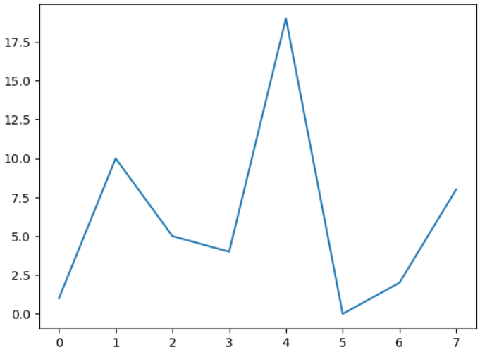
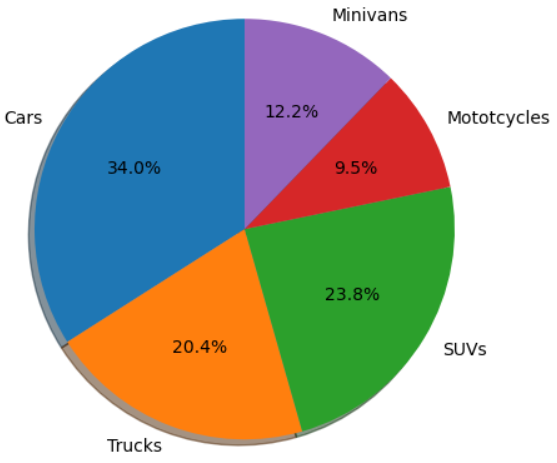
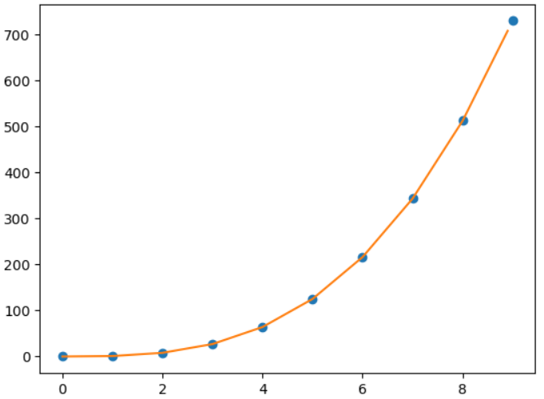
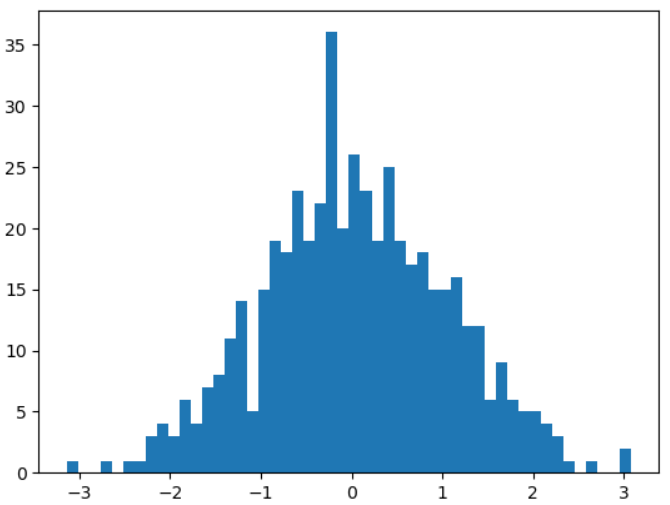
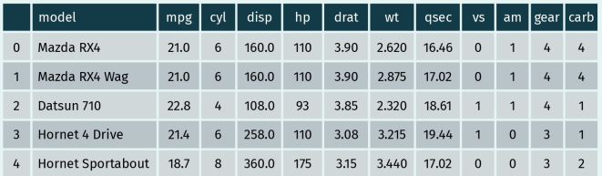
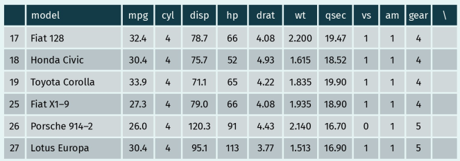
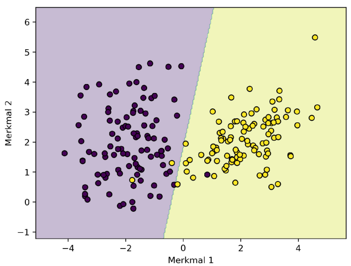
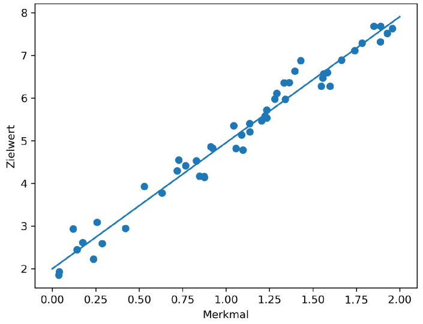
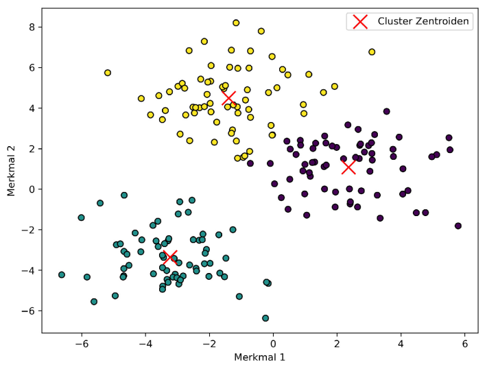

# M04 Einführung in die Programmierung mit Python
## L06 Module und Pakete

<details>
<summary>LERNZIELE</summary>
	<ul>
		<li>Prinzip und Verwendung von Python-Namensräumen zu erläutern.</li>
		<li>Eigene Python-Programme zu dokumentieren und die Dokumentation importierter Funktionen abzurufen.</li>
		<li>Die Einsatzbereiche verschiedener datenwissenschaftlicher Pakete für Python zu benennen.</li>
	</ul>
</details>

<details>
<summary>ZUSAMMENFASSUNG</summary>

Die Vergabe eindeutiger, selbsterklärender Variablen- und Funktionsnamen kann sich als schier unlösbare Aufgabe erweisen, wenn Ihre Anwendungen eine gewisse Komplexität und Größe erreicht haben. In diesem Fall hilft die konsequente Unterscheidung und Beachtung verschiedener Namensräume sowohl bei der Umsetzung von Benennungskonventionen als auch bei der Vermeidung von Namenskonflikten.

Darüber hinaus sind Programmierer aufgefordert, die Lesbarkeit ihres Codes durch Kommentare und Docstrings zu verbessern. Letzteres ist insbesondere dann angeraten, wenn die erstellten Module künftig von Dritten genutzt werden, die möglicherweise auf die mit dem help-Befehl abrufbare Dokumentation angewiesen sind.

Außerdem wissen wir nun, weshalb Python im Bereich Data Science so populär ist: Programmierer, die eine datenwissenschaftliche Anwendung oder eine auf maschinellem Lernen basierende Software
entwickeln möchten, profitieren von einer Vielzahl an Ressourcen und Bibliotheken. Dazu zählen unter anderem NumPy, Matplotlib, SciPy, Pandas und Scikit-Learn.
</details>

---

### 1. Einbindung und Erstellung

##### Module
> Im Grunde handelt es sich bei einem Modul um eine Datei, die Python-Code enthält. Dabei können Sie entweder die gesamte Datei oder lediglich spezifische Funktionen daraus zur Nutzung in Ihren Anwendungen importieren.

- Die Datei muss die Endung `.py` haben.
- Funktionen aus der Datei können wie folgt eingebunden werden:  
  `from` **&lt;Dateiname_ohne_.py_Endung>** `import` **&lt;**__Name der Funktion>__

### 2. Namensräume

##### Namensraum
Die Unterscheidung verschiedener Namensräume erleichtert die Vergabe eindeutiger Funktions- und Variablennamen sowie die Vermeidung doppelter Bezeichner bei der Einbindung von Modulen und Paketen.

- **Built-in-Namensraum**: umfasst die Namen aller vordefinierten Funktionen und Ausnahmen.
- **Globaler Namensraum**: enthält die Bezeichnungen aller Variablen und Funktionen, die in Ihrem Programm außerhalb von Funktionsdefinitionen sichtbar sind.
- **Lokaler Namensraum**: enthält alle Namen, die innerhalb einer bestimmten Funktion vergeben werden.

##### Namensdoppelungen

Entsteht wenn zwei Funktionen den selben Namen im selben Namensraum haben. 

```python
from math import floor

print(floor(6.5))		# 6
def floor(a):
    if a == 2:
        print("Second floor")
        
print(floor(2))			# Second floor
```

- Im Beispiel oben,  existieren zwei Funktion im selben Namensraum. 

```python
import math

# umgeht das Problem mit dem selben Namensraum
print(math.floor(6.5))		# 6
```

- Pakete können auch unter einen anderen Namen importiert werden.

```python
import math as something

print(something.floor(6.5)) # 6
```

### 3. Kommentierung und Dokumentation

##### Kommentare

- werden mit `#` eingeleitet und vom Interpreter ignoriert

 ##### Docstrings

- Sind von `"""`  umschlossen.

- Die Beschreibung wird mit der Funktion verknüpft wenn sie unter dem Funktionskopf, während der Definition, platziert wird.

- Kann durch die IDE oder mit der `help(` **&lt;**__Funktionsname_ohne_klammern>__`)` Funktion im Terminal angezeigt werden.

  ```python
  def add_two_numbers(a, b):
      """Adds two numbers together and returns the result."""
      return a + b
  help(add_two_numbers)	# zeigt Funktionsbeschreibung
  ```

### 4. Gängige datenwissenschaftliche Pakete
#### NumPy

- vordefinierte robuste Datentypen, die speziell zur Speicherung und Handhabung n-dimensionaler Datensätze entwickelt wurden und dabei effizienter als Python-Standardlisten sind (*NumPy-Arrays*)
- höhere Geschwindigkeiten bei der Verarbeitung großer Datenmengen (im Vergleich zu den Python-Standardfunktionen)
- ein breites Spektrum an Funktionen für die statistische Analyse umfangreicher Datensets

#### Matplotlib

- insbesondere im Rahmen des Moduls `pyplot`, ein breites Spektrum an flexiblen, individuell anpassbaren und einfach zu nutzenden Plotfunktionen, mit denen Sie unter anderem Graphen, Histogramme sowie Balken- und Streudiagramme erstellen können.
- Als Grundlage können dabei verschiedenste Datentypen dienen, darunter auch NumPy-Arrays.

*Einfacher Kurvenplot mit Matplotlib*

```python
import numpy
import matplotlib.pyplot as plt
my_array = numpy.array([1,10,5,4,19,0,2,8])
plt.plot(my_array)
plt.show()
```



*Einfaches Tortendiagramm mit Matplotlib*

```python
import matplotlib.pyplot as plt
categories = 'Cars', 'Trucks', 'SUVs', 'Mototcycles', 'Minivans'	# ist ein Tuple
quantities = [250, 150, 175, 70, 90]

fig, axl = plt.subplots()
axl.pie(quantities, labels=categories, autopct='%1.1f%%', shadow=True, startangle=90)
axl.axis('equal')
plt.show()
```



#### SciPy

- bietet Ihnen ein breites Spektrum an Funktionen für wissenschaftliche Berechnungen in verschiedensten Bereichen – von der linearen Algebra über die Kurveninterpolation bis hin zur Signalverarbeitung
- Kann Zufallsdatensätze erzeugen (*z.B. Sample mit insgesamt 500 Datenpunkten*)

*Kurveninterpolation mit SciPy*

```python
import numpy as np
import matplotlib.pyplot as plt
from scipy import interpolate

x = np.arange(0, 10)
y = x * x * x
f = interpolate.interp1d(x, y)
intx = np.arange(0, 9, 0.1)
inty = f(intx)
plt.plot(x, y, "o", intx, inty, "-")
plt.show()
```



*SciPy-Histogramm einer Normalverteilung*

```python
import scipy.stats
import numpy
import matplotlib.pyplot as plt

my_data = scipy.stats.norm.rvs(size=500)
plt.hist(my_data, bins=50)
plt.plot()
plt.show()
```



#### Pandas

- diverse Datenstrukturen speziell für wissenschaftliche Anwendungen mit höchsten Ansprüchen in Performanz, Effizienz und einfacher Nutzung
- vielfältige Funktionen zur Bearbeitung der in diesen Datenstrukturen gespeicherten Informationen

- Die wichtigste Pandas-Datenstruktur ist der zweidimensionale DataFrame zur Speicherung tabellenartiger Daten. Er bietet Ihnen die Möglichkeit, den Inhalt von .csv-Dateien in Ihre Anwendung einzulesen und dort zu verarbeiten. Das Einlesen kann dabei besonders
  einfach mithilfe der Pandas-Funktion read_csv und der Übergabe des Dateinamens als Argument implementiert werden.

*Fahrzeugdaten in einem Pandas-DataFrame*

```python
import pandas

car_data = pandas.read_csv('mtcars.csv')
car_data.head()		# zeigt die ersten 5 Einträge
```



*Filter zur Identifizierung sparsamer Autos im Pandas-DataFrame*

```python
import pandas

car_data = pandas.read_csv('mtcars.csv')
efficient_cars = car_data["mpg"] > 25
print(car_data[efficient_cars])
```



#### Scikit-Learn

- Scikit-Learn unterstützt das maschinelle Lernen in Python mit Funktionen zur Erstellung, Implementierung und Nutzung von Klassifizierungs-, Regressions- und Clusteralgorithmen, unter anderem.

- Eine Methode des maschinellen Lernens sind sogenannte Klassifizierungsalgorithmen. Dabei lernt ein Algorithmus, Datenpunkte anhand ihrer Merkmale einer vorgegebenen Klasse zuzuordnen. Dazu wird ein Trainingsdatensatz mit bekannten Klassen (Labels) verwendet. Jeder Datenpunkt besitzt mehrere Merkmale, zum Beispiel Messwerte, Eigenschaften oder Pixelwerte. Zu jedem Datenpunkt im Trainingsdatensatz ist bereits bekannt, zu welcher Klasse er gehört. Der Algorithmus nutzt diese gelabelten Datenpunkte, um ein Modell zu erstellen (lernen), das den Zusammenhang zwischen Merkmalen und Klassen beschreibt. Dieses Modell kann anschließend auf neue, unbekannte Daten angewendet werden, um vorherzusagen, zu welcher der bekannten Klassen sie gehören. Ein typisches Beispiel ist die Spam-Erkennung: Anhand vieler bereits als „Spam“ oder „Nicht-Spam“ markierter E-Mails lernt das Modell charakteristische Muster und kann danach neue E-Mails automatisch einer der beiden Klassen zuordnen. Eine Klassifikation mit zwei Klassen nennt man binäre Klassifikation. Ein weiteres Beispiel ist die Bildklassifikation, bei der ein Modell lernt, ob ein Bild zum Beispiel eine Katze, einen Hund oder ein Auto zeigt.

- Die nachstehende Abbildung zeigt beispielhaft die Ausgabe eines einfachen Klassifizierungsalgorithmus aus der Scikit-Learn-Bibliothek, angewendet auf synthetisch erzeugte Datenpunkte mit jeweils zwei Merkmalen. Jeder Punkt stellt einen Datenpunkt dar. Die tatsächliche Klasse eines Datenpunkts wird durch die Füllfarbe visualisiert. Es gibt also zwei Klassen. Die farbige Hintergrundfläche zeigt die vom Modell vorhergesagte Klasse für jeden Bereich des Merkmalsraums. Die Grenze zwischen den verschieden eingefärbten Bereichen entspricht der Entscheidungsgrenze des Modells. Sie beschreibt, wo der Klassifikator zwischen den Klassen unterscheidet. Die Abbildung zeigt, dass die meisten Datenpunkte korrekt zugeordnet werden, da sie in dem Bereich liegen, der ihrer tatsächlichen Klasse entspricht (Füllfarbe ist gleich Hintergrundfarbe). Ein paar Punkte befinden sich jedoch im „falschen“ Bereich der Entscheidungsfläche und werden deshalb vom Modell falsch klassifiziert. Diese Punkte verdeutlichen, dass gelernte Modelle die Daten nicht immer perfekt trennen können.

  *Beispiel einer binären Klassifikation*



- Im Unterschied zur Klassifikation, bei der Datenpunkte Klassen zugeordnet werden, besteht der Zweck von Regressionsalgorithmen darin, aus Daten einen Zusammenhang zu lernen (Zusammenhang zwischen abhängigen und unabhängigen Variablen) und damit kontinuierliche Werte vorherzusagen. Auch hier wird ein Trainingsdatensatz mit bekannten Zielwerten (Labels) verwendet, in dem jeder Datenpunkt Merkmale sowie einen zugehörigen numerischen Ausgabewert besitzt. Letzerer kann auch mehrdimensional sein. Der Algorithmus nutzt die Trainingsdaten, um ein Modell zu lernen, das den Zusammenhang zwischen Merkmalen (unabhängigen Variablen) und Ausgabewerten (abhängige Variablen) beschreibt. Dieses Regressionsmodell kann anschließend auf neue, unbekannte Daten angewendet werden, um deren wahrscheinliche Ausgabewerte vorherzusagen. Ein typisches Beispiel ist die Vorhersage von Immobilienpreisen: Aus bekannten Hausmerkmalen (z. B. Anzahl der Zimmer, Lage, Fläche usw.) und Preisen lernt das Modell, welche
  Kombinationen zu welchen Preisen führen, und sagt anschließend den Preis eines neuen Hauses anhand seiner Merkmale vorher.
- Die folgende Abbildung zeigt die Ausgabe eines einfachen Regressionsalgorithmus auf synthetischen Daten mit einem Merkmal und einem eindimensionalen Zielwert. Die Punkte sind die Daten, die Linie ist die vom Modell gelernte Regressionsfunktion zur Vorhersage der kontinuierlichen Zielwerte.

*Beispiel einer linearen Regression*



- Clusteralgorithmen teilen Datenpunkte ohne vorgegebene Klassen in Gruppen (Cluster) ein. Im Gegensatz zur Klassifikation gibt es dabei keine Labels. Jeder Datenpunkt wird durch Merkmale beschrieben. Der Algorithmus fasst Datenpunkte mit ähnlichen Merkmalen (aufgrund von Ähnlichkeitsmaßen) zu Clustern zusammen. Ziel ist es, verborgene
  Strukturen in Daten zu entdecken. Ein typisches Beispiel ist die Kundensegmentierung: Anhand von Merkmalen wie Alter, Einkommen oder Kaufverhalten werden Kunden automatisch in ähnliche Gruppen eingeteilt, ohne dass diese Gruppen vorher festgelegt sind.
- Die folgende Abbildung zeigt die Ausgabe eines einfachen Clusteringalgorithmus auf synthetischen Daten mit zwei Merkmalen. Die Punkte sind die Daten. Die Füllfarben zeigen die Clusterzugehörigkeiten. Es gibt drei Cluster. Die Kreuze zeigen die Zentren der Cluster.

*Beispiel mit drei Clustern*


