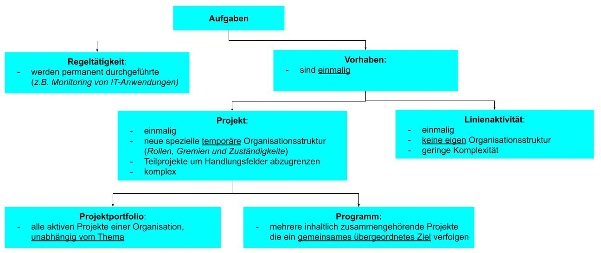
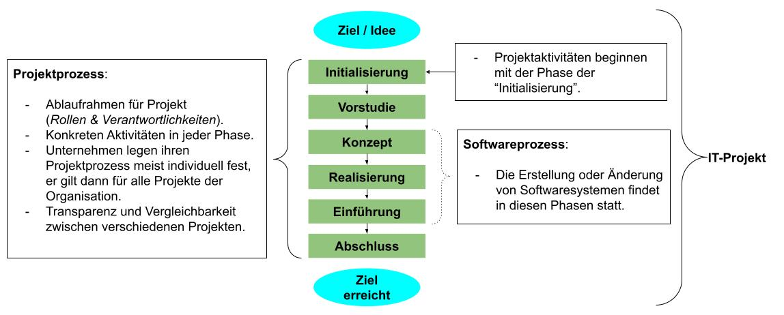

# IT-Projektmanagement

# L01 Begriffe und Grundlagen im IT-Projektmanagement

## Einleitung
*Nach der Diskussion des Begriffs IT-Projekt wird ein Lebenszyklusmodell für IT-Projekte vorgestellt und die wichtigsten Aktivitäten sowie Ziele jeder Phase erläutert. Abschließend wird mit den Rollen und Gremien zum Multiprojektmanagement der Kontext vermittelt, in den IT-Projekte typischerweise eingebettet sind.*

LERNZIELE

<ul>
    <li>Was der Begriff IT-Projekt bedeutet und anhand welcher Eigenschaften IT-Projekte charakterisiert werden können.</li>
    <li>Aus welchen Phasen der Lebenszyklus von IT-Projekten besteht und was die wichtigsten Aktivitäten und Ziele jeder Phase sind.</li>
    <li>Was Multiprojektmanagement ist und welche Rollen und Gremien es dazu gibt.</li>
</ul>

ZUSAMMENFASSUNG

IT-Projekte sind Projekte, die sich mit der Entwicklung von Informations- und Kommunikationssystemen beschäftigen. Damit haben IT-Projekte auch die Eigenschaften Einzigartigkeit, Komplexität und temporäre Organisationsform. 

Grundsätzlich lässt sich zu IT-Projekten ganz allgemein ein Idealmodell für ein Phasenkonzept beschreiben. Es umfasst die Phasen Initialisierung, Vorstudie, Konzept, Realisierung und Einführung, bevor es mit der Phase Abschluss endet. Insbesondere in mittleren und großen Organisationen werden mehrere Projekte parallel durchgeführt.  

Die Menge aller aktiven Projektprozesse wird auch als Projektportfolio bezeichnet. Das Multiprojektmanagement kümmert sich um die Planung, Überwachung und Steuerung mehrerer Projektprozesse mithilfe der Gremien Projektportfolio-Board sowie dem ProjektmanagementOffice.

## 1.1 Projektbegriff und Arten von IT-Projekten

### [Projekt](./M06_glossar.md#projekt-allgemein) (*allgemein*)
>Es gibt keine allgemeingültige Definition, folgende Aspekte treffen nach DIN 699011 zu:
- vorgegebenes Ziel,
- zeitliche, finanzielle oder sonstige Begrenzungen,
- einmaliges (*innovatives, risikobehaftetes, komplexes*) Vorhaben,
- klare Abgrenzung zu anderen **Vorhaben**,
- temporäre projektspezifische Organisation aufgrund der Schwierigkeit & Bedeutung des Projektes

*Abgrenzung von Aufgaben & __Vorhaben__*

### IT-Projekt
>Selbe Definition wie Projekt, beschäftigen sich jedoch nur mit der Entwicklung von Informations- & Kommunikationssystemen.

|Arten von IT-Projekten |Ziel des Projekts |
|---|---|
|**Entwicklungsprojekte** |Etwas Neues zu erschaffen, *z. B. IT-Systeme oder Strategien*. |
|**Wartungsprojekte**, **Betreuungsprojekte** |Bestehende IT-Systeme zu warten und die Anwendenden bei deren Einsatz zu unterstützen. |
|**Projektierungsprojekte** |Änderungen der aktuellen IT-Infrastruktur vorzubereiten und zu planen, wie die Einführung einer neuen Anwendung. |
|**Änderungsprojekte** |Die aktuelle IT-Infrastruktur eines Unternehmens zu ändern, etwa Systemeinführungen. |
|**Forschungsprojekte**, **Versuchsprojekte** |Durch die prototypische Umsetzung von System und Prozessen benötigte Informationen zu erhalten, die bei Entscheidungen über Änderung der IT-Infrastruktur eines Unternehmens benötigt werden. |
|**Rationalisierungsprojekte**, **Outsourcing-Projekte** |Aktuelle Abläufe und Strukturen innerhalb einer Organisation zu optimieren bzw. stärker auf die wertschöpfenden Geschäftsprozesse zu konzentrieren, beispielsweise die Auslagerung des Rechenzentrumsbetriebs an Dienstleister. |
|**Beratungsprojekte** |Kunden bei der Konzeption, Planung, Entwicklung, Inbetriebnahme und dem laufenden Betrieb von IT-Systemen zu unterstützen.|

### Maße für Komplexität von IT-Projekten
Folgende Faktoren deuten auf die Komplexität eines Projektes:
- Der geplante (*bzw. nach Projektende der tatsächliche*) Aufwand in Personentagen bzw. Personenjahren.
- Anzahl der:
    - aktiv am Projekt beteiligten Mitarbeitenden,  
    - Stakeholder,  
    - Systeme und Systemschnittstellen (*die erstellt bzw. geändert werden*),  
    - Organisationen (*die im Projekt zusammenarbeiten*),  
- Kritikalität des Projekts hinsichtlich der wertschöpfenden Geschäftsprozesse,  
- Zeitdauer,
- Projektbudget

### Einfluss von IT-Projekten
> **[Change-Prozess](./M06_glossar.md#änderungsprozess-auch-change-prozess-oder-change)**: Technische und Organisatorische Veränderungen während und nach Abschluss des Projektes   
- Hat Einfluss auf die Gestaltung der Arbeitsabläufe und die Zielerreichung von Fachabteilungen.
- Abhängigkeiten und Beziehung müssen Berücksichtigt werden, zwischen:  
    - IT-Systemen innerhalb und ausserhalb des Projektes,
    - IT-Systemen und Betroffenen Stakeholder,
    - Stakeholder untereinander.  

#### Begleitung des Change-Prozess
- Planung und Begleitung
- Schulungsprogramme
- intensive Kommunikation zwischen Führungskräften und den betroffenen Mitarbeitenden

---
## 1.2 IT-Projektlebenszyklus
- Zu IT-Projekten als auch zu Projekten lässt sich ein **Idealmodell** für ein "Phasenkonzept" beschreiben, welches in der Praxis jedoch abweicht. 
- Unternehmen legen sich oft auf einen spezifischen **Projektprozess** fest, der dann ganz allgemein für alle Projekte des Unternehmens gilt.

*Variante eines Idealmodells für ein Phasenkonzept in einem IT-Projekt:*

|Phase |Ziel |Typische Aktivitäten |
|---|---|---|
|**Initialisierung** |- Erste Beschreibung der Projektziele;   - Entscheidung ob das Projekt weitergeführt wird |- Problem & Ziele dokumentieren,   - Unternehmenskontext einordnen,   - Aufgabenstellungen & Verantwortlichkeiten festlegen |
|**Vorstudie**   (*Machbarkeitsstudie*) |- Analyse des Problems & möglicher Lösungsansätze;   - Entscheidung über Projektauftrag |- Problem analysieren,   - Lösungsansätze erarbeiten & bewerten,   - Projektauftrag formulieren,   - groben Ablauf- & Organisationsplan erstellen |
|**Konzept** |- Entscheidung für eine Lösungsvariante & deren Detaillierung für die Realisierung |- Lösungsvarianten analysieren & auswählen,   - Requirements Engineering starten,   - Rahmenzeitplan & Meilensteine definieren,   - Aufwände schätzen |
|**Realisierung**   (*Durchführung / Implementierung*) |- Umsetzung aller notwendigen IT-Änderungen zur Zielerreichung |- Technische Spezifikation & Architekturbeschreibung erstellen,   - Implementierung,   - Qualitätssicherung,   - Dokumentation & Handbücher erstellen |
|**Einführung**   (*Transition / Inbetriebnahme*)|- Überführung der Ergebnisse in die produktive Betriebsumgebung |- Parallelbetrieb alter & neuer Systeme,   - Datenmigration,   - Schulungen für Nutzende & Support-Team,   - organisatorische Anpassungen vornehmen |
|**Abschluss** |- Übergabe der Projektergebnisse;   - formelles Ende des Projekts     **Ein Abschluss findet immer statt – auch wenn das Projekt sein Ziel nicht erreicht oder vorzeitig abgebrochen wird.** |- Ergebnisse an Auftraggeber übergeben,   - Projektorganisation auflösen,   - buchhalterischen Abschluss durchführen,   - Projektdokumentation erstellen |

---
## 1.3 Multiprojektmanagement – Das Projekt im Kontext der Organisation
- In mittleren und großen Organisationen laufen mehrere Projekte häufig gleichzeitig.
- Die Gesamtheit dieser aktiven Projekte nennt sich **Projektportfolio**.
- Das Planen, Überwachen und Steuern von Projekten gleichzeitig wird **Multiprojektmanagement** genannt.

### Ziele des Multiprojektmanagements
- Auswahl der Projekte mit dem größten Nutzen für die Unternehmensziele.
- Priorisierung laufender Projekte bei der Ressourcenzuteilung.
- Ausgewogene Risikoverteilung im Portfolio (*z. B. nicht zu viele risikoreiche Projekte gleichzeitig*).
- Kontinuierliche Bewertung von Planabweichungen, als Entscheidungsgrundlage für
mögliche Steuerungsmaßnahmen.

### Gremien und Rollen im Multiprojektmanagements
|Rolle/Gremium |Aufgaben |
|---|---|
|**(_Projekt_) Portfolio-Board** |- **Strategische Entscheidungen**: Projekte für das Portfolio auswählen, genehmigen und regelmäßig (re-)priorisieren.   - Entscheidungen zu Phasenübergängen im IT-Projektlebenszyklus.   **Mitglieder**: IT-Leitung (*CIO*), IT-Führungsebene, Leitung des PMO|
|**PMO**   (_**P**roject **M**anagement **O**ffice_) |- Operative Überwachung & Steuerung kritischer & komplexer Projekte.  - Durchsetzung und Überwachung von Richtlinien, Vorgaben und Standards für das Projektmanagement.   -  Kapazitätsplanung und Ressourcenzuteilung zu Projekten.   - Berichterstattung an das Portfolio-Board   - Unterstützung einzelner Projekte durch Einsatz von Projektmanagementtechniken und -werkzeugen. |
|**(_Projekt_) Portfolio-Manager** |- Bindeglied zwischen Portfolio-Board und Projektleitern.   - Unterstütze Projektleiter Ziele und Projekte abzuschließen.   - Überwacht das Verhältnis von: geschaffenen Werten zu verbrauchten Ressourcen, Veränderungen von Projektrisiken, Kundenzufriedenheit und dem erreichten Qualitätsgrad. |

### Projekt-Jour-fixe (*„fester Tag“*)
Die Projektleitung berichtet dem Portfolio-Manager regelmäßig über:
- Aktuelle Projektveränderungen
- Risikoeinschätzung
- Anstehende Maßnahmen & Meilensteine
- Kostenkontrolle (*z.B. via Earned-Value-Analyse*)
- Kundenzufriedenheit & Qualitätsgrad

